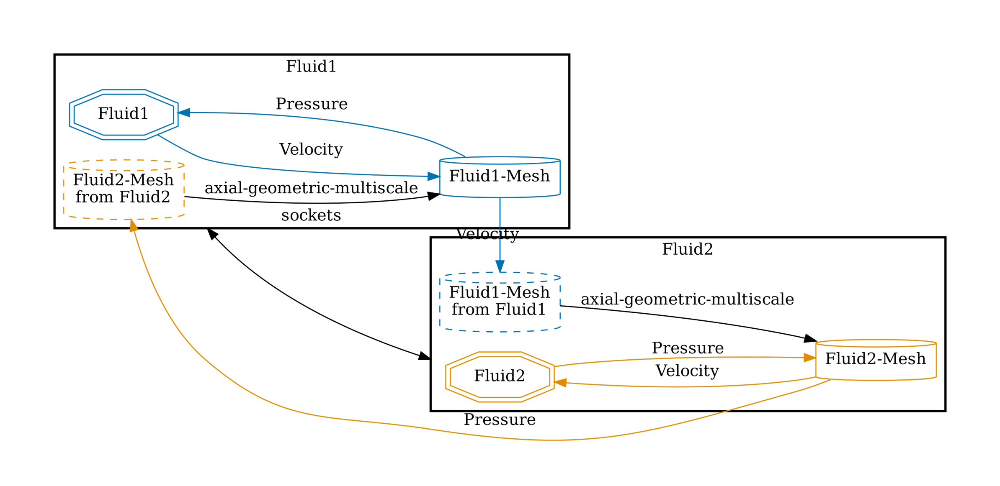
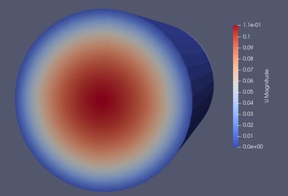


Get the [case files of this tutorial](https://github.com/ezonta/tutorials/tree/GeoMultiScaleTutorial/1D-3D-partitioned-pipe). Read how in the [tutorials introduction](https://www.precice.org/tutorials.html).


## Prerequisites

- preCICE
- Python bindings of preCICE
- OpenFOAM together with the OpenFOAM adapter of preCICE

## Setup
We exchange velocity data from the 1D to the 3D participant and pressure data vice versa. The config looks as follows:



## How to run

In two different terminals execute


```bash
cd Fluid1 && ./run.sh
```

```bash
cd Fluid2 && ./run.sh
```

## Results

You should be able to see an established laminar profile at the inlet of the 3D participant.



