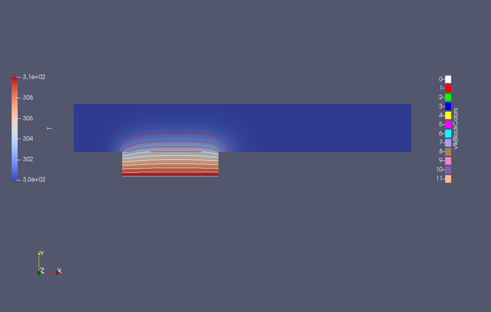
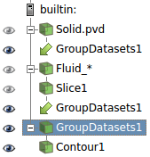

# Setup

The setup for this tutorial is based on the the flow-over-plate tutorial in the [precice/openfoam-adapter](https://github.com/precice/openfoam-adapter). Please refer to [this wiki page](https://github.com/precice/openfoam-adapter/wiki/Tutorial-for-CHT:-Flow-over-a-heated-plate) of the openfoam-adapter for details and references regarding the experimental setup.

## OpenFOAM

See [Download v5.0 | Ubuntu](https://openfoam.org/download/5-0-ubuntu/). Don't forget to also update your `~/.bashrc`! See [Download v5.0 | Ubuntu -> User Configuration](https://openfoam.org/download/5-0-ubuntu/).

## preCICE + OpenFOAM adapter

**preCICE:** See [preCICE wiki](https://github.com/precice/precice/wiki/Building). If you have problems compiling, see the "Troubleshooting" section below.
**OpenFOAM adapter:** See [OpenFOAM adapter wiki](https://github.com/precice/openfoam-adapter/wiki/Building). If you have problems compiling, see the "Troubleshooting" section below.

To make sure that everything is working properly, you should run the following tutorial case: https://github.com/precice/openfoam-adapter/wiki/Tutorial-for-CHT:-Flow-over-a-heated-plate

## FEniCS

To install FEniCS for python run the following commands (from https://fenicsproject.org/download/):

```
sudo apt-get install software-properties-common
sudo add-apt-repository ppa:fenics-packages/fenics
sudo apt-get update
sudo apt-get install --no-install-recommends fenics
```

To make sure that fenics is working properly, you should run at least one of the tutorials on https://github.com/hplgit/fenics-tutorial/tree/master/pub/python/vol1.

### Troubleshooting

* you can check your fenics version by typing `dolfin-version`
* for newer fenics versions, you might have to replace `u_e.vector().array()` with `u_e.vector().get_local()`. (newer: 2017.2.0, older:1.6)
* if you get strange errors with Dolfin, make sure that you have sympy version 1.1.1 (see https://www.allanswered.com/post/gnewm/vectorfunctionspace-not-working-in-2018-1-since-there-are-no-variables-in-the-expression-0-0-it-cannot-be-differentiated/). You can check your sympy version via `python -c "import sympy; print(sympy.__version__)"`. If you have to downgrade sympy, remove it first via `sudo apt-get remove --auto-remove python-sympy`. Then install it using pip `sudo pip install sympy==1.1.1`. Probably, you will have to reinstall fenics after autoremoving sympy.

## Get the OpenFOAM Fluid case

Copy the Folder `Fluid` and all its contents from https://github.com/precice/openfoam-adapter/tree/master/tutorials/CHT/flow-over-plate/buoyantPimpleFoam-laplacianFoam to this folder.

# Running

To start the fluid solver (OpenFOAM), run the following commands in a shell opened in this folder:

```
blockMesh -case Fluid
buoyantPimpleFoam -case Fluid
```

To start the solid solver (FEniCS), run the following command in a shell opened in this folder:

```
python Solid/heat.py
```

## Visualization

To create VTK output for the Fluid solver, go to the directory `fenics-adapter/tutorials/CHT/flow-over-plate/buoyantPimpleFoam-fenics/Fluid` and run `foamToVTK`. Now you can use paraview to visualize the output. The solid solver's output is stored in `fenics-adapter/tutorials/CHT/flow-over-plate/buoyantPimpleFoam-fenics/out` (open `FEniCs_precice_Lund2018/out/Solid.pvd`), the Fluid solver's output is stored in `fenics-adapter/tutorials/CHT/flow-over-plate/buoyantPimpleFoam-fenics/Fluid/VTK` (open `Fluid_..vtk`). The fluid dataset is a 3D dataset, therefore you should extract a **Slice** first (Z normal, origin at (x,y,z) = (x,y,0.0001)). Then you can combine this slice and the solid 2D dataset into a single dataset using **Group Datasets**.



This is how your setup in paraview should look like, to obtain this output:


