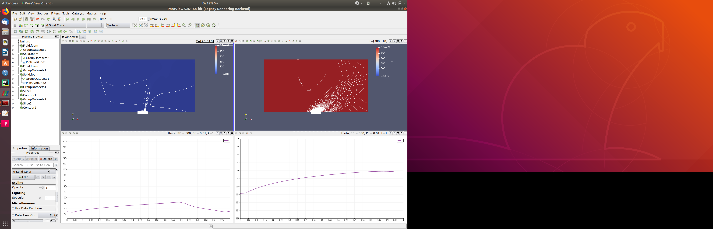
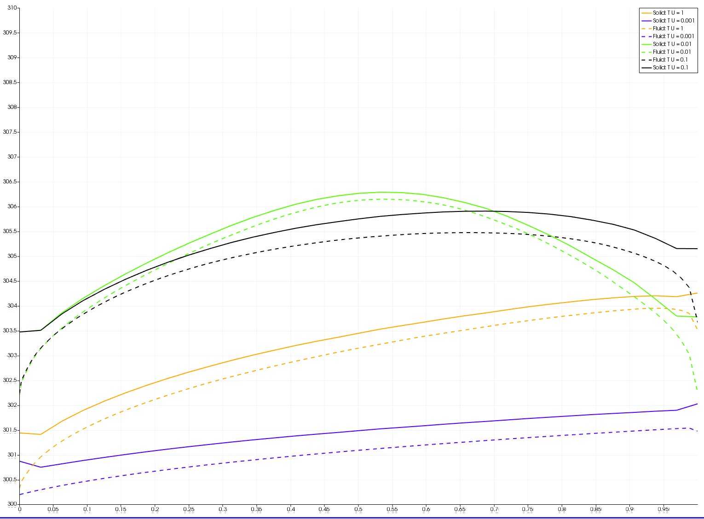
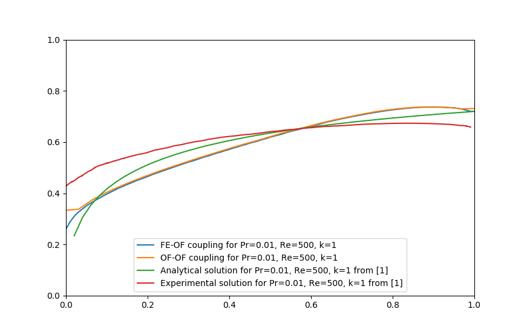

# Experimental Setup

We want to compare the flow over heated plate scenario for two different software setups. We also consider the analytic solution for comparison. We only consider the physical setup with **k=1**, **lambda=0.25**, **Re=500**, **Pr=0.01**, **T_c = 310**, **T_inf=310**. For explanation of the parameters and reference solution, refer to [1]. This specific parameter set has been evaluated in [1] Fig.8 a), [2], [3] and [4].

## 1) OF-OF

We use OpenFOAM for simulation of the fluid and OpenFOAM for simulation of the solid

* source code and running, see [flow-over-plate/buoyantPimpleFoam-laplacianFoam](https://github.com/precice/openfoam-adapter/tree/master/tutorials/CHT/flow-over-plate/buoyantPimpleFoam-laplacianFoam)
* preCICE config being used [`precice-config_serial_FE_OF.xml`](https://github.com/precice/tutorials/blob/GAMMAnnual2019/CHT/flow-over-plate/buoyantPimpleFoam-fenics/validation/precice-config_serial_OF_OF.xml)
* data stored in [`out_OF-OF.csv`](https://github.com/precice/tutorials/blob/GAMMAnnual2019/CHT/flow-over-plate/buoyantPimpleFoam-fenics/validation/out_OF_OF.csv)

## 2) FE-OF

Using OpenFOAM for simulation of the fluid and FEniCS for simulation of the solid.

* source code and running, see [flow-over-plate/buoyantPimpleFoam-fenics](https://github.com/precice/tutorials/tree/GAMMAnnual2019/CHT/flow-over-plate/buoyantPimpleFoam-fenics)
* preCICE config being used [`precice-config_serial_FE_OF.xml`](https://github.com/precice/tutorials/blob/GAMMAnnual2019/CHT/flow-over-plate/buoyantPimpleFoam-fenics/validation/precice-config_serial_FE_OF.xml)
* data stored in [`out_FE-OF.csv`](https://github.com/precice/tutorials/blob/GAMMAnnual2019/CHT/flow-over-plate/buoyantPimpleFoam-fenics/validation/out_FE_OF.csv)

## 3) analytic solution

For derivation see [1].

## 4) experimental solution

From numerical experiments in [1].

## 5) OF-OF (with modified geometry)

We use OpenFOAM for simulation of the fluid and OpenFOAM for simulation of the solid

* source code and running, see (branch:`GAMMAnnual2019`) [tutorials/CHT/flow-over-plate/buoyantPimpleFoam-laplacianFoam_extended_out_T_different](https://github.com/precice/tutorials/tree/GAMMAnnual2019/CHT/flow-over-plate/buoyantPimpleFoam-laplacianFoam_extended_out_T_different)
* data stored in [`out_OF_OF_extended_geometry.csv`](https://github.com/precice/tutorials/blob/GAMMAnnual2019/CHT/flow-over-plate/buoyantPimpleFoam-fenics/validation/out_OF_OF_extended_geometry.csv)

## Comments

The data `*.out` is obtained from the vtk output of the solid part of the simulation. We use paraview to exporting the data of *plot over line* along the coupling boundary.

The simulation has to be run for a larger amount of time (approx. 50s simulation time, see `precice-config`) in order to reach steady state. **For the sake of speeding up the computation, the timestep size has been increased for the FEniCS solver!**

## Postprocessing

Run `python3 plotParaviewOut.py` to obtain the plot with the results.
 
## Results

### Finding the right model parameters

Given in [1]

* `lambda = 0.25`: use `a = 0.25` and `b=1`
* `Re = 500 = rho * v * d / mu`: use `b=1` as characteristic length `d`; `U_inf = 0.1` as inflow velocity `v`; `mu = 0.0002` for the dynamic viscosity; `rho = 1` for the density (**how to set this in OpenFOAM???**).
* `Pr = 0.01`: directly defined in `Fluid/constant/thermophysicalProperties`.
* `k=1`: use `k_s = 100` (defined in `Solid/constant/transportProperties`) and `k_f=100=c_p * mu / Pr` (all defined in `Fluid/constant/thermophysicalProperties`).

#### `T_c` and `T_inf`

* not given in [1]
* we use `T_c = 310` and `T_inf = 300`

However, these parameters have a huge effect on the results:

Here, we compared our reference case (`T_c = 310` and `T_inf = 300`) to another case (`T_c = 310` and `T_inf = 25`).

### varying U_in

* We tried the following values for `U_in= 1, 0.1, 0.01, 0.001, 0.0001`
* Case files can be found in `CHT/flow-over-plate/buoyantPimpleFoam-laplacianFoam_extended_300_310_U_*`
* We used a maximum simulation time of `T_end = 500` and timestep size `dt=0.01`
* Most cases **did not** run until `T_end`!
    * `U_in = 1` breaks at `t=1.25`
    * `U_in = 1` ran with `dt_solver = 0.001`; `dt_precice = 0.01` (subcycling) until `T_end = 141`. See `CHT/flow-over-plate/buoyantPimpleFoam-laplacianFoam_extended_300_310_U_1_0_dt_0_001`
    * `U_in = 0.1` breaks at `t = 150`
    * `U_in = 0.01` breaks at `t = 470`
    * `U_in = 0.001` succeeds until `T_end = 500`
    * `U_in = 0.0001` breaks at `t = 68`

**with none of the velocities we get close to the results from [1]!**

### Comparison to Vynnycky results

* Simulation results match each other
* Both simulation results miss analytical solution and experimental solution
* in [1, p.55] it is already mentioned that Pr = 0.01 might be too low for the analytical solution.
* The difference between our experiemnts and the ones in [1] might be due to the slightly different scenarios. In our case, we have a channel with fluid; in [1] we have a half plane.

## References

[1] Vynnycky, M., Kimura, S., Kanev, K., & Pop, I. (1998). Forced convection heat transfer from a flat plate: the conjugate problem. International Journal of Heat and Mass Transfer, 41(1), 45–59.  
[2] Cheung Yau, L. (2016). Conjugate Heat Transfer with the Multiphysics Coupling Library preCICE. Technical University of Munich.  
[3] Reiser, A. (2018). Extending a CFD Lab Course by a preCICE Conjugate Heat Transfer Tutorial. Technical University of Munich.  
[4] Chourdakis, G. (2017). A general OpenFOAM adapter for the coupling library preCICE. Technical University of Munich.  
