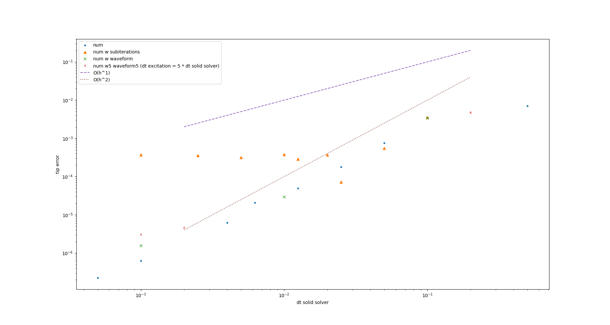

# Excitement

## Running

Use `precice-config.xml` and `precice-adapter-config-fsi-s.json` from this folder.
You will have to replace `adapter_config_filename = "precice-adapter-config-fsi-s.json"` with `adapter_config_filename = "../tools/precice-adapter-config-fsi-s.json"` in `Solid/cyl-flap.py`.

Run the following commands from `tutorials/FSI/cylinderFlap/OpenFOAM-FEniCS`:

* `python3 Solid/cyl-flap.py`
* `python3 tools/excitement.py tools/precice-config.xml`

A file `out.txt` will be created in this folder. The result of the simulation is written to this folder

## Using multirate / subiterations

Depending on `precice_dt` and `fenics_dt` the computations are done using multirate timeintegration or not.

* *no multirate:* the input force is provided for every single timestep
* *multirate:* the input force is only provided for the timestep size `precice_dt`, if `fenics_dt < precice_dt` the same force will be applied for all fenics timesteps inside of a window.

# Convergence Study

Based on the results of the simulation above, one can perform a convergence study, by running `plot_convergence_study.py`.

## Simulation result and Error estimation

The convergence study is based on the results stored in `out.txt`. Here the final displacement of the tip is used as the basis. The error is estimated by computing the absolute difference between each result and a reference solution. The result of the simulation with the smallest time step is used as reference solution.

