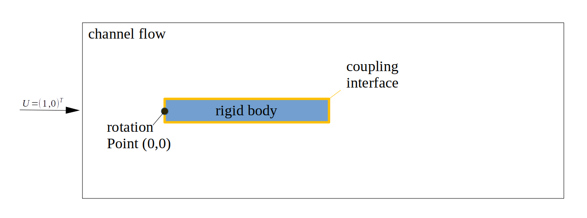

# FSI tutorial of a rigid body flap in a channel flow

This tutorial deals with a fluid-structure-interaction problem. The fluid part of the simulation is computed using OpenFOAM and the rigid body motion is a rigid body model written in `c++` with only a single degree of freedom, namely the deflection angle of the flap in the channel. The rigid body is fixed in the origin at (0,0) and the force exerted by the fluid on the rigid body structure causes an oscillatory rotation of the body. The simulation runs for 2.5 seconds. After 1.5 seconds we increase the angular stiffness of the structure by a factor of 8 to stabilize the coupled problem. Feel free to modify these parameters and increase the simulation time. 



## Building the `rigid_body` participant

Before starting the coupled simulation, the `rigid_body` solver needs to be compiled using `cmake`. You can run the following commands from this directory to build the `rigid_body` solver
```
cd Solid && cmake . && make
```

## Running the coupled simulation

You may run the two simulations in two different terminals and watch their output on the screen by using the scripts `runFluid` (or `runFluid -parallel`) and `runSolid`. You can cleanup the simulation using `Allclean`.

There is an [open issue](https://github.com/precice/openfoam-adapter/issues/26) that leads to additional "empty" result directories when running with some OpenFOAM versions, leading to inconveniences during post-processing. Please run the script `removeObsoleteSolvers.sh` to delete the additional files.

Ini serial, the simulation takes roughly 30 seconds to compute.

## Visualizing the results

You can visualize the simulation results of the `Fluid` participant using paraView (use paraFoam to trigger the OpenFOAM native reader or load the (empty) file `Fluid.foam` into paraView). The rigid body doesn't generate any readable output files, but the motion can be observed in the OpenFOAM data. In addition, one could visualize the coupling meshes including the exchanged coupling data. preCICE generates the relevant files during the simulation and stores them in the directory `coupling-meshes`. In order to visualize the results, load the `vtk` files in paraView and apply a `Glyph` filter. Depending on the specific paraView version, you might additionally need to disable the `ScaleArray` option by selecting `No scale array` since the exchanged data might be inappropriate for a scaling operation. You can further add a `Warp By Vector` filter with `Displacements` to deform the coupling data.

## Disclaimer

This offering is not approved or endorsed by OpenCFD Limited, producer and distributor of the OpenFOAM software via www.openfoam.com, and owner of the OPENFOAM® and OpenCFD® trade marks.
