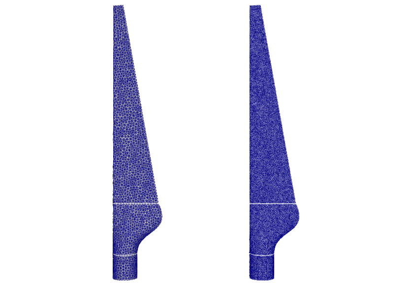



If you are completely new to ASTE have a look at our [ASTE documentation](https://precice.org/tooling-aste.html). This tutorial shows how to setup a mapping between two (artificial) meshes using preCICE and ASTE in parallel. The executed mapping can be investigated in terms of accuracy as well as runtime.

## Setup

Our example consists of a wind turbine blade geometry, which was triangulated using different refinement levels. The mesh files are stored in [this GitLab repository](https://gitlab.lrz.de/precice/precice2-ref-paper-setup) and correspond to the mesh files used for the mapping tests of our [version 2 reference paper](https://doi.org/10.12688/openreseurope.14445.1). The mesh files are automatically downloaded when the `run.sh` script is executed. In this example setup, we map the mesh `0.01.vtk` (left side of the figure) to the mesh `0.006.vtk` (right side of the figure).



## Configuration

preCICE configuration (image generated using the [precice-config-visualizer](https://precice.org/tooling-config-visualization.html)):


## Running the tutorial

All necessary steps in order to run the mapping setup are summarized in the `run.sh` script. Have a look at the comments in the run script in order to understand what is happening. In particular, the script executes the following steps:

1. Download the mesh files and extract them in the `meshes` directory. This step is only executed when running the script for the first time. For our example, we only use two of the downloaded meshes. The tutorial can easily be modified to employ different meshes.
2. Generate input data for our mapping problem. As described in the [ASTE documentation](https://precice.org/tooling-aste.html#precice-aste-evaluate), the python script `precice-aste-evaluate` evaluates a test function and stores the results on a mesh. Here, we select Franke's function, evaluate it on the input mesh `0.01.vtk`, and store the results on a mesh called `input_mesh.vtu`. Use `precice-aste-evaluate --list-functions` to get a complete list of available test functions and their definitions.
3. Partition meshes. We want to execute the mapping in parallel. To this end, we need to partition our mesh files so that each rank receives its own mesh file. The python script `precice-aste-partition` partitions a given mesh in a specified number of pieces (here two for the input mesh and two for the output mesh).
4. Execute the actual mapping. We start two instances of `precice-aste-run`, which is the ASTE core module interfacing with preCICE, to emulate two participants. Here, we map the data from the coarse input mesh to the fine output mesh. We store the mesh and data per rank in files `mapped/mapped...` with data called `InterpolatedData`.
5. Join scattered mesh files. The python script `precice-aste-join` joins the results into one large mesh file `result.vtu`.
6. Investigate accuracy of mapping configuration. We use `precice-aste-evaluate` again. This time, we use the `--diff` flag in order to compute the error between our test function and the mapped data. We store the difference data (`Error`) on the result mesh (`result.vtu`) as well, which allows us to visualize the error distribution, e.g., using `ParaView`. `precice-aste-evaluate` also prints several global error measures to the console:

```bash
---[ASTE-Evaluate] INFO : Vertex count 9588
---[ASTE-Evaluate] INFO : Relative l2 error 0.002402706834866804
---[ASTE-Evaluate] INFO : Maximum absolute error per vertex 0.009659755828445804
---[ASTE-Evaluate] INFO : Maximum signed error per vertex 0.00888725146042224
---[ASTE-Evaluate] INFO : Minimum absolute error per vertex 0.0
---[ASTE-Evaluate] INFO : Minimum signed error per vertex -0.009659755828445804
---[ASTE-Evaluate] INFO : Median absolute error per vertex 0.0011544478395176805
---[ASTE-Evaluate] INFO : 99th percentile of absolute error per vertex 0.007066025673252374
---[ASTE-Evaluate] INFO : 95th percentile of absolute error per vertex 0.005206080046631978
---[ASTE-Evaluate] INFO : 90th percentile of absolute error per vertex 0.004253350142177374
```

This information is additionally stored in a JSON file `result.stats.json` for potential further processing.


The error measures used here are only useful for consistent mapping configurations, i.e., `constraint="consistent"`.


This tutorial is meant as a starting point to investigate mapping setups. The provided configuration uses a `nearest-neighbor` mapping, but there are other mapping configurations available (commented out) in the `precice-config.xml` file. Example: using the last configuration (`rbf-compact-polynomial-c6` with a dense matrix decomposition) leads to the following error measures:

```bash
---[ASTE-Evaluate] INFO : Vertex count 3458
---[ASTE-Evaluate] INFO : Relative l2 error 9.588343106540401e-08
---[ASTE-Evaluate] INFO : Maximum absolute error per vertex 1.7229951972397295e-06
---[ASTE-Evaluate] INFO : Maximum signed error per vertex 1.7229951972397295e-06
---[ASTE-Evaluate] INFO : Minimum absolute error per vertex 3.5638159090467525e-14
---[ASTE-Evaluate] INFO : Minimum signed error per vertex -1.6968422637542169e-06
---[ASTE-Evaluate] INFO : Median absolute error per vertex 6.217611314696114e-09
---[ASTE-Evaluate] INFO : 99th percentile of absolute error per vertex 3.548732313379818e-07
---[ASTE-Evaluate] INFO : 95th percentile of absolute error per vertex 1.6012309731194814e-07
---[ASTE-Evaluate] INFO : 90th percentile of absolute error per vertex 8.077894064206796e-08
```

which are clearly better than the ones we got with `nearest-neighbor` mapping above. However, this comes at the cost of a much higher runtime ().
