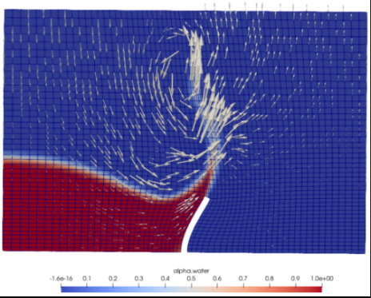
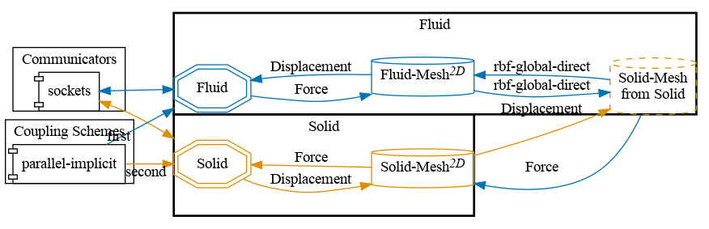


Get the [case files of this tutorial](https://github.com/precice/tutorials/tree/master/breaking-dam-2d). Read how in the [tutorials introduction](https://precice.org/tutorials.html).


## Setup

The two-dimensional breaking dam case is a free surface problem. A large column of water comes into contact with a flexible wall, causing the wall to bend and the water to flow over the wall. A no-slip boundary condition is applied at the bottom, the left, and the right boundary, and a zero pressure condition at the top boundary. The image below shows the alpha value (0 is air, 1 is water) and velocity vectors at t=0.6.

A similar, but not identical, setup is used in [1].

## Configuration

preCICE configuration (image generated using the [precice-config-visualizer](https://precice.org/tooling-config-visualization.html)):

## Available solvers

Fluid participant:

* OpenFOAM (interFoam). In case you are using a very old OpenFOAM version, you need to adjust the solver to `interDyMFoam` in the `Fluid/system/controlDict` file. For more information, have a look at the [OpenFOAM adapter documentation](https://precice.org/adapter-openfoam-overview.html).

Solid participant:

* CalculiX. For more information, have a look at the [CalculiX adapter documentation](https://precice.org/adapter-calculix-overview.html). This is a modified setup of the one used in the `perpendicular-flap` tutorial.

## Running the simulation

You can start the simulation by running the script `./run.sh` located in each participant directory. OpenFOAM can be executed in parallel using `run.sh -parallel`. The default setting uses 4 MPI ranks.

## Post-processing

You can visualize the results using ParaView or `cgx` (for native CalculiX results files) as usual. See some [visualization hints for CalculiX results](https://precice.org/tutorials.html#visualizing-calculix-results).


This offering is not approved or endorsed by OpenCFD Limited, producer and distributor of the OpenFOAM software via www.openfoam.com, and owner of the OPENFOAM® and OpenCFD® trade marks.


## References

[1] K. Davis, M. Schulte, B. Uekermann. [Enhancing Quasi-Newton Acceleration for Fluid-Structure Interaction](https://doi.org/10.3390/mca27030040). Mathematical and Computational Applications. 2022; 27(3):40
