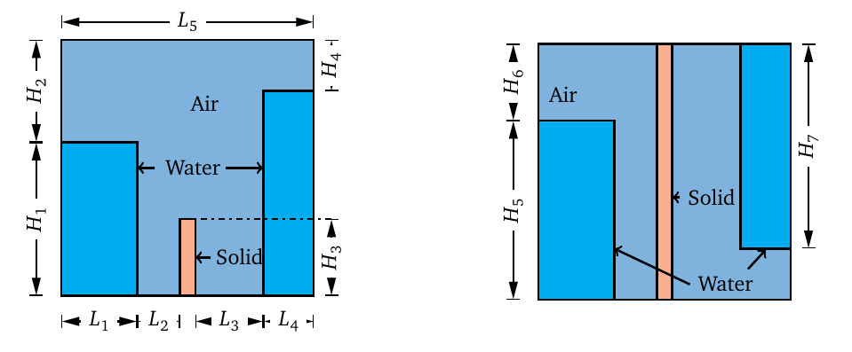
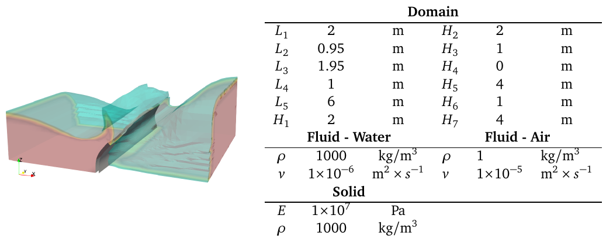


Get the [case files of this tutorial](https://github.com/precice/tutorials/tree/breaking-dam-2d/breaking-dam-3d). Read how in the [tutorials introduction](https://www.precice.org/tutorials.html).


## Setup

The three-dimensional breaking dam case is a free surface problem, that is an extension of the two-dimensional problem. Two large columns of water comes into contact with a flexible wall at different times, causing the wall to bend and twist as the water flows over and around the wall. The solid domain is fixed only at the bottom and the sides are free to move in-plane. The test case was run for 0.75s with a time step of dt = 0.005s, for a total of 150 time steps.

## Available solvers

Fluid participant:

* OpenFOAM (interFoam). In case you are using a very old OpenFOAM version, you will need to adjust the solver to `interDyMFoam` in the `Fluid/system/controlDict` file. For more information, have a look at the [OpenFOAM adapter documentation](https://www.precice.org/adapter-openfoam-overview.html).

Solid participant:

* CalculiX. For more information, have a look at the [CalculiX adapter documentation](https://www.precice.org/adapter-calculix-overview.html).

## Running the simulation

You can start the simulation by running the script `./run.sh` located in each participant directory. OpenFOAM can be executed in parallel using `run.sh -parallel`. The default setting uses 4 MPI ranks.

## Post-processing

You can visualize the results using paraView or `cgx`(for native CalculiX resul files), as usual.


This offering is not approved or endorsed by OpenCFD Limited, producer and distributor of the OpenFOAM software via www.openfoam.com, and owner of the OPENFOAM®  and OpenCFD®  trade marks.

