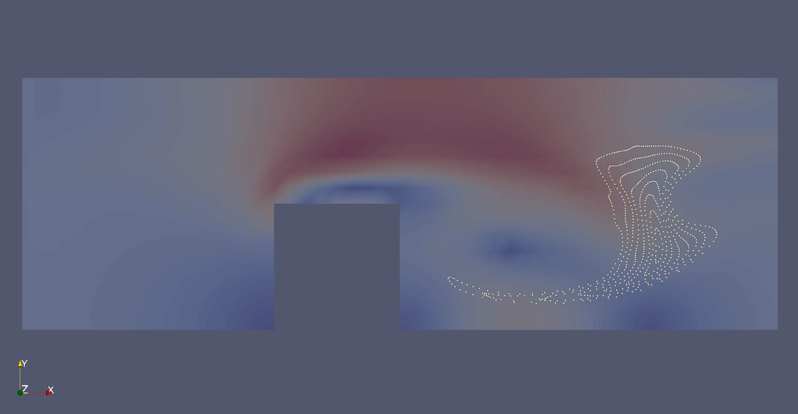

# Hints and TODOs

## General hints

- we already have a unidirectional mesh-particle tracing [tutorial](https://precice.org/tutorials-channel-transport-particles.html). This scenario is also available in the [tutorials repository](https://github.com/precice/tutorials/tree/develop/channel-transport-particles) and couples Nutils with MercuryDPM
- the unidirectional tutorial only couples via the fluid velocity and should run out-of-the-box, use `setup-mercurydpm.sh` to run and compile the MercuryDPM participant
- the tutorial uses OpenFOAM or Nutils, and MercuryDPM
- all Nutils simulations use Nutils version 7
- the bidirectional scenario builds upon this tutorial case

## Before starting

- make sure you have the latest develop of preCICE

## The bidirectional coupling

- the bidirectional coupling is pull request [706](https://github.com/precice/tutorials/pull/706)
- from the [tutorials](https://github.com/precice/tutorials/tree/develop/channel-bidirectional), checkout the branch `channel-bidirectional` and navigate to `~/tutorials/channel-transport-particles/`
- run the `setup-mercurydpm.sh` script again (it checks out another branch for the solver)
- the overall setup is no too much physics-motivated, using the same boundary conditions leads to the following

- after you completed the case, I would validate it with a more complex scenario
- while the simulation here is 2D, the final validation case will be 3D
- I put all further comments directly into the `fluid.py` code
