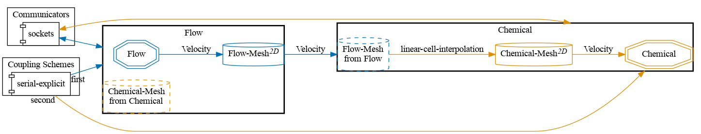
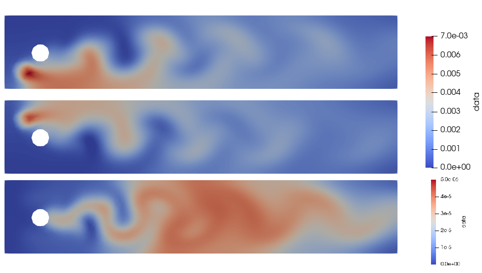


Get the [case files of this tutorial](https://github.com/precice/tutorials/tree/master/channel-transport-reaction). Read how in the [tutorials introduction](https://www.precice.org/tutorials.html).


## Setup

We solve a system of advection-diffusion-reaction in a fluid flowing past a cylinder. This case is inspired from a FEniCS tutorial [1]. A fluid flows inside a channel containing a cylinder as an obstacle. Chemical species A, B and C live in the fluid, with sources of A and B at the entry of the channel. Due to diffusion and fluid mixing, A and B react to form a certain amount of C.

The geometry is shown below:


The simulation is split into two participants: a Fluid participant that computes the fluid flow and sends the velocity field to the Chemical participant which computes the reaction, diffusion and advection of all chemical species. The coupling is unidirectional (`serial-explicit` with only one data entity being transferred).

## Configuration

preCICE configuration (image generated using the [precice-config-visualizer](https://precice.org/tooling-config-visualization.html)):



## Available solvers and dependencies

Both participants run on FEniCS. Install [FEniCS](https://fenicsproject.org/download/) and the [FEniCS-adapter](https://github.com/precice/fenics-adapter) to run this tutorial.

## Running the simulation

Each participant has a `run.sh` file in its subfolder.
To start the `Fluid` participant, run:

   ```bash
   cd fluid-fenics
   ./run.sh
   ```

To start the `Chemical` participant, run:

   ```bash
   cd chemical-fenics
   ./run.sh
   ```

## Postprocessing

The chemical participant writes `.vtu` and `.pvd` files that can be opened with ParaView. The fluid participant also produces output files representing the velocity field. Since the fluid time step is significantly smaller than the chemical time step, there are more fluid velocity files than chemical concentration files. Keep this in mind when opening both simultaneously.
The figure below shows the state after a duration of 2 units of time. The concentration in A, B and C are plotted.



## References

<!-- markdownlint-configure-file {"MD034": false } -->
[1] Hans Petter Langtangen and Anders Logg. Solving PDEs in Python. _Springer_ (2017). https://doi.org/10.1007/978-3-319-52462-7
