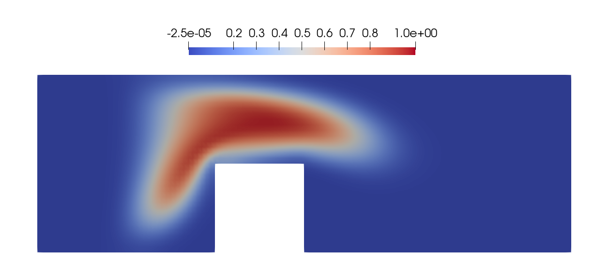


Get the [case files of this tutorial](https://github.com/precice/tutorials/tree/master/channel-transport). Read how in the [tutorials introduction](https://www.precice.org/tutorials.html).


## Setup

We model a two-dimensional incompressible fluid flowing through a channel with an obstacle. The fluid problem is coupled to a simple transport problem in a uni-directional fashion. The transport problem is initialized with a circular blob close to the inflow. The convected and diffused blob after 23 timesteps:



## Available solvers

Fluid participant:

* Nutils. For more information, have a look at the [Nutils adapter documentation](https://www.precice.org/adapter-nutils.html). This Nutils solver requires at least Nutils v7.0.

Transport participant:

* Nutils. For more information, have a look at the [Nutils adapter documentation](https://www.precice.org/adapter-nutils.html). This Nutils solver requires at least Nutils v7.0.

## Running the Simulation

Open two separate terminals and start one fluid and one transport participant by calling the respective run scripts `run.sh` located in the participant directory. For example:

```bash
cd fluid-nutils
./run.sh
```

and

```bash
cd transport-nutils
./run.sh
```

## Post-processing

All solvers generate `vtk` files which can visualized using, e.g., ParaView.
