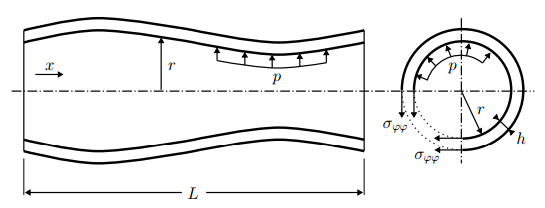
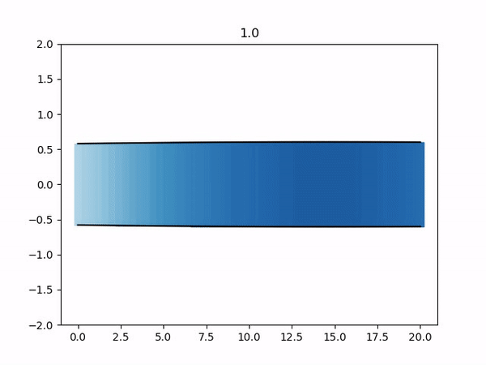
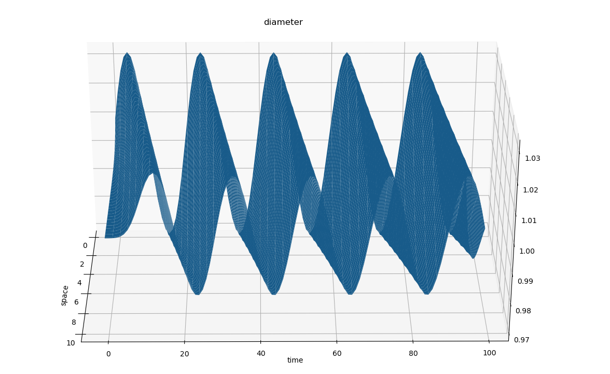



## Setup

We want to simulate the internal flow in a flexible tube as shown in the figure below (image from [1]).



The flow is assumed to be incompressible flow and gravity is neglected. Due to the axisymmetry, the flow can be described using a quasi-two-dimensional continuity and momentum equations. The motivation and exact formulation of the equations that we consider can be found in [2].

The following parameters have been chosen:

- Length of the tube: L = 10
- Inlet velocity: $$ v_{inlet} = 10 + 3 sin (10 \pi t) $$
- Initial cross sectional area = 1
- Initial velocity: v = 10
- Initial pressure: p = 0
- Fluid density: $$ \rho = 1 $$
- Young modulus: E = 10000

Additionally the solvers use the parameters `N = 100` (number of cells), `tau = 0.01` (dimensionless timestep size), `kappa = 100` (dimensionless structural stiffness) by default. These values can be modified directly in each solver.

## Available solvers

Both fluid and solid participant are supported in:

- *C++*: An example solver using the intrinsic [C++ API of preCICE](https://www.precice.org/couple-your-code-api.html). This solver also depends on LAPACK (e.g. on Ubuntu `sudo apt-get install liblapack-dev`)
- *Python*: An example solver using the preCICE [Python bindings](https://www.precice.org/installation-bindings-python.html). This solver also depends on the Python libraries `numpy scipy matplotlib vtk mpi4py`, which you can get from your system package manager or with `pip3 install --user <package>`.

### Building the C++ Solver

In order to use the C++ solver, you first need to build the scripts `FluidSolver` and `SolidSolver`. Each script needs to be built separately.

```bash
cd fluid-cpp
mkdir build && cd build
cmake ..
make all
```

```bash
cd solid-cpp
mkdir build && cd build
cmake .. 
make all
```

Building can be skipped if you do not plan to use the C++ version.  

## Running the Simulation

### C++

Open two separate terminals and start each participant by calling the respective run script.

```bash
cd fluid-cpp
./run.sh
```

and

```bash
cd solid-cpp
./run.sh
```

### Python

Open two separate terminals and start each participant by calling the respective run script. Only serial run is possible:

```bash
cd fluid-python
./run.sh
```

and

```bash
cd solid-python
./run.sh
```

**Optional:** A run-time plot visualization can be trigged by passing `--enable-plot` in `run.sh` of `FluidSolver.py`. Additionally a video of the run-time plot visualization can be generated by additionally passing `--write-video`



## Post-processing



The results from each simulation are stored in each `fluid-<participant>/output/` folder. You can visualize these VTK files using the provided `plot-diameter.sh` script

```bash
./plot-diameter.sh
```

which will try to visualize the results from both fluid cases, if available. This script calls the more flexible `plot-vtk.py` Python script, which you can use as

```bash
python3 plot-vtk.py <quantity> <case>/output/<prefix>
```

Note the required arguments specifying which quantity to plot (`pressure`, `velocity` or `diameter`) and the name prefix of the target vtk files.

For example, to plot the diameter of the fluid-python case using the default prefix for VTK files, `plot-diameter.sh` executes:

```bash
python3 plot-vtk.py diameter fluid-python/output/out_fluid_
```



## References

[1] B. Gatzhammer. Efficient and Flexible Partitioned Simulation of Fluid-Structure Interactions. Technische Universitaet Muenchen, Fakultaet fuer Informatik, 2014.

[2] J. Degroote, P. Bruggeman, R. Haelterman, and J. Vierendeels. Stability of a coupling technique for partitioned solvers in FSI applications. Computers & Structures, 2008.

[3] M. Mehl, B. Uekermann, H. Bijl, D. Blom, B. Gatzhammer, and A. van Zuijlen.
Parallel coupling numerics for partitioned fluid-structure interaction simulations. CAMWA, 2016.  
