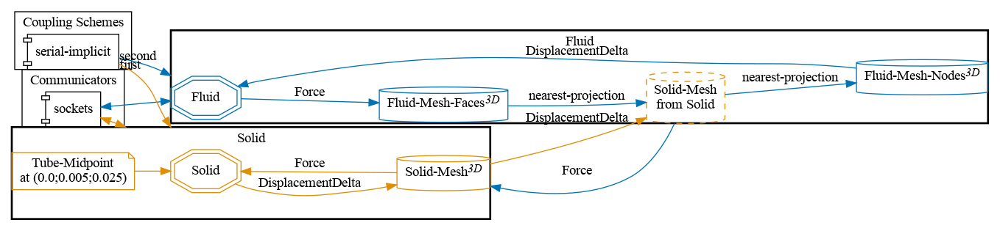
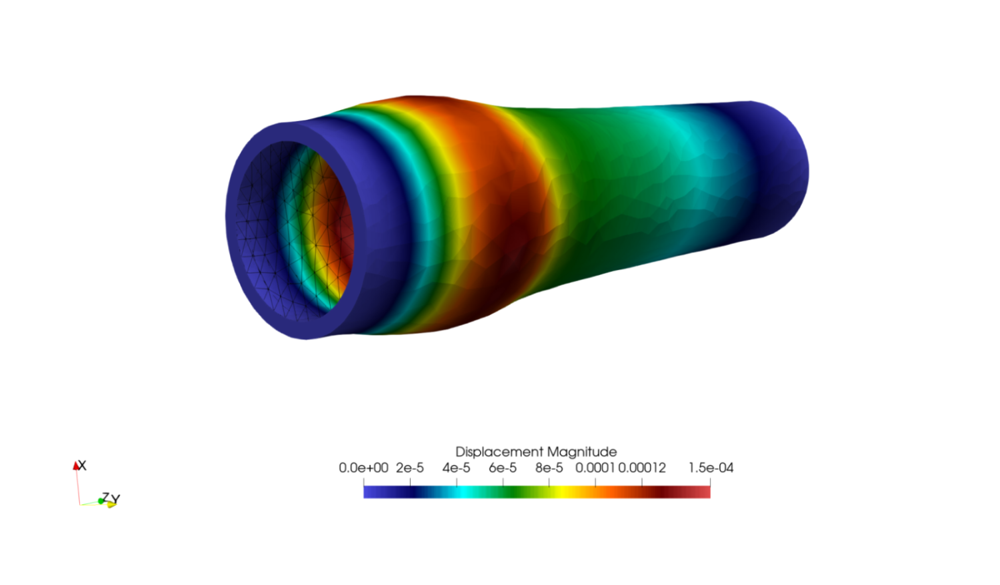


Get the [case files of this tutorial](https://github.com/precice/tutorials/tree/master/elastic-tube-3d). Read how in the [tutorials introduction](https://precice.org/tutorials.html).


## Setup

The expanding tube test case involves a cylindrical fluid domain surrounded by a solid domain. A pressure inlet boundary condition is applied at the inlet for 3 milliseconds, and then 0 set to zero for a further 7 millisecond. The pressure of the fluid expands the tube which then relaxes once the pressure decreases.

The expanding tube test case comes with the interface surface mesh connectivity of the solid domain. This allows the use of nearest-projection mapping of the displacements of the solid domain. In order to run the example with nearest projection mapping, the "node-mesh-with-connectivity" has been specified in the `solid-calculix/config.yml` file. More details can be found in the [CalculiX configuration description](https://precice.org/adapter-calculix-config.html#nearest-projection-mapping).

## Configuration

preCICE configuration (image generated using the [precice-config-visualizer](https://precice.org/tooling-config-visualization.html)):

## Available solvers

Fluid participant:

* OpenFOAM (pimpleFoam). In case you are using a very old OpenFOAM version, you will need to adjust the solver to `pimpleDyMFoam` in the `Fluid/system/controlDict` file. For more information, have a look at the [OpenFOAM adapter documentation](https://precice.org/adapter-openfoam-overview.html).

Solid participant:

* CalculiX. For more information, have a look at the [CalculiX adapter documentation](https://precice.org/adapter-calculix-overview.html).

* FEniCS. The structural model is currently limited to linear elasticity. Currently 3D functionality is experimental in the FEniCS adapter and more details can be found [here](https://github.com/precice/fenics-adapter/pull/133) For more information, have a look at the [FeniCS adapter documentation](https://precice.org/adapter-fenics.html).

## Running the simulation

You can start the simulation by running the script `./run.sh` located in each participant directory. OpenFOAM can be executed in parallel using `run.sh -parallel`. The default setting uses 4 MPI ranks.

## Post-processing

You can visualize the results using paraView or `cgx`(for native CalculiX result files), as usual. The total deformation is rather small. Multiplying the deformation by factor of 10 (warp by vector filter in paraView) and visualizing the fluid domain at `t=0.005s` looks as follows:

You can also plot the displacement of the midpoint of the tube for each participant individually by running `sh plot-displacements.sh <filename>`. If you have run all the solver combinations and want to compare the plots, you can run `sh plot-all-displacements.sh` which looks like:


This offering is not approved or endorsed by OpenCFD Limited, producer and distributor of the OpenFOAM software via www.openfoam.com, and owner of the OPENFOAM®  and OpenCFD®  trade marks.

