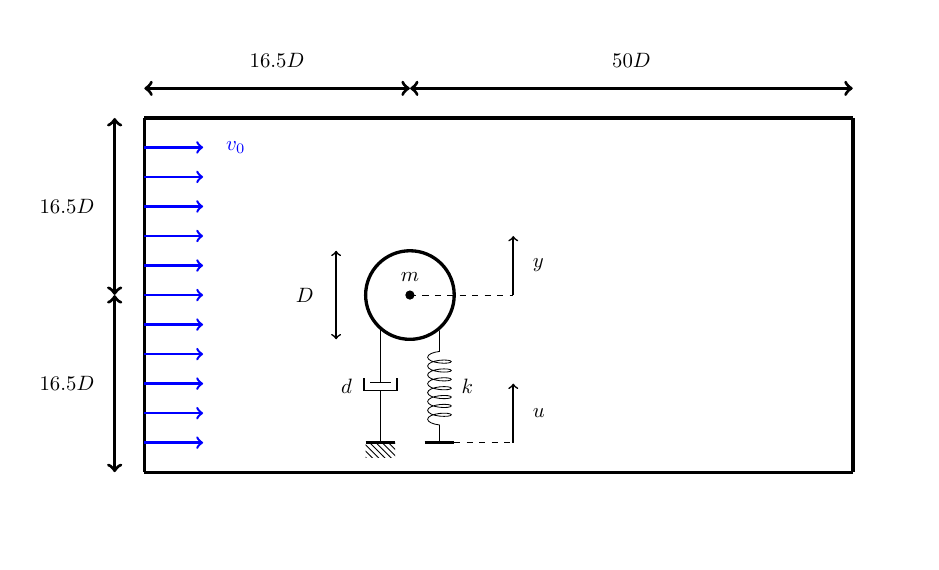


Get the [case files of this tutorial](https://github.com/precice/tutorials/tree/master/flow-around-controlled-moving-cylinder). Read how in the [tutorials introduction](https://www.precice.org/tutorials.html).


## Setup

We simulate a 2D flow around a cylinder. The cylinder is not fixed, but mounted on a spring-damper system which allows it to move in the y-direction. The vortex shedding of the flow brings the cylinder to oscillate up and down. This setup has received attention as a test case for numerical simulations [1] in the past and is backed up with experimental data [2].

The oscillation can be counteracted by moving the root point of the spring [3]. To adjust the root point accordingly, a PID controller is implemented. The full setup is shown below:



## Multi coupling

We want to use three participants for the simulation: `Fluid`, `Solid` and `Controller`. For this we need to use a multi-coupling scheme. Read more about the concept [here](https://precice.org/configuration-coupling-multi.html).

We are using a composition of bi-coupling schemes with one explicit coupling between `Fluid` and `Solid` and another explicit coupling between `Solid` and `Controller`. The participants `Fluid` and `Controller` are not coupled, as they don't exchange any data with each other.

The configuration of this case looks like this:

```xml
<coupling-scheme:serial-explicit> 
  <participants first="Fluid" second="Solid" /> 
  ...
</coupling-scheme:serial-explicit> 

<coupling-scheme:serial-explicit> 
  <participants first="Solid" second="Controller" /> 
  ...
</coupling-scheme:serial-explicit>

```

## About the solvers

OpenFOAM is used for the `Fluid` participant. The spring-damper system is solved in a separate Python `Solid` participant. Finally, the PID algorithm is calculated in a FMU as participant `Controller`.

- *OpenFOAM*: To run this case, you need the preCICE [OpenFOAM Adapter](https://precice.org/adapter-openfoam-get.html). OpenFOAM is used to simulate the laminar flow around the cylinder with the solver `pimpleFoam`.
- *FMI*: A solver using the [preCICE-FMI Runner](https://github.com/precice/fmi-runner). The Runner executes the FMU model `PIDcontroller.fmu` for computation. The compiled FMU model for Linux is part of this repository. For other systems, please recompile the model from the provided C-files (see folder "controller-fmi/fmu"). If you want to change the model parameters or simulation setup, have a look inside `fmi-settings.json` and `precice-settings.json` (see folder "controller-fmi").
- *Python*: A python script solving the spring damper system. It uses the preCICE [Python bindings](https://www.precice.org/installation-bindings-python.html) and depends on the Python library `numpy`. You can install `numpy` from your system package manager or with `pip3 install --user <package>`.

## Running the simulation

Open three seperate terminals. The commands for the `Solid` and the `Controller` are:

```bash
cd solid-python
bash ./run.sh
```

and

```bash
cd controller-fmi
bash ./run.sh
```

For the `Fluid` participant, you can run OpenFOAM either serial or in parallel. To run the case in serial, you can use the same command as before

```bash
cd fluid-openfoam
bash ./run.sh
```

while for the parallel computaion you need to set an additional flag

```bash
cd fluid-openfoam
bash ./run.sh -parallel
```

## Post-processing

There are multiple options for post-processing, depending on what you want to visualize.

### Plot displacement and forces

The `Solid` participant writes a `watchpoint` during the simulation. To plot this data, run the command

```bash
bash plot-watchpoint.sh solid-python
```

### Plot controller variables

The preCICE-FMI Runner stores some of the internal controller variables like output values and the terms of the different gains. To plot for example the error between measured and wanted state, run the command

```bash
python3 plot-timeseries.py ./controller-fmi/output/controller-output.csv E_OVER_T
```

To get a full list of the plot options, run `python3 plot-timeseries.py -h`.

### View the simulation results in ParaView

OpenFOAM creates `.vtk` files during the simulation which you can visualize and animate in [ParaView](https://www.paraview.org/download/). To do so, run

```bash
cd fluid-openfoam
paraFoam
```

## Acknowledgements

Many thanks to Mosayeb Shams from Herriot Watt University, UK, who helped to set up this simulation case.

## Sources

- The general idea was taken from [3]
- The OpenFOAM case files make use of the following work:
  - An [OpenFOAM tutorial](https://gitlab.com/mAlletto/openfoamtutorials/-/tree/master/transverseRe100m*10) to study vortex induced vibrations on a 2D cylinder
  - An [online article](https://curiosityfluids.com/2016/07/19/oscillating-cylinder-in-crossflow-pimpledymfoam/) discussing the setup of a similar OpenFOAM case
  
## References

[1] Placzek, A. and Sigrist, J.F. and Hamdouni, A. [Numerical Simulation of an oscillating cylinder in a cross-flow at low Reynolds number: Forced and free oscillations](https://dx.doi.org/10.1016/j.compfluid.2008.01.007), Computers and Fluids, 2009, 38 (1), pp.80-100

[2] Anagnostopoulus, P. and Bearman, P.W. Response Characteristics of a vortex-excited cylinder at low Reynolds numbers, Journal of Fluids and Structures, January 1992, DOI: 10.1016/0889-9746(92)90054-7

[3] Sicklinger, S. [Stabilized Co-Simulation of Coupled Problems including Fields and Signals](https://www.researchgate.net/publication/269705153_Stabilized_Co-Simulation_of_Coupled_Problems_Including_Fields_and_Signals), Technical University of Munich, Dissertation
