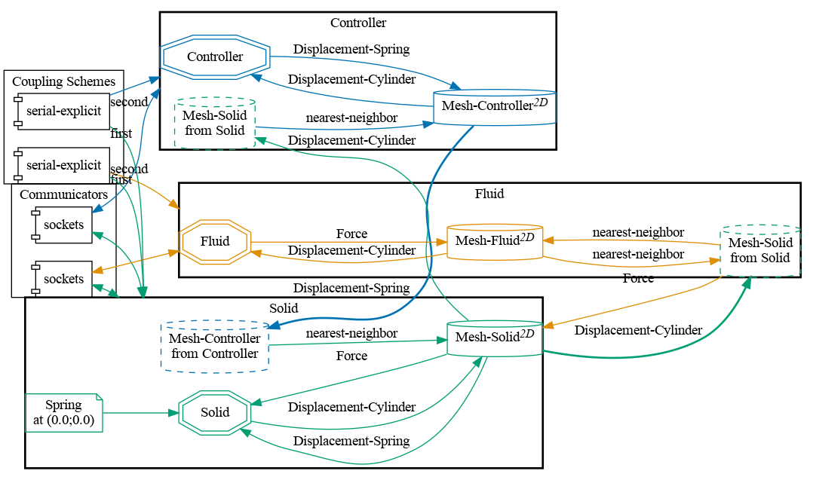
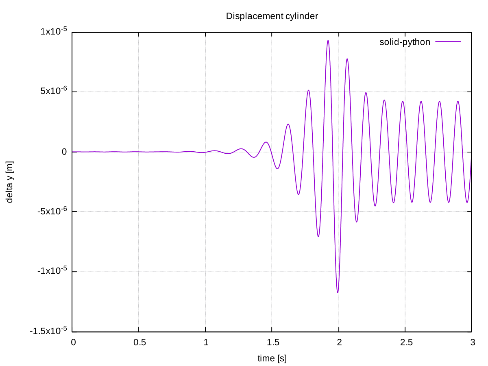


Get the [case files of this tutorial](https://github.com/precice/tutorials/tree/master/flow-around-controlled-moving-cylinder). Read how in the [tutorials introduction](https://www.precice.org/tutorials.html).


## Setup

We simulate a 2D flow around a cylinder. The cylinder is not fixed, but mounted on a spring-damper system which allows it to move in the y-direction. The vortex shedding of the flow brings the cylinder to oscillate up and down. This setup has received attention as a test case for numerical simulations [2] in the past and is backed up with experimental data [3]. The oscillation can be counteracted by moving the root point of the spring [4]. To adjust the root point accordingly, a PID controller is implemented. The full setup is shown below:


This case was contributed by Leonard Willeke et al. [1]. To reduce the overall runtime compared to the original contribution, this case uses a larger time step size 2.5e-3 (instead of 1e-3) and the controller switches on at t=2 (instead of t=40). Still, the scenario requires around an hour to complete.

## Configuration

preCICE configuration (image generated using the [precice-config-visualizer](https://precice.org/tooling-config-visualization.html)):



## Available solvers

OpenFOAM is used for the `Fluid` participant. The spring-damper system is solved in a separate Python `Solid` participant. Finally, the PID algorithm is calculated in an FMU as participant `Controller`.

- *OpenFOAM*: To run this case, you need the preCICE [OpenFOAM Adapter](https://precice.org/adapter-openfoam-get.html). OpenFOAM is used to simulate the laminar flow around the cylinder with the solver `pimpleFoam`.
- *FMI*: A solver using the [preCICE-FMI Runner](https://github.com/precice/fmi-runner) (requires at least v0.2). The Runner executes the FMU model `PIDcontroller.fmu` for computation. The provided run script (see below) builds this model if not already there. If you want to change the model parameters or simulation setup, have a look inside `fmi-settings.json` and `precice-settings.json` (see folder `controller-fmi`).
- *Python*: A python script solving the spring damper system. It uses the preCICE [Python bindings](https://www.precice.org/installation-bindings-python.html) and depends on the Python library `numpy`. You can install `numpy` from your system package manager or with `pip3 install --user <package>`.

## Running the simulation

Open three separate terminals. The commands for the `Solid` and the `Controller` are:

```bash
cd solid-python
./run.sh
```

and

```bash
cd controller-fmi
./run.sh
```

For the `Fluid` participant, you can run OpenFOAM either in serial or in parallel. To run the case in serial, you can use the same command as before

```bash
cd fluid-openfoam
./run.sh
```

while for the parallel computation, you need to set an additional flag

```bash
cd fluid-openfoam
./run.sh -parallel
```

## Post-processing

There are multiple options for post-processing, depending on what you want to visualize.

### Plot displacement and forces

The `Solid` participant writes a `watchpoint` during the simulation. To plot this data in four individual windows, run the command

```bash
./plot-watchpoint.sh solid-python
```

The displacement of the cylinder clearly shows the onset of the controller after t=2:



### Plot controller variables

Upon completion of the scenario, the preCICE-FMI Runner stores some of the internal controller variables such as output values and the terms of the different gains. To plot for example the error between measured and wanted state, run the command

```bash
python3 plot-timeseries.py ./controller-fmi/output/controller-output.csv E_OVER_T
```

To get a full list of the plot options, run `python3 plot-timeseries.py -h`. Please note: This script requires a few standard python libraries (pandas, matplotlib, argparse, enum).

### View the simulation results in ParaView

OpenFOAM creates `.vtk` files during the simulation which you can visualize and animate in [ParaView](https://www.paraview.org/download/). To do so, run

```bash
cd fluid-openfoam
paraFoam
```

The displacements of the cylinder are very small, however, and, thus, not directly visible. With a `WarpByVector` filter based on the `cellDisplacement` data, try scaling them up by a factor of 100.

## Acknowledgements

Many thanks to [Mosayeb Shams](https://github.com/mosayebshams) from Herriot Watt University, UK, who helped to set up this simulation case.

## Sources

- The general idea was taken from [4].
- The OpenFOAM case files make use of the following work:
  - An [OpenFOAM tutorial](https://gitlab.com/mAlletto/openfoamtutorials/-/tree/master/transverseRe100m*10) to study vortex induced vibrations on a 2D cylinder
  - An [online article](https://curiosityfluids.com/2016/07/19/oscillating-cylinder-in-crossflow-pimpledymfoam/) discussing the setup of a similar OpenFOAM case
  
## References

[1] L. Willeke, D. Schneider, B. Uekermann, [A preCICE-FMI Runner to Couple FMUs to PDE-Based Simulations](https://doi.org/10.3384/ecp204479), Proceedings 15th Intern. Modelica Conference, 2023

[2] Placzek, A. and Sigrist, J.F. and Hamdouni, A. [Numerical Simulation of an oscillating cylinder in a cross-flow at low Reynolds number: Forced and free oscillations](https://dx.doi.org/10.1016/j.compfluid.2008.01.007), Computers and Fluids, 2009, 38 (1), pp.80-100

[3] Anagnostopoulus, P. and Bearman, P.W. Response Characteristics of a vortex-excited cylinder at low Reynolds numbers, Journal of Fluids and Structures, January 1992, DOI: 10.1016/0889-9746(92)90054-7

[4] Sicklinger, S. [Stabilized Co-Simulation of Coupled Problems including Fields and Signals](https://www.researchgate.net/publication/269705153_Stabilized_Co-Simulation_of_Coupled_Problems_Including_Fields_and_Signals), Technical University of Munich, Dissertation
