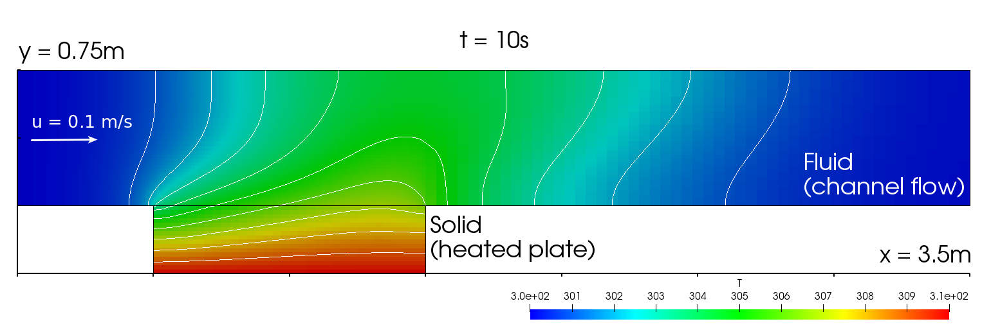
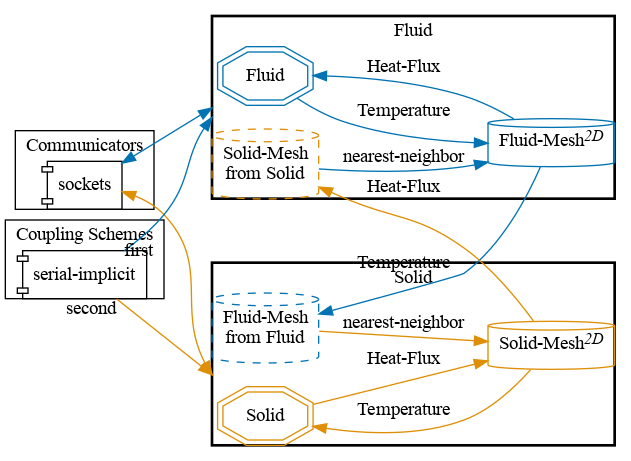
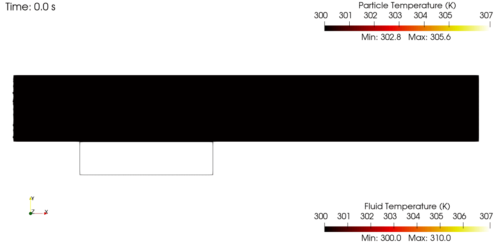


Get the [case files of this tutorial](https://github.com/precice/tutorials/tree/develop/flow-over-heated-plate-particles), as continuously rendered here, or see the [latest released version](https://github.com/precice/tutorials/tree/master/flow-over-heated-plate-particles) (if there is already one). Read how in the [tutorials introduction](https://precice.org/tutorials.html).


## Setup

This scenario consists of one fluid and one solid participant and it is inspired by Vynnycky et al. [1]. A fluid enters a channel with temperature $$ T_\infty $$, where it comes in contact with a solid plate. The plate is heated at its bottom and has a constant temperature of $$ T_{hot} $$. The scenario differs from the flow-over-heated-plate tutorial by adding a basicReactingCloud of particles to the fluid (OpenFOAM) participant.  



The test case is two-dimensional and a serial-implicit coupling with Aitken underrelaxation is used for the coupling.

Proper implicit coupling of Lagrangian particles involves not only accounting for existing particles in the domain during checkpointing, but also adjusting the particle injection logic for implicit coupling loops within time-windows as well. Particle injection is handled in OpenFOAM via injectionModels. injectionModels lie outside the OpenFOAM solver objectRegistry, so they cannot be directly modified by the existing OpenFOAM preCICE adapter functionObject. Therefore, the OpenFOAM preCICE adapter source code was modified to build an additional library, `libImplicitInjectors.so`. `libImplicitInjectors.so` contains "implicit" versions of the following existing OpenFOAM-native injectionModel types: patchInjection, coneNozzleInjection, and manualInjection. In practice, the user simply needs to make sure they have the `libImplicitInjectors.so` library loaded in their `system/ControlDict` file (alongside `libpreciceAdapterFunctionObject.so`) and then swap a native OpenFOAM injectionModel type (like patchInjection) for an "implicit" version (implicitPatchInjection) in the injectionModels sub-dictionary of their particle cloud file. The following table maps native OpenFOAM injectionModels to their corresponding "implicit" version:

| Native OpenFOAM | "implicit" verison |
| --------------- | ------------------ |
| patchInjection | implicitPatchInjection |
| coneNozzleInjection | implicitConeNozzleInjection |
| manualInjection | implicitManualInjection |

The inlet velocity is $$ u_{\infty} = 0.1 m/s $$, the inlet temperature is $$ T_{\infty} = 300K $$. The fluid and solid have the same thermal conductivities $$ k_S = k_F = 100 W/m/K $$. Further material properties of the fluid are its viscosity $$ \mu = 0.0002 kg/m/s $$ and specific heat capacity $$ c_p = 5000 J/kg/K $$. The Prandtl number $$ Pr = 0.01 $$ follows from thermal conductivity, viscosity and specific heat capacity. The solid has the thermal diffusivity $$ \alpha = 1 m^2/s $$. The gravitational acceleration is $$ g = 9.81 m/s^2 $$.

Particle properties were set to match the fluid: $$ rho = 1.0 kg/m^3 $$, $$ c_p = 5000 J/kg/K $$, $$ T_0 = 300 K $$, $$ U_0 = (0.4 0 0) m/s $$.  

## Configuration

preCICE configuration (image generated using the [precice-config-visualizer](https://precice.org/tooling-config-visualization.html)):



## Available solvers

By default, the fluid participant reads heat-flux values and the solid participant reads temperature values for the coupled simulation. The following participants are available:

Fluid participant:

* OpenFOAM (buoyantPimpleFoam). For more information, have a look at the [OpenFOAM adapter documentation](https://precice.org/adapter-openfoam-overview.html).

Solid participant:

* OpenFOAM (laplacianFoam). For more information, have a look at the [OpenFOAM adapter documentation](https://precice.org/adapter-openfoam-overview.html).

## Running the Simulation

All listed solvers can be used in order to run the simulation. Open two separate terminals and start the desired fluid and solid participant by calling the respective run script `run.sh` located in the participant directory. For example:

```bash
cd fluid-openfoam
./run.sh
```

and

```bash
cd solid-openfoam
./run.sh
```

## Post-processing

How to visualize the simulation results depends on the selected solvers. Most of the solvers generate VTK files which can visualized using ParaView or similar tools.
In case of OpenFOAM, you can open the `.foam` file with ParaView, or create VTK files with `foamToVTK`.

An example of the visualized expected results looks as follows:



## References

[1]  M. Vynnycky, S. Kimura, K. Kanev, and I. Pop. Forced convection heat transfer from a flat plate: the conjugate problem. International Journal of Heat and Mass Transfer, 41(1):45 – 59, 1998.


This offering is not approved or endorsed by OpenCFD Limited, producer and distributor of the OpenFOAM software via www.openfoam.com, and owner of the OPENFOAM®  and OpenCFD®  trade marks.

