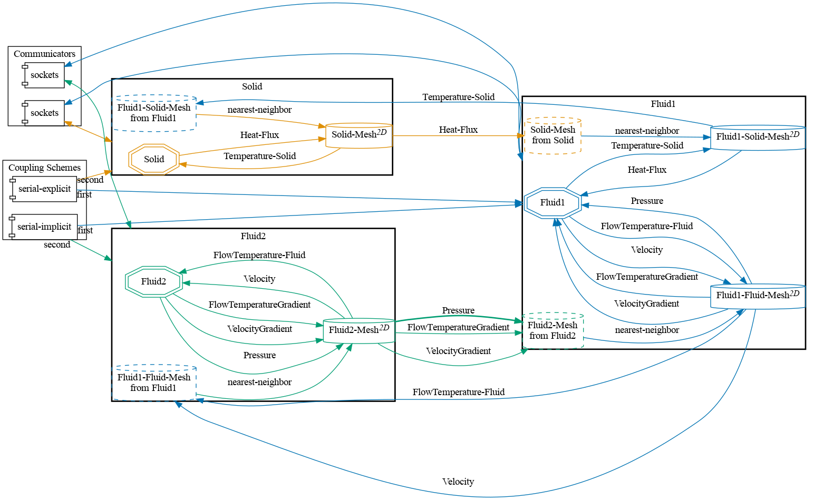


Get the [case files of this tutorial](https://github.com/precice/tutorials/tree/master/flow-over-heated-plate-partitioned-flow). Read how in the [tutorials introduction](https://www.precice.org/tutorials.html).


## Setup

The setup for this tutorial is similar to the [flow over a heated plate](https://www.precice.org/tutorials-flow-over-heated-plate.html). In this case we additionally partition the OpenFOAM fluid to create a three-way coupling using CHT (conjugate heat transfer) and FF (fluid-fluid coupling).

The test case is two-dimensional and uses a serial-implicit coupling with Quasi-Newton acceleration for the fluid-fluid coupling. The CHT coupling between the solid and the fluid2 participant is changed to serial-explicit because it does not make sense numerically to have multiple serial-implicit schemes.  
Note that it is usually recommended using the fully implicit parallel `coupling-scheme:multi` with more than two participants. (learn more about this [here](https://precice.org/configuration-coupling-multi.html)). However, in this basic example, it is sufficient to do the CHT coupling explicitly.

The flow partitioning is done with the fluid-fluid module of the [preCICE OpenFOAM adapter](https://www.precice.org/adapter-openfoam-overview.html). Because we use buoyantPimpleFoam we have to tell the adapter that the coupled pressure has the name `p_rgh`. The temperature is coupled at the fluid-solid interface by exchanging *Temperature* and *Heat-Flux*, at the fluid-fluid interface it is *FlowTemperature* and *FlowTemperatureGradient*. Note the difference in naming: *Temperature* is used for conjugate heat transfer and *FlowTemperature* for fluid-fluid coupling.

## Configuration

preCICE configuration (image generated using the [precice-config-visualizer](https://precice.org/tooling-config-visualization.html)):



## Available solvers

The following participants are available:

Fluid1 and Fluid2 participant:

* OpenFOAM (buoyantPimpleFoam). For more information, have a look at the [OpenFOAM adapter documentation](https://www.precice.org/adapter-openfoam-overview.html).

Solid participant:

* OpenFOAM (laplacianFoam). For more information, have a look at the [OpenFOAM adapter documentation](https://www.precice.org/adapter-openfoam-overview.html).

We only provide an OpenFOAM for the solid participant here, but other solvers would also work. See the standard [flow-over-heated-plate](https://precice.org/tutorials-flow-over-heated-plate.html) tutorial for other possible solid solvers.

## Running the Simulation

Open three separate terminals and start the OpenFOAM fluid participants and the solid participant by calling the respective run script `run.sh` located in the participant directory:

```bash
cd fluid1-openfoam
./run.sh
```

and

```bash
cd fluid2-openfoam
./run.sh
```

and

```bash
cd solid-openfoam
./run.sh
```

## Post-processing

Have a look at the [flow-over-heated-plate](https://www.precice.org/tutorials-flow-over-heated-plate.html) tutorial for the general aspects of post-processing.

An example of the visualized expected results looks as follows:


Observe that the temperature at the bottom of the plate is 310K and at the inlet 300K. On the interface, the temperature is between these values. An area of higher temperature is formed above the plate, which is shifted towards the front, driven by the flow.  
The below graph shows that the temperature is now coupled smoothly across both the solid-fluid and the fluid-fluid coupling interface.


The temperature is sampled along the black line seen in the inset image. It is compared to the values obtained from the basic flow-over-heated-plate tutorial case without the additional fluid-fluid coupling.


This offering is not approved or endorsed by OpenCFD Limited, producer and distributor of the OpenFOAM software via www.openfoam.com, and owner of the OPENFOAM®  and OpenCFD®  trade marks.

