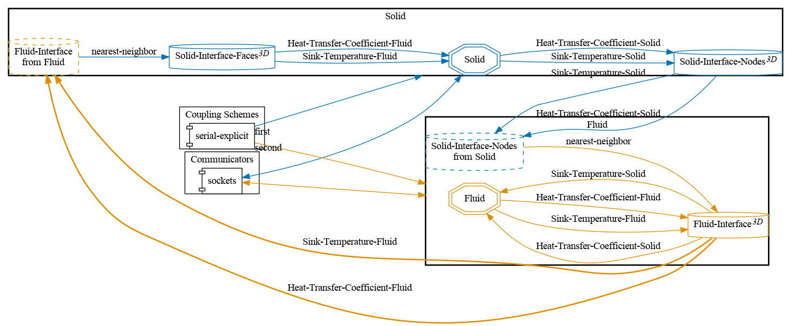


Get the [case files of this tutorial](https://github.com/precice/tutorials/tree/master/flow-over-heated-plate-steady-state). Read how in the [tutorials introduction](https://precice.org/tutorials.html).


## Setup

The setup for this tutorial is similar to the [flow over a heated plate](https://precice.org/tutorials-flow-over-heated-plate.html) using OpenFOAM. In this tutorial OpenFOAM is used as the solver for the fluid domain, and code_aster is the solver for the solid domain. A difference here is that we are using a steady-state OpenFOAM solver for demonstration purposes, therefore the results between the two tutorials are not comparable.


This is a pseudo-2D case, but we still set a 3D `solver-interface` in `precice-config.xml`, because the code_aster case is set up like this at the moment. Contributions here are particularly welcome!


## Configuration

preCICE configuration (image generated using the [precice-config-visualizer](https://precice.org/tooling-config-visualization.html)):

## Available solvers

Fluid participant:

* OpenFOAM. We use buoyantSimpleFoam instead of the transient buoyantPimpleFoam. For more information, have a look at the [OpenFOAM adapter documentation](https://precice.org/adapter-openfoam-overview.html).

Solid participant:

* code_aster. The [code_aster adapter documentation](https://precice.org/adapter-code_aster.html) is oriented on this tutorial case. In particular the described configuration settings.

## Running the Simulation

Open two separate terminals and start each participant by calling the respective `run.sh` script.

## Post-processing

Firstly, enable the ParaViS view in Salome-Meca by selecting the icon in the top of the screen.

For visualizing the results of the fluid solver, go to `File -> Open ParaView File` and select the `fluid-openfoam.foam` file. If you're asked to choose a reader, please select `OpenFOAMReader` and click `Apply` to visualize the result.

For visualizing the result of the solid solver, press again `Open ParaView File` and select the `output-..rmed` group. Again, click `Apply` to visualize the result. After setting the temperature scale for both domains to 300-310 K, the following result is given for timestep 200:

The `.rmed` file output from Code_Aster can be viewed using [GMSH](https://gmsh.info/). The result is as follows:


This offering is not approved or endorsed by OpenCFD Limited, producer and distributor of the OpenFOAM software via www.openfoam.com, and owner of the OPENFOAM®  and OpenCFD®  trade marks.

