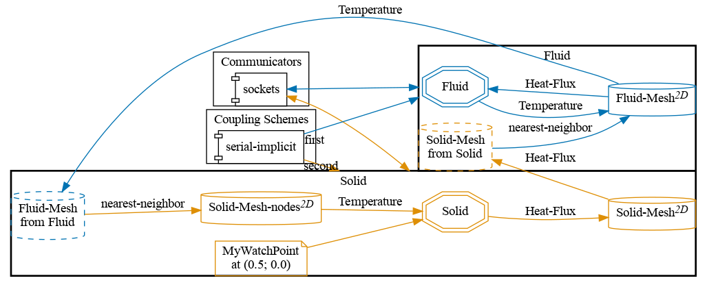


Get the [case files of this tutorial](https://github.com/precice/tutorials/tree/master/flow-over-heated-plate-calculix). Read how in the [tutorials introduction](https://www.precice.org/tutorials.html).


## Setup

The scenario is exactly the same as the one described in the [flow over heated plate tutorial](https://precice.org/tutorials-flow-over-heated-plate.html). However, this tutorial is specialized for the case when heat fluxes and temperatures live on different meshes. This is the case with CalculiX: heat fluxes are written on face centers, while temperatures are read on nodes. This requires updating the `precice-config.xml` file to take this into account. On the fluid side, a single mesh can still be used.

## Configuration

preCICE configuration (image generated using the [precice-config-visualizer](https://precice.org/tooling-config-visualization.html)):



## Available solvers

By default, the fluid participant reads heat-flux values and the solid participant reads temperature values for the coupled simulation. The following participants are available:

Fluid participant:

* OpenFOAM (buoyantPimpleFoam). For more information, have a look at the [OpenFOAM adapter documentation](https://www.precice.org/adapter-openfoam-overview.html).
* SU2 (copy the `fluid-su2` directory from the `flow-over-heated-plate` tutorial as-is). For more information, have a look at the [SU2 adapter docmentation](https://www.precice.org/adapter-su2.html).

Solid participant:

* CalculiX. For more information, have a look at the [CalculiX adapter documentation](https://precice.org/adapter-calculix-overview.html). Be sure to use at least version 2.19.1 of the adapter.

## Running the Simulation

Open two separate terminals and start the desired fluid and solid participant by calling the respective run script `run.sh` located in the participant directory. For example:

```bash
cd fluid-openfoam
./run.sh
```

and

```bash
cd solid-calculix
./run.sh
```

## Post-processing

On the OpenFOAM side, you can open the `.foam` file with ParaView, or create VTK files with `foamToVTK`. CalculiX outputs `.frd` files which can be opened with `cgx` or converted into VTK files using the converter available in the adapter repository.

CalculiX produces 1000 result files, which one can then synchronize with OpenFOAM using the "Temporal Shift Scale" filter on the CalculiX results, using a scale of 0.01. This is because CalculiX considers that each time window (of length 0.01 by default) is one time step, and increases the total time by 1 in the VTK files. Since the two datasets use different data names for temperature, just use the same scale for temperature on both outputs (from 300K to 310K, which should be the minimum and maximum values in this setup). Alternatively, apply a "Calculator" filter on the CalculiX results, creating a variable `T` as a point data field with values from `NDTEMP_T`, and then group the two data sets.


This offering is not approved or endorsed by OpenCFD Limited, producer and distributor of the OpenFOAM software via www.openfoam.com, and owner of the OPENFOAM®  and OpenCFD®  trade marks.

