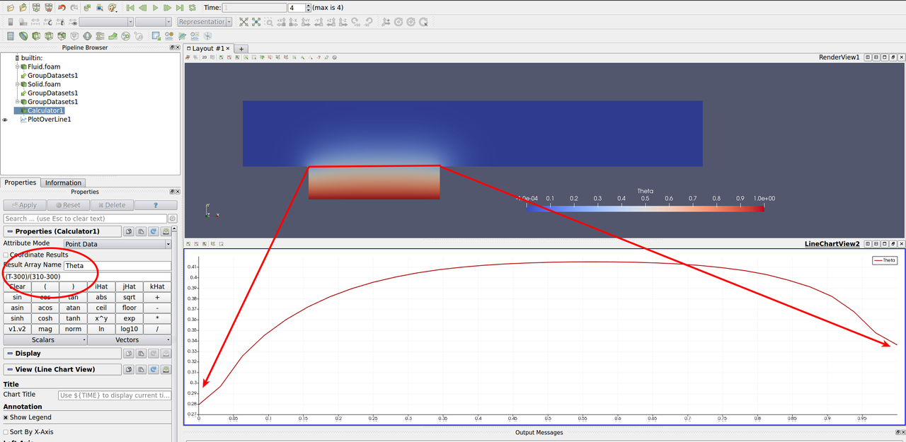
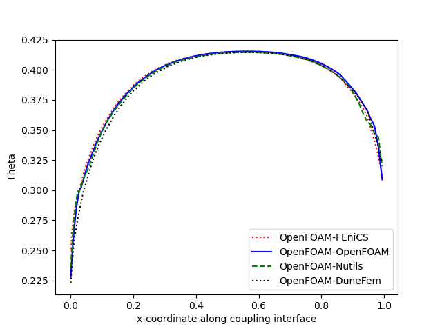



## Setup

This scenario consists of one fluid and one solid participant and it is inspired by Vynnycky et al. [1]. A fluid enters a channel with temperature $$ T_\infty $$, where it comes in contact with a solid plate. The plate is heated at its bottom and has a constant temperature of $$ T_{hot} $$.


The test case is two-dimensional and a serial-implicit coupling with Aitken underrelaxation is used for the coupling.

The inlet velocity is $$ u_{\infty} = 0.1 m/s $$, the inlet temperature is $$ T_{\infty} = 300K $$. The fluid and solid have the same thermal conductivities $$ k_S = k_F = 100 W/m/K $$. Further material properties of the fluid are its viscosity $$ mu = 0.0002 kg/m/s $$ and specific heat capacity $$ c_p = 5000 J/kg/K $$. The Prandtl number $$ Pr = 0.01 $$ follows from thermal conductivity, viscosity and specific heat capacity. The solid has the thermal diffusivity $$ \alpha = 1 m^2/s $$. The gravitational acceleration is $$ g = 9.81 m/s^2 $$.

## Available solvers

By default, the fluid participant reads heat-flux values and the solid participant reads temperature values for the coupled simulation. The following participants are available:

Fluid participant:

* OpenFOAM (buoyantPimpleFoam). For more information, have a look at the [OpenFOAM adapter documentation](https://www.precice.org/adapter-openfoam-overview.html).

Solid participant:

* OpenFOAM (laplacianFoam). For more information, have a look at the [OpenFOAM adapter documentation](https://www.precice.org/adapter-openfoam-overview.html).

* FEniCS. For more information, have a look at the [FeniCS adapter documentation](https://www.precice.org/adapter-fenics.html).

* Nutils. For more information, have a look at the [Nutils adapter documentation](https://precice.org/adapter-nutils.html).

## Running the Simulation

All listed solvers can be used in order to run the simulation. Open two separate terminals and start the desired fluid and solid participant by calling the respective run script `run.sh` located in the participant directory. For example:

```bash
cd fluid-openfoam
./run.sh
```

and

```bash
cd solid-fenics
./run.sh
```

in order to use OpenFOAM and FEniCS for this test case. Feel free to try different combinations, they should all run and give approximately similar results.

## Post-processing

How to visualize the simulation results depends on the selected solvers. Most of the solvers generate VTK files which can visualized using ParaView or similar tools.
In case of OpenFOAM, you can open the `.foam` file with ParaView, or create VTK files with `foamToVTK`.

An example of the visualized expected results looks as follows:


Observe that the temperature at the bottom of the plate is 310K and at the inlet 300K. On the interface, the temperature is between these values. An area of higher temperature is formed above the plate, which is shifted towards the front, driven by the flow.

You may use additional filters, such as the Calculator and the Plot Over Line, to obtain the distribution of the non-dimensional temperature $$ (T-T_{inlet})/(T_{solid}-T_{inlet}) $$:



### Compare results

First generate the output for each run by adding export to the participant `Solid` in `precice-config.xml`:

```xml
<participant name="Solid">
  <export:vtk directory="preCICE-output" />
  <use-mesh name="Fluid-Mesh" from="Fluid" />
  <use-mesh name="Solid-Mesh" provide="yes" />
  ...
</participant>
```

After that running a case from this tutorial will export data into `solid-*/preCICE-output`. To visualize and compare these results run `python3 plot-final-interface-temperature.py` (You can install the required python packages by running `pip3 install -r plot-final-interface-temperature-requirements.txt`). This will plot the dimensionless temperature `theta = (T-300)/(310-300)` (with `T` being the temperature) across the coupling interface, i.e. where the solid and the fluid meet and exchange heat. The x-axis shows the x coordinate and the y-axis the dimensionless temperature `theta` at the interface. If you want to exclude certain cases, simply comment out the corresponding lines in the script. For reference see below:



## References

[1]  M. Vynnycky, S. Kimura, K. Kanev, and I. Pop. Forced convection heat transfer from a flat plate: the conjugate problem. International Journal of Heat and Mass Transfer, 41(1):45 – 59, 1998.


