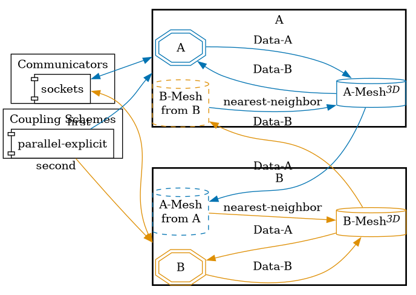


Get the [case files of this tutorial](https://github.com/precice/tutorials/tree/master/growing-mesh). Read how in the [tutorials introduction](https://precice.org/tutorials.html).


## Motivation

This case is an extremely simplified version of the scenario presented by Jean-Marc Gratien during Coupled 2023 *Implementing a Comprehensive Hydromechanical Model for Sedimentary Basins by Coupling a 3D Mechanical Code to a Classic Basin Fluid Flow Code with the PreCICE Library*.

In the original scenario a hydrogeological and a geomechanical model are coupled via preCICE using an implicit coupling schemes.
The scheme iterates until both model agree on effective stress.
At fixed points in time, geological events deposit new layers onto the mesh, effectively growing the mesh into z-direction.

This tutorial aims to implement such a growing mesh scenario without the implicit coupling.

## Setup

The problem consists of a unit-square uniformly discretized by 512 x 512 nodes.
The unit square is partitioned among the ranks of a solver according to an n x m grid, where 512 must be divisible by n and m.
The mesh starts with 2 nodes in z direction and at a given frequency, 2 nodes are added to the mesh, changing only the load per rank, not the partitioning.

## Configuration

preCICE configuration (image generated using the [precice-config-visualizer](https://precice.org/tooling-config-visualization.html)):



## Available solvers

There is a generic python solver that can be used for either A or B.

The runs scripts in participant folders `A` and `B` accept the amount of ranks as an optional parameter.

## Running the Simulation

Pass the amount of ranks to the run script of the solvers.
Not passing a number, runs the simulation on a single rank.
To run both on a two rank each, use:

```bash
cd A
./run.sh 2
```

and

```bash
cd B
./run.sh 2
```
