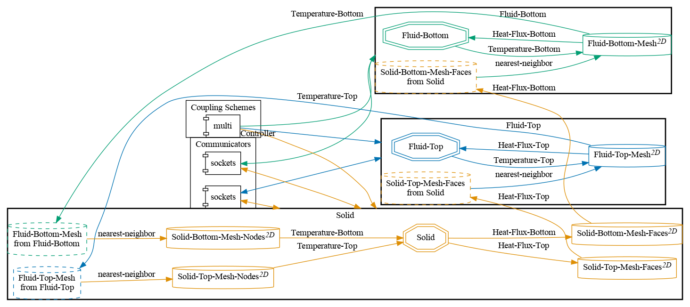


Get the [case files of this tutorial](https://github.com/precice/tutorials/tree/master/heat-exchanger-simplified). Read how in the [tutorials introduction](https://www.precice.org/tutorials.html).


## Setup

This tutorial extends the [flow over heated plate: Two meshes](https://precice.org/tutorials-flow-over-heated-plate-two-meshes.html) tutorial, adding another channel flow below the plate. The plate is not heated in this scenario, but is acting as a conducting material for the two fluids, serving as a simplified heat exchanger example.

Contrary to the [heat exchanger](https://precice.org/tutorials-heat-exchanger.html) tutorial, which defines Robin-Robin coupling, this case defines a Dirichlet-Neumann coupling, exchanging temperature (from the fluids to the solid) and heat flux (from the solid to the fluids). Additionally, instead of composing two explicit coupling schemes, this tutorial uses a fully-implicit multi-coupling scheme and is transient.

## Configuration

preCICE configuration (image generated using the [precice-config-visualizer](https://precice.org/tooling-config-visualization.html)):



## Available solvers

Fluid participants:

* OpenFOAM (buoyantPimpleFoam). For more information, have a look at the [OpenFOAM adapter documentation](https://www.precice.org/adapter-openfoam-overview.html).

Solid participant:

* CalculiX. For more information, have a look at the [CalculiX adapter documentation](https://precice.org/adapter-calculix-overview.html). Be sure to use at least version 2.19.1 of the adapter.

## Running the Simulation

Open two separate terminals and start the desired fluid and solid participant by calling the respective run script `run.sh` located in the participant directory. For example:

```bash
cd fluid-top-openfoam
./run.sh
```

and

```bash
cd fluid-bottom-openfoam
./run.sh
```

to run the fluid participants, as well as

```bash
cd solid-calculix
./run.sh
```

to run the solid participant (which is also controlling the coupling).

## Post-processing

Similarly to the [flow over heated plate: Two meshes](https://precice.org/tutorials-flow-over-heated-plate-two-meshes.html) tutorial.



This offering is not approved or endorsed by OpenCFD Limited, producer and distributor of the OpenFOAM software via www.openfoam.com, and owner of the OPENFOAM®  and OpenCFD®  trade marks.

