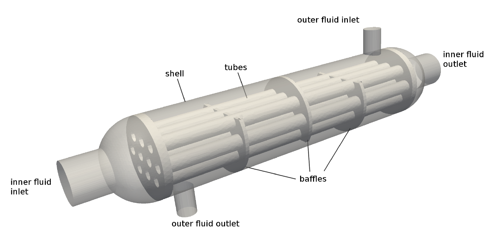
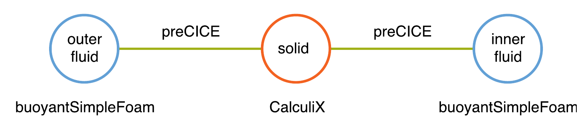
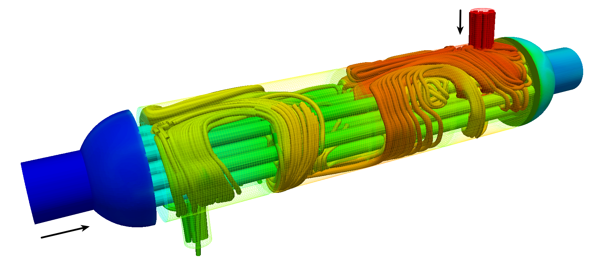



This tutorial describes how to run a conjugate heat transfer simulation with two separate OpenFOAM solvers and CalculiX. The files for this tutorial are located in this repository (directory CHT/heat_exchanger).

This tutorial is based on [a case](https://www.simscale.com/projects/cheunglucia/heat_exchanger_-_cht_simulation/) prepared with [SimScale](https://www.simscale.com/) by [Lucia Cheung Yau](https://github.com/ludcila) for her [Master's Thesis](https://www5.in.tum.de/pub/Cheung2016_Thesis.pdf).

## Setup

This scenario consists of two fluid and one solid participant and represents a [shell-and-tube heat exchanger](https://en.wikipedia.org/wiki/Shell_and_tube_heat_exchanger). The geometry includes an (adiabatic) shell, in which an _inner fluid_ flows. It enters from the top-right inlet and exits from the bottom-left, after getting redirected several times by baffles. The geometry also includes a set of tubes, in which an _outer fluid_ flows from left to right. The two fluids enter in different temperatures and exchange heat through the (thick) solid walls of the tubes. This is a steady-state simulation and the flow is considered laminar.

We define the participants `Inner-Fluid`, `Solid`, and `Outer-Fluid` and two interfaces: one between the `Inner-Fluid` and `Solid` and one between the `Solid` and `Outer-Fluid`. Parallel-explicit coupling is used on both interfaces as pseudo timestepping to reach steady-state. We use nearest-neighbor mapping between all meshes. The OpenFOAM participants can either be executed in serial, or in parallel.

## Available solvers

* OpenFOAM. `buoyantSimpleFoam` is used for fluid flow (both participants). This is a solver for steady-state, buoyant, turbulent flow of compressible fluids for ventilation and heat transfer. For more information, have a look at the [OpenFOAM adapter documentation](https://www.precice.org/adapter-openfoam-overview.html).

* CalculiX. For more information, have a look at the [CalculiX adapter documentation](https://www.precice.org/adapter-calculix-overview.html).

## Running the Simulation



Before starting the simulation for the first time you need to download the mesh files and copy them into the appropriate location. The shell script `./download-meshes.sh` will handle these things automatically. Afterwards, the simulation setup is ready to run.

In order to run the coupled simulation, you can simply step into the participant directories and execute`./run.sh` (or `./run.sh -parallel` for running a fluid participant in parallel). The simulation will need several minutes or up to an hour on a laptop to end (t=500). Before repeating the simulation, you can use the `clean-tutorial.sh` script to clean-up any previous results and log files.

## Post-processing

After the first results are written (a new time directory will be created), you may visualize the results.

For the OpenFOAM results, you can use ParaView and open the allready-provided `fluid-inner-openfoam.foam` and `fluid-outer-openfoam.foam` files. You can then group the two cases and visualize them together.

Unfortunately, ParaView does not support CalculiX result files. You may see the results in CGX or convert them using 3rd-party tools.


