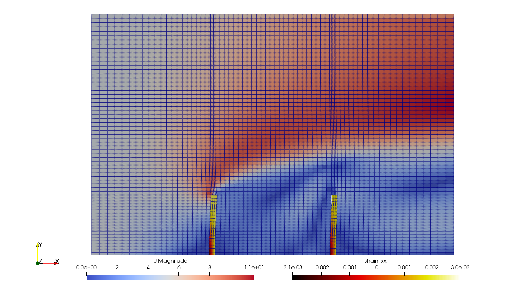



## Case Setup

In the following tutorial we model a fluid flowing through a channel. Two solid, elastic flaps are fixed to the floor of this channel. The flaps oscillate due to the fluid pressure building up on its surface. In this case, a fluid and two solids are coupled together using a fully-implicit multi-coupling scheme. The case setup is shown here:


The simulated flow domain is 6 units long (x) and 4 units tall (z). The flaps are clamped at the bottom (z=0) and they are 1 unit tall (z), 0.1 units long (x), and 0.3 units wide (y). Being located at x=-1 and x=1, the flaps split the domain into three equal parts.

This is a quasi-2D simulation, with one cell in width and empty conditions are imposed on the front and back.

The inflow velocity is 5 m/s (uniform) on the left boundary.
At the outlet, pressure is set to zero and velocity to `zeroGradient`.
The top, bottom and flap are walls with a `noslip` condition.

For a case showing fluid-structure interaction only (no multi-coupling), take a look at the [single perpendicular flap tutorial](https://www.precice.org/tutorials-perpendicular-flap.html).

## Why multi-coupling?

This is a case with three participants: the fluid and each flap. In preCICE, there are two options to [couple more than two participants](https://www.precice.org/configuration-coupling-multi.html). The first option a composition of bi-coupling schemes, in which we must specify the exchange of data in a participant to participant manner. However, such a composition is not suited for combining multiple strong fluid-structure interations [1]. Thus, in this case, we use the second option, fully-implicit multi-coupling.

We can set this in our `precice-config.xml`:

```xml
<coupling-scheme:multi>
  <participant name="Fluid" control="yes"/>
   <participant name="Solid1" />
   <participant name="Solid2" />
```

The participant that has the control is the one that it is connected to all other participants. This is why we have chosen the fluid participant for this task.

## About the Solvers

For the fluid participant we use OpenFOAM. In particular, we use the application `pimpleFoam`. The geometry of the Fluid participant is defined in the file `Fluid/system/blockMeshDict`. Besides, we must specify where are we exchanging data with the other participants. The interfaces are set in the file `Fluid/system/preciceDict`. In this file, we set to exchange stress and displacement on the surface of each flap.

Most of the coupling details are specified in the file `precide-config.xml`. Here we estipulate the order in which we read/write data from one participant to another or how we map from the fluid to the solid's mesh. In particular, we have choosen the nearest-neighbor mapping scheme.

For the simulation of the solid participants we use the deal.II adapter. In deal.II, the geometry of the domain is specified directly on the solver. The two flaps in our case are essentially the same but for the x-coordinate. The flap geometry is given to the solver when we select the scenario in the '.prm' file.

```text
set Scenario            = PF
```

But to specify the position of the flap along the x-axis, we must specify it in the `Solid1/linear_elasticity.prm` file as follows:

```text
set Flap location     = -1.0
```

While in case of `Solid2/linear_elasticity.prm` we write:

```text
set Flap location     = 1.0
```

The scenario settings are implemented similarly for the nonlinear case.

## Running the Simulation

1. Preparation:
   To run the coupled simulation, copy the deal.II executable `linear_elasticity` or `nonlinear_elasticity` into the main folder. To learn how to obtain the deal.II executable take a look at the description on the  [deal.II-adapter page](https://www.precice.org/adapter-dealii-overview.html).
2. Starting:

   We are going to run each solver in a different terminal. It is important that first we navigate to the simulation directory so that all solvers start in the same directory.
   To start the `Fluid` participant, run:

   ```bash
   cd fluid-openfoam
   ./run.sh
   ```

   to start OpenFOAM in serial or

   ```bash
   cd fluid-openfoam
   ./run.sh -parallel
   ```

   for a parallel run.

   The solid participants are only designed for serial runs. To run the `Solid1` participant, execute the corresponding deal.II binary file e.g. by:

   ```bash
   cd solid-left-dealii
   ./run.sh -linear
   ```

   Finally, in the third terminal we will run the solver for the `Solid2` participant by:

   ```bash
   cd solid-right-dealii
   ./run.sh -linear
   ```

   In case we want to run the nonlinear case, simply replace the flag`-linear` by `-nonlinear`.

## Postprocessing

After the simulation has finished, you can visualize your results using e.g. ParaView. Fluid results are in the OpenFOAM format and you may load the `fluid-openfoam.foam` file. Looking at the fluid results is enough to obtain information about the behaviour of the flaps. You can also visualize the solid participants' vtks though.



## References

<!-- markdownlint-configure-file {"MD034": false } -->
[1] H. Bungartz, F. Linder, M. Mehl, B. Uekermann. A plug-and-play coupling approach for parallel multi-field simulations. _Comput Mech_ **55**, 1119-1129 (2015). https://doi.org/10.1007/s00466-014-1113-2


