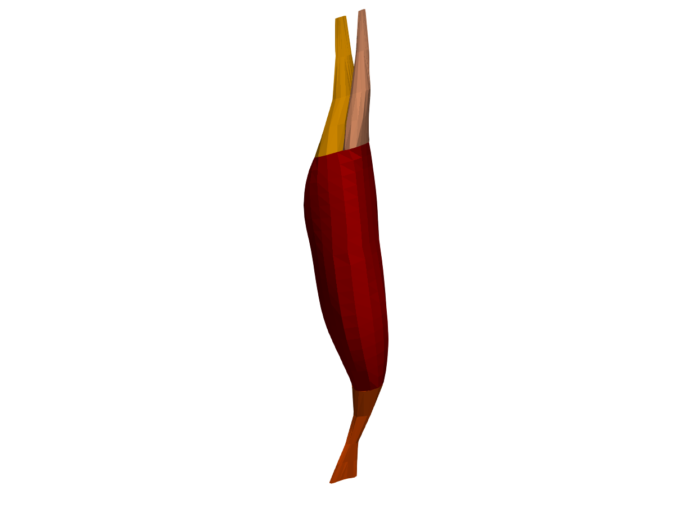
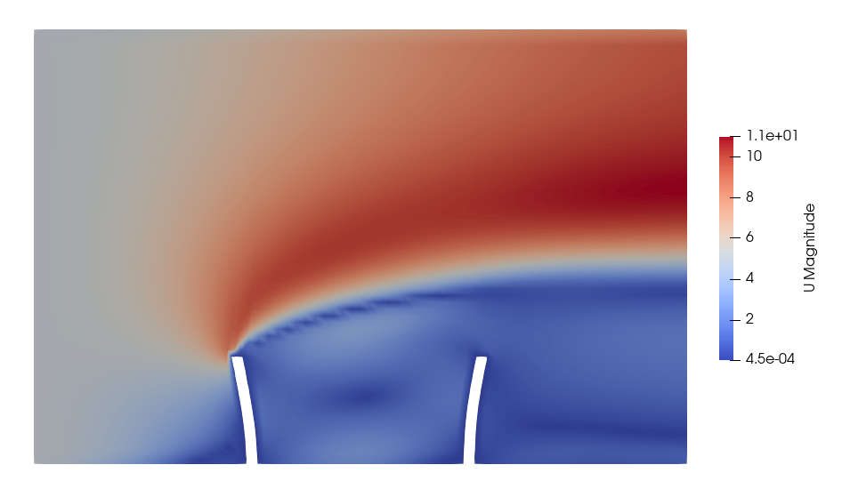


Get the [case files of this tutorial](https://github.com/precice/tutorials/tree/master/muscle-tendon-complex). Read how in the [tutorials introduction](https://www.precice.org/tutorials.html).


## Case Setup

In the following tutorial we model the contraction of a muscle, in particular, the biceps. The biceps is attached to the bones by three tendons (one at the bottom and two at the top). We enforce an activation in the muscle which results in its contraction. The tendons move as a result of the muscle contraction. In this case, a muscle and three tendons are coupled together using a fully-implicit multi-coupling scheme. The case setup is shown here:

 

The muscle participant (in red), is connected to three tendons. The muscle sends traction values to the tendons, which send displacement and velocity values back to the muscle. The end of each tendon which is not attached to the muscle is fixed by a dirichlet boundary condition (in reality, it would be fixed to the bones).

The muscle and tendon meshes are obtained from patient imaging. The interfaces of the tendons and the muscle do not perfectly match, which is a quite common issue due to the limitations of imaging methods and postprocessing tools. Nonetheless, preCICE coupling methods are robust and can handle meshes that do not match perfectly. 


TODO: how is the muscle activated!

TODO: Add related case? multiple-perpendicular flap?

## Why multi-coupling?

This is a case with four participants: the muscle and each tendon. In preCICE, there are two options to [couple more than two participants](https://www.precice.org/configuration-coupling-multi.html). The first option is a composition of bi-coupling schemes, in which we must specify the exchange of data in a participant to participant manner. However, such a composition is not suited for combining multiple strong fluid-structure interactions [1]. Thus, in this case, we use the second option, fully-implicit multi-coupling.

We can set this in our `precice-config.xml`:

```xml
<coupling-scheme:multi>
   <participant name="Muscle" control="yes"/>
   <participant name="Tendon-Bottom"/>
   <participant name="Tendon-Top-A"/>
   <participant name="Tendon-Top-B"/>
    
```

The participant that has the control is the one that it is connected to all other participants. This is why we have chosen the muscle participant for this task.

## About the Solvers TODO

For the fluid participant we use OpenFOAM. In particular, we use the application `pimpleFoam`. The geometry of the Fluid participant is defined in the file `Fluid/system/blockMeshDict`. Besides, we must specify where are we exchanging data with the other participants. The interfaces are set in the file `Fluid/system/preciceDict`. In this file, we set to exchange stress and displacement on the surface of each flap.

Most of the coupling details are specified in the file `precice-config.xml`. Here we estipulate the order in which we read/write data from one participant to another or how we map from the fluid to the solid's mesh. In particular, we have chosen the nearest-neighbor mapping scheme.

For the simulation of the solid participants we use the deal.II adapter. In deal.II, the geometry of the domain is specified directly on the solver. The two flaps in our case are essentially the same but for the x-coordinate. The flap geometry is given to the solver when we select the scenario in the '.prm' file.

```text
set Scenario            = PF
```

But to specify the position of the flap along the x-axis, we must specify it in the `solid-upstream-dealii/parameters.prm` file as follows:

```text
set Flap location     = -1.0
```

While in case of `solid-downstream-dealii/parameters.prm` we write:

```text
set Flap location     = 1.0
```

The scenario settings are implemented similarly for the nonlinear case.

## Running the Simulation TODO

1. Preparation:
   To run the coupled simulation, copy the deal.II executable `elasticity` into the main folder. To learn how to obtain the deal.II executable take a look at the description on the  [deal.II-adapter page](https://www.precice.org/adapter-dealii-overview.html).
2. Starting:

   We are going to run each solver in a different terminal. It is important that first we navigate to the simulation directory so that all solvers start in the same directory.
   To start the `Fluid` participant, run:

   ```bash
   cd fluid-openfoam
   ./run.sh
   ```

   to start OpenFOAM in serial or

   ```bash
   cd fluid-openfoam
   ./run.sh -parallel
   ```

   for a parallel run.

   The solid participants are only designed for serial runs. To run the `Solid-Upstream` participant, execute the corresponding deal.II binary file e.g. by:

   ```bash
   cd solid-upstream-dealii
   ./run.sh
   ```

   Finally, in the third terminal we will run the solver for the `Solid-Downstream` participant by:

   ```bash
   cd solid-downstream-dealii
   ./run.sh
   ```

## Postprocessing TODO

After the simulation has finished, you can visualize your results using e.g. ParaView. Fluid results are in the OpenFOAM format and you may load the `fluid-openfoam.foam` file. Looking at the fluid results is enough to obtain information about the behaviour of the flaps. You can also visualize the solid participants' vtks though.



## References TODO

<!-- markdownlint-configure-file {"MD034": false } -->
[1] H. Bungartz, F. Linder, M. Mehl, B. Uekermann. A plug-and-play coupling approach for parallel multi-field simulations. _Comput Mech_ **55**, 1119-1129 (2015). https://doi.org/10.1007/s00466-014-1113-2


This offering is not approved or endorsed by OpenCFD Limited, producer and distributor of the OpenFOAM software via www.openfoam.com, and owner of the OPENFOAM®  and OpenCFD®  trade marks.

