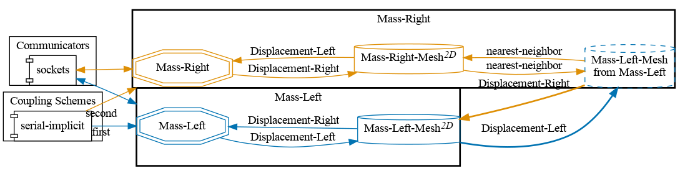


Get the [case files of this tutorial](https://github.com/precice/tutorials/tree/master/oscillator-overlap). Read how in the [tutorials introduction](https://precice.org/tutorials.html).


## Setup

This tutorial solves the same problem as the [oscillator tutorial](https://precice.org/tutorials-oscillator.html), but applies a different domain decomposition strategy. See the oscillator tutorial for details on the general setup. The partitioning of the mass-spring system is shown here:


Note that this case applies an overlapping Schwarz-type coupling method and not (like most other tutorials in this repository) a Dirichlet-Neumann coupling. This results in a symmetric setup of the solvers. We will refer to the solver computing the trajectory of $m_1$ as `Mass-Left` and to the solver computing the trajectory of $m_2$ as `Mass-Right`. For more information, please refer to [1].

## Configuration

preCICE configuration (image generated using the [precice-config-visualizer](https://precice.org/tooling-config-visualization.html)):



## Available solvers

This tutorial is only available in Python. You need to have preCICE and the Python bindings installed on your system.

- *Python*: An example solver using the preCICE [Python bindings](https://precice.org/installation-bindings-python.html). This solver also depends on the Python libraries `numpy`, which you can get from your system package manager or with `pip3 install --user <package>`.

## Running the Simulation

### Python

Open two separate terminals and start both participants by calling:

```bash
cd python
./run.sh -l
```

and

```bash
cd python
./run.sh -r
```
