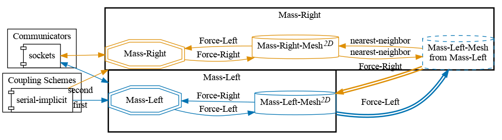
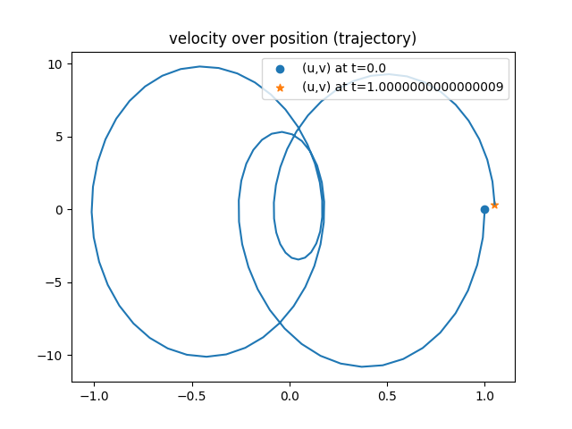


Get the [case files of this tutorial](https://github.com/precice/tutorials/tree/master/oscillator). Read how in the [tutorials introduction](https://precice.org/tutorials.html).


## Setup

This tutorial solves a simple mass-spring oscillator with two masses and three springs. The system is cut at the middle spring and solved in a partitioned fashion:


Note that this case applies a Schwarz-type coupling method and not (like most other tutorials in this repository) a Dirichlet-Neumann coupling. This results in a symmetric setup of the solvers. We will refer to the solver computing the trajectory of $m_1$ as `Mass-Left` and to the solver computing the trajectory of $m_2$ as `Mass-Right`. For more information, please refer to [1].

## Configuration

preCICE configuration (image generated using the [precice-config-visualizer](https://precice.org/tooling-config-visualization.html)):



## Available solvers

There are two different implementations:

- *Python*: A solver using the preCICE [Python bindings](https://precice.org/installation-bindings-python.html). This solver also depends on the Python libraries `numpy`, which you can get from your system package manager or with `pip3 install --user <package>`. Using the option `-ts` allows you to pick the time stepping scheme being used. Available choices are Newmark beta, generalized alpha, explicit Runge Kutta 4, and implicit RadauIIA. The solver uses subcycling: Each participant performs 4 time steps in each time window. The data of these 4 substeps is then used by preCICE to create a third order B-spline interpolation (`waveform-degree="3"` in `precice-config.xml`).
- *FMI*: A solver using the [preCICE-FMI runner](https://github.com/precice/fmi-runner) (requires at least v0.2). The Runner executes the FMU model `Oscillator.fmu` for computation. The provided run scripts (see below) build this model if not already there. For more information, please refer to [2].

## Running the simulation

Open two separate terminals and start both participants. For example, you can run a simulation where the left participant is computed in Python and the right participant is computed with FMI with these commands:

```bash
cd mass-left-python
./run.sh
```

and

```bash
cd mass-right-fmi
./run.sh
```

Of course, you can also use the same solver for both sides.

## Post-processing

Each simulation run creates two files containing position and velocity of the two masses over time. These files are called `trajectory-Mass-Left.csv` and `trajectory-Mass-Right.csv`. You can use the script `plot-trajectory.py` for post-processing. Type `python3 plot-trajectory --help` to see available options. You can, for example, plot the trajectory of the left mass of the Python solver by running

```bash
python3 plot-trajectory.py mass-left-python/output/trajectory-Mass-Left.csv TRAJECTORY
```

The solvers allow you to study the effect of different time stepping schemes on energy conservation. Newmark beta conserves energy:


Generalized alpha does not conserve energy:



For details, refer to [1].

## References

[1] V. Schüller, B. Rodenberg, B. Uekermann and H. Bungartz, A Simple Test Case for Convergence Order in Time and Energy Conservation of Black-Box Coupling Schemes, in: WCCM-APCOM2022. [URL](https://www.scipedia.com/public/Rodenberg_2022a)

[2] L. Willeke, D. Schneider and B. Uekermann, A preCICE-FMI Runner to Couple FMUs to PDE-Based Simulations, Proceedings 15th Intern. Modelica Conference, 2023. [DOI](https://doi.org/10.3384/ecp204479)
