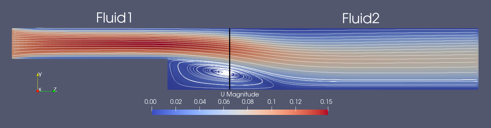
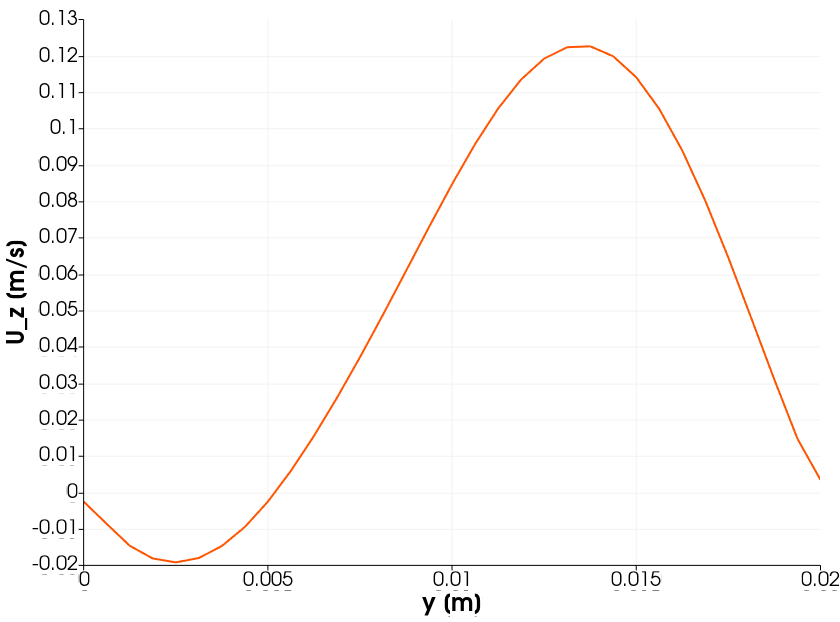


Get the [case files of this tutorial](https://github.com/precice/tutorials/tree/master/partitioned-backwards-facing-step). Read how in the [tutorials introduction](https://www.precice.org/tutorials.html).


## Setup

This scenario consists of two incompressible fluid solvers in series. The case is a two-dimensional flow over a backwards facing step. Fluid1 consists of an incoming channel that opens into a bigger one over a sudden step. Fluid2 is the remaining part of the bigger channel, where the flow develops behind the step. The fluid will develop a recirculation region behind the step which will also expand across the coupling interface

The key point of this tutorial is the demonstration of custom inlet-outlet OpenFOAM boundary conditions for velocity and pressure. These can dynamically switch their behavior according to the underlying flow direction.
The boundary conditions `coupledVelocity` and `coupledPressure` come with the preCICE OpenFOAM adapter and can be set in the corresponding start time dictionaries for velocity and pressure.

## Configuration

preCICE configuration (image generated using the [precice-config-visualizer](https://precice.org/tooling-config-visualization.html)):


## Available solvers

* OpenFOAM (pimpleFoam) for both participants. For more information, have a look at the [OpenFOAM adapter documentation](https://www.precice.org/adapter-openfoam-overview.html).

## Running the Simulation

Open two separate terminals and start the desired fluid1 and fluid2 participants by calling the respective run script. For example:

```bash
cd fluid1-openfoam
./run.sh
```

and

```bash
cd fluid2-openfoam
./run.sh
```

## Post-processing

The OpenFOAM solvers generate a `.foam` file each. You can open this file in ParaView.
An example of the visualized expected results at $t=3.0s$ looks as follows:



We observe that the velocity and pressure values are smooth across the interface. Going through different time steps, we can also see how our inlet-outlet boundary conditions accurately changed behavior when the recirculation travelled inside the coupling interface.

Plotting the velocity in z-direction over the coupling interface at $t=2.5s$ shows a smooth transition from negative to positive values:




This offering is not approved or endorsed by OpenCFD Limited, producer and distributor of the OpenFOAM software via www.openfoam.com, and owner of the OPENFOAM®  and OpenCFD®  trade marks.

