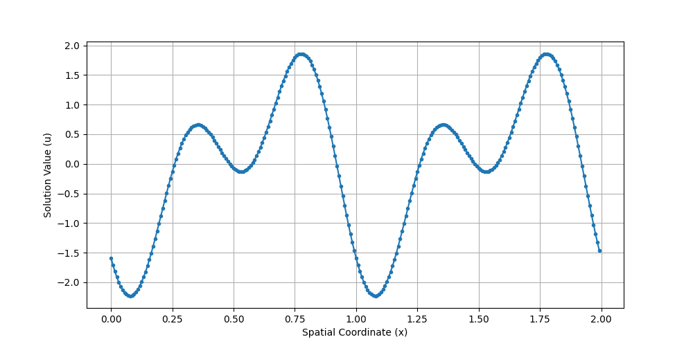


Get the [case files of this tutorial](https://github.com/precice/tutorials/tree/master/partitioned-burgers-1d). Read how in the [tutorials introduction](https://precice.org/tutorials.html).


## Setup

We solve the 1D viscous Burgers' equation on the domain $[0,2]$ using a partitioned approach. The domain is split at $x=1$ into two participants:

- **Dirichlet**: Solves the left half $[0,1]$ and receives Dirichlet boundary conditions at the interface.
- **Neumann**: Solves the right half $[1,2]$ and receives Neumann boundary conditions at the interface.

Both outer boundaries use zero-gradient conditions. The problem is solved for different initial conditions of superimposed sine waves, which can be generated using the provided script.

<p align="center">
  
  <br><em>Initial condition used for the simulation (seed 0, see <code>generate_ic.py</code>)</em>
</p>

The Burgers' equation `solver-scipy` is implemented in a first-order finite volume code using Lax-Friedrichs fluxes and implicit Euler time stepping.

This tutorial includes two versions for the Neumann participant:
- A standard finite volume solver (`neumann-scipy`).
- A pre-trained neural network surrogate that approximates the solver (`neumann-surrogate`).


## Configuration

preCICE configuration (image generated using the [precice-config-visualizer](https://precice.org/tooling-config-visualization.html)):

<p align="center">
  
</p>


## Running the tutorial

### Initial condition 

Before running the participants, you must generate the initial condition file. From the root of the tutorial folder, run the command and replace `<seed>` with any integer.:

```bash
python3 generate_ic.py --epoch <seed>
```

This script requires the Python libraries `numpy` and `matplotlib`. It generates the initial condition file `initial_condition.npz` used by both participants. If you do not have the dependencies, then you can run either of the participant run scripts to create a Python virtual environment with the required packages and try again. 

Or, simply, run the helper scripts (see below), which will also generate the initial condition file if it does not exist.

---

#### Helper scripts

There are helper scripts that automate runs and visualization of both participants. They also accept an integer seed argument to specify the initial condition.

```bash
run-partitioned-scipy.sh
```

and

```bash
run-partitioned-surrogate.sh
```

### Running the participants

To run the partitioned simulation, open two separate terminals and start each participant individually:

You can find the corresponding `run.sh` script for running the case in the folders corresponding to the participant you want to use:

```bash
cd dirichlet-scipy
./run.sh
```

and

```bash
cd neumann-scipy
./run.sh
```

or, to use the pretrained neural network surrogate participant:

```bash
cd neumann-surrogate
./run.sh
```

**Note:** The surrogate participant requires PyTorch and related dependencies, which requires several gigabytes of disk space.

### Monolithic solution (reference)

You can run the whole domain using the monolithic solver for comparison:

```bash
cd solver-scipy
./run.sh
```


 
## Visualization

After both participants (and/or monolithic simulation) have finished, you can run the visualization script.
`visualize_partitioned_domain.py` generates plots comparing the partitioned and monolithic solutions. You can specify which timestep to plot:

```bash
python3 visualize_partitioned_domain.py --neumann neumann-surrogate/surrogate.npz [timestep]
```

The script will produce the following output files in the `images/` directory:
- `full-domain-timestep-slice.png`: Solution $u$ at a selected timestep

<p align="left">
  
</p>

- `gradient-timestep-slice.png`: Gradient $du/dx$ at a selected timestep

- `full-domain-evolution.png`: Time evolution of the solution

<p align="left">
  
</p>
