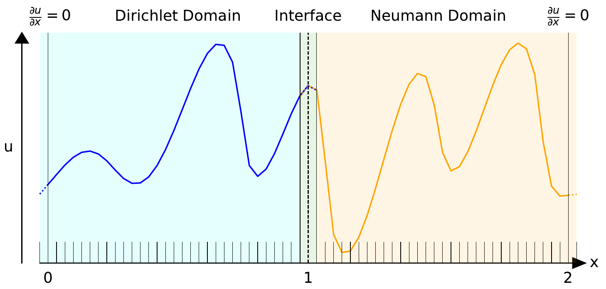
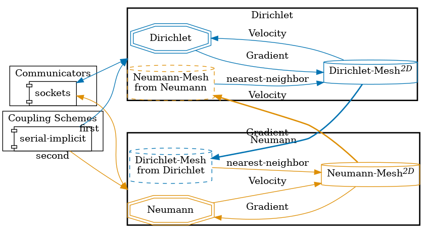
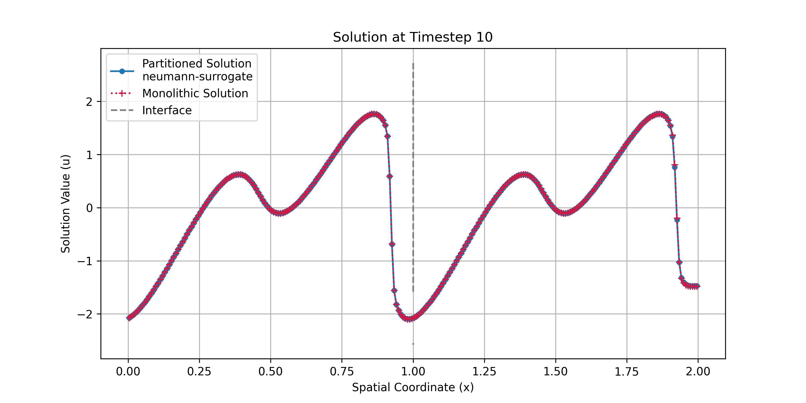
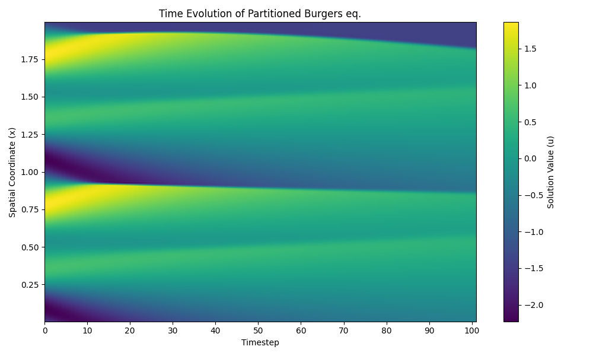


Get the [case files of this tutorial](https://github.com/precice/tutorials/tree/develop/partitioned-burgers-1d), as continuously rendered here, or see the [latest released version](https://github.com/precice/tutorials/tree/master/partitioned-burgers-1d) (if there is already one). Read how in the [tutorials introduction](https://precice.org/tutorials.html).


## Setup

We solve the 1D viscous Burgers' equation on the domain $[0,2]$:


$$
\frac{\partial u}{\partial t} = \nu \frac{\partial^2 u}{\partial x^2} - u \frac{\partial u}{\partial x},
$$

where $u(x,t)$ is the scalar velocity field and $\nu$ is the viscosity. In this tutorial by default $\nu$ is very small ($10^{-12}$), but can be changed in the solver.


The domain is partitioned into participants at $x=1$:

- **Dirichlet**: Solves the left half $[0,1]$ and receives Dirichlet boundary conditions at the interface.
- **Neumann**: Solves the right half $[1,2]$ and receives Neumann boundary conditions at the interface.

Both outer boundaries use zero-gradient conditions $\frac{\partial u}{\partial x} = 0$. The problem can be solved for different initial conditions of superimposed sine waves, which can be generated using the provided script `utils/generate_ic.py`.

<p align="center">
  
  <br><em>Diagram of the partitioned domain with an example initial condition.</em>
</p>


## Configuration

preCICE configuration (image generated using the [precice-config-visualizer](https://precice.org/tooling-config-visualization.html)):

<p align="center">
  
</p>

## Available Solvers

The conservative formulation of the Burgers' equation `solver-scipy` is implemented in a first-order finite volume code using Lax-Friedrichs fluxes and implicit Euler time stepping.

This tutorial includes two versions for the Neumann participant:
- A standard finite volume solver (`neumann-scipy`).
- A pre-trained neural network surrogate that approximates the solver (`neumann-surrogate`).


The surrogate participant requires PyTorch and related dependencies, which requires several gigabytes of disk space (~7Gb). 


## Running the simulation
### Running the participants

To run the partitioned simulation, open two separate terminals and start each participant individually:

You can find the corresponding `run.sh` script for running the case in the folders corresponding to the participant you want to use:

```bash
cd dirichlet-scipy
./run.sh
```

and

```bash
cd neumann-scipy
./run.sh
```

or, to use the pretrained neural network surrogate participant:

```bash
cd neumann-surrogate
./run.sh
```

### Initial condition 

The initial condition file `initial_condition.npz` is automatically generated by the run scripts if it does not exist.
You can also manually generate it using the script in `utils/`:

```bash
python3 utils/generate_ic.py --epoch <seed>
```

This script requires the Python libraries `numpy` and `matplotlib`.

---

### Helper scripts

There are helper scripts in the `utils/` directory that automate runs and visualization of both participants. They also accept an integer seed argument to specify the initial condition.

```bash
./utils/run-partitioned-scipy.sh
```

and

```bash
./utils/run-partitioned-surrogate.sh
```

### Monolithic solution (reference)

You can run the whole domain using the monolithic solver for comparison:

```bash
cd solver-scipy
./run.sh
```


 
## Visualization

After both participants (and/or monolithic simulation) have finished, you can run the visualization script.
`visualize_partitioned_domain.py` generates plots comparing the partitioned and monolithic solutions. You can specify which timestep to plot:

```bash
python3 visualize_partitioned_domain.py --neumann neumann-surrogate/surrogate.npz [timestep]
```

The script will produce the following output files in the `images/` directory:
- `full-domain-timestep-slice.png`: Solution $u$ at a selected timestep

<p align="left">
  
</p>

- `gradient-timestep-slice.png`: Gradient $du/dx$ at a selected timestep

- `full-domain-evolution.png`: Time evolution of the solution

<p align="left">
  
</p>
