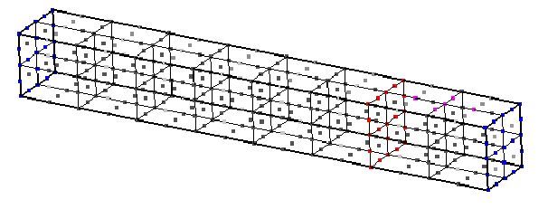
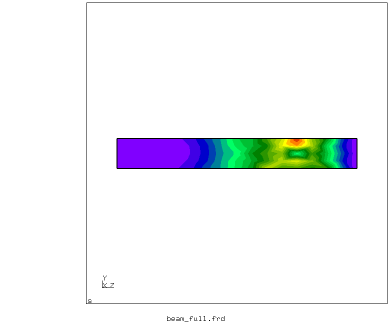



## Setup

We have a rectangular linear elastic beam of dimensions 1 x 1 x 8 m, divided in two subdomains by a splitting plane at z = 6 m. This plane corresponds to the coupling surface. Both ends of the beam (z = 0 and z = 8 m) are fixed. A mechanical load F = -0.001 N is applied constantly along the y-axis onto a small set of nodes near the end of the beam. These boundary conditions can be seen in the input files `beam<x>.inp`. Initial conditions are zero both for position and velocity. Other parameters can be found and customized in the `.inp` files.

## Available solvers

* CalculiX. CalculiX is used for both structural parts. For more information, have a look at the [CalculiX adapter documentation](https://www.precice.org/adapter-calculix-overview.html) for more.

## Running the Simulation

The prepared case already contains configuration and mesh files, so that the simulation is ready to run. You can start the simulation by running the script `./run.sh` located in each participant directory. You will see both participants of the simulation running simultaneously.

## Post-processing

To see an animated visualization of the results, you can run the script `./visualize.py`. It joins the `*.frd` output files of both participants to form a new file with the entire beam. Then, it calls `cgx`, since CalculiX results can only be visualized with this graphic tool. If you want to use e.g. ParaView, you may use converting tools.

You can open result files directly with `cgx` with the command `cgx beam1.frd`, for instance.
