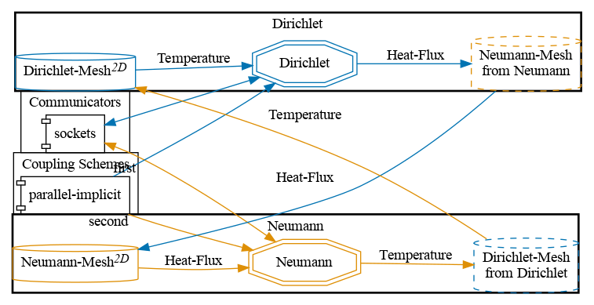


Get the [case files of this tutorial](https://github.com/precice/tutorials/tree/master/partitioned-heat-conduction-direct). Read how in the [tutorials introduction](https://precice.org/tutorials.html).


## Setup

This case is a modified version of the [partitioned heat conduction tutorial](tutorials-partitioned-heat-conduction.html). Main modification is that we here use the [direct mesh access feature](couple-your-code-direct-access.html) to let the solvers compute the data mapping and not preCICE.

Further minor modifications:

- We use a parallel coupling scheme instead of a serial one to prevent running into the problem where we are trying to add a zero column to the quasi-Newton matrix. For serial coupling, this happens here because one data field converges much faster than the other.

## Configuration

preCICE configuration (image generated using the [precice-config-visualizer](https://precice.org/tooling-config-visualization.html)):



## Available solvers

Currently only `nutils` is provided as a solver. The data mapping is computed by directly sampling the FEM function representation at the inquired locations.

## Running the simulation

Open two terminals and run:

```bash
cd neumann-nutils
./run.sh
```

and

```bash
cd dirichlet-nutils
./run.sh
```

See the [partitioned heat conduction tutorial](tutorials-partitioned-heat-conduction.html).
