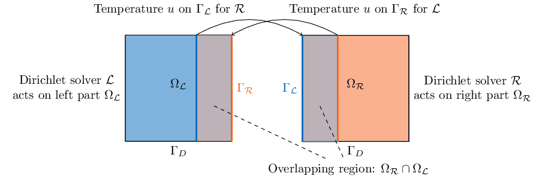
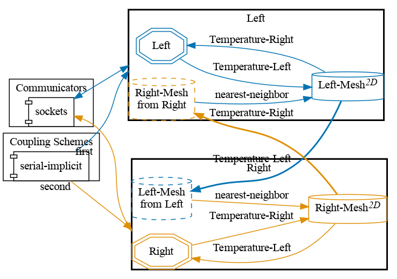


Get the [case files of this tutorial](https://github.com/precice/tutorials/tree/master/partitioned-heat-conduction-overlap). Read how in the [tutorials introduction](https://www.precice.org/tutorials.html).


## Setup

We solve a partitioned heat equation, but apply an overlapping Schwarz-type domain decomposition method in this tutorial.

Note that this case applies an overlapping Schwarz-type coupling method and not (like most other tutorials in this repository) a Dirichlet-Neumann coupling. This results in a symmetric setup of the solvers.

## Configuration

preCICE configuration (image generated using the [precice-config-visualizer](https://precice.org/tooling-config-visualization.html)):

## Running the simulation

This tutorial is for FEniCS.

For choosing whether you want to run the left or right participant, please provide the following commandline input:

* `python3 heat.py left` flag will run the left participant.
* `python3 heat.py right` flag will run the right participant.

Like for the case `partitioned-heat-conduction` (using Dirichlet-Neumann coupling), we can also expect for the overlapping domain decomposition applied here to recover the analytical solution. `errorcomputation.py` checks this explicitly, by comparing the numerical to the analytical solution and raising an error, if the approximation error is not within a given tolerance.
