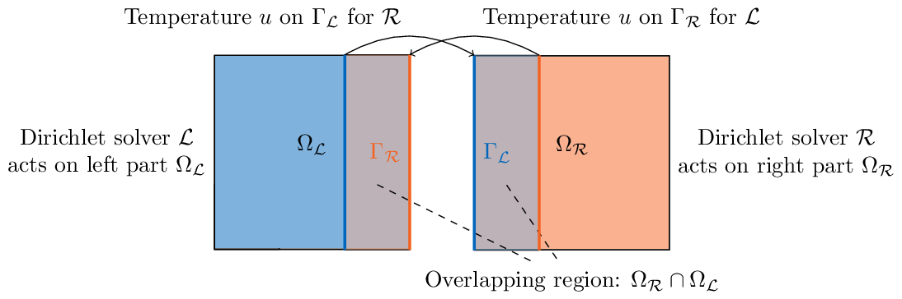


Get the [case files of this tutorial](https://github.com/precice/tutorials/tree/master/partitioned-heat-conduction-schwarz). Read how in the [tutorials introduction](https://www.precice.org/tutorials.html).


## Setup

We solve a partitioned heat equation, but apply an overlapping Schwarz-type domain decomposition method in this tutorial.

## Running the simulation

This tutorial is for FEniCS.

For choosing whether you want to run the left or right participant, please provide the following commandline input:

* `heat.py left` flag will run the left participant.
* `heat.py right` flag will run the right participant.
