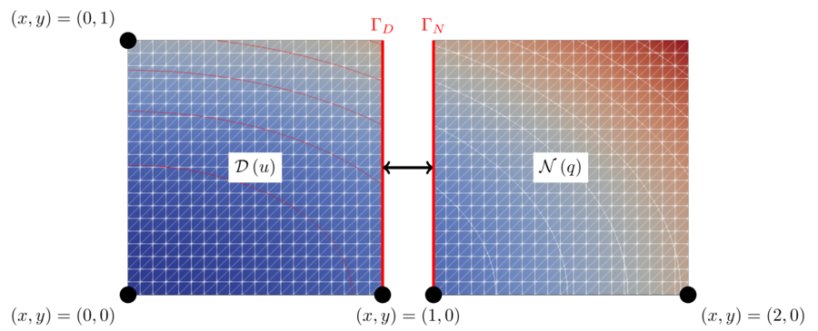
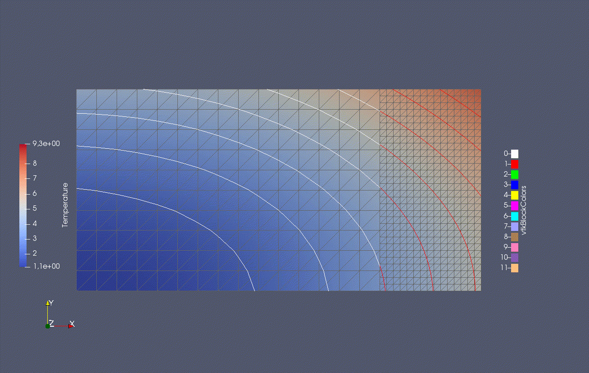



## Setup

We solve a partitioned heat equation. For information on the non-partitioned case, please refer to [1, p.37ff]. In this tutorial the computational domain is partitioned and coupled via preCICE. The coupling roughly follows the approach described in [2].



Case setup from [3]. `D` denotes the Dirichlet participant and `N` denotes the Neumann participant.

The heat equation is solved on a rectangular domain `Omega = [0,2] x [0,1]` with given Dirichlet boundary conditions. We split the domain at `x_c = 1` using a straight vertical line, the coupling interface. The left part of the domain will be referred to as the Dirichlet partition and the right part as the Neumann partition. To couple the two participants we use Dirichlet-Neumann coupling. Here, the Dirichlet participant receives Dirichlet boundary conditions (`Temperature`) at the coupling interface and solves the heat equation using these boundary conditions on the left part of the domain. Then the Dirichlet participant computes the resulting heat flux (`Heat-Flux`) from the solution and sends it to the Neumann participant. The Neumann participant uses the flux as a Neumann boundary condition to solve the heat equation on the right part of the domain. We then extract the temperature from the solution and send it back to the Dirichlet participant. This establishes the coupling between the two participants.

This simple case allows us to compare the solution for the partitioned case to a known analytical solution (method of manufactures solutions, see [1, p.37ff]). For more usage examples and details, please refer to [3, sect. 4.1].

## Available solvers and dependencies

You can either couple a solver with itself or different solvers with each other. In any case you will need to have preCICE

* FEniCS. Install [FEniCS](https://fenicsproject.org/download/) and the [FEniCS-adapter](https://github.com/precice/fenics-adapter). The code is largely based on this [fenics-tutorial](https://github.com/hplgit/fenics-tutorial/blob/master/pub/python/vol1/ft03_heat.py) from [1].

* Nutils. Install [Nutils](http://www.nutils.org/en/latest/).

* OpenFOAM. Install OpenFOAM and the [OpenFOAM adapter](https://www.precice.org/adapter-openfoam-overview.html). This tutorial uses a custom solver, which you can find in `tutorials/partitioned-heat-conduction/openfoam-solver` and build using `cd tutorials/partitioned-heat-conduction/openfoam-solver && wmake`. Have a look at the section below (Notes on the OpenFOAM case) for further information.

### Notes on the OpenFOAM case

Running this tutorial with OpenFOAM is a bit of a challenge and requires some special considerations:

* First of all, OpenFOAM does not provide a Laplace solver with a non-zero right-hand side. Therefore, we provide a modified Laplace solver together with the tutorial, which needs to be compiled before running the tutorial. The solver can be compiled by executing `wmake` in the solver directory `./openfoam-solver/`. The generated executable will be stored in the `FOAM_USER_APPBIN` by default. Afterwards, the custom solver `heatTransfer` can be started from the respective OpenFOAM case directory, as usual.

* The second challenge is given by the time- and space-dependent Dirichlet boundary conditions required for domain boundaries not belonging to the interface. For this purpose, a valid installation of `groovyBC` (part of [`swak4Foam`](https://openfoamwiki.net/index.php/Contrib/swak4Foam)) is required.

* The third challenge is given by the space-dependent initial conditions. We use `funkySetFields` (installed with OpenFOAM) to evaluate the initial condition. You can directly execute the `./run.sh` script, which calls the `setInitialField.sh` in order to evaluate the required initial condition and store it in the `0` directory. Note that `run.sh`  deletes the `0` time directory and copies it again from `0.orig`. If you start modifying the initial or boundary conditions, make sure you modify the files located in the `0.orig` directory in combination with the default `run.sh` scripts.

## Running the simulation

You can find the corresponding `run.sh` script in each participant solver.

In case of `fenics` and `nutils` the Dirichlet-kind and a Neumann-kind participant are currently merged into a single participant directory. Therefore, please provide the following command line input argument:

* `-d` flag will enforce Dirichlet boundary conditions on the coupling interface.
* `-n` flag will enforce Neumann boundary conditions on the coupling interface.

For running the case, a Dirichlet and a Neumann participant need to be executed, e.g., `./run.sh -d` and `./run.sh. -n`

The FEniCS case also supports parallel runs. Here, you cannot use the `run.sh` script, but must simply execute

```bash
mpirun -n <N_PROC> python3 heat.py -d
```

OpenFOAM supports parallel runs as usual. However, you need to execute the command manually by running: `mpirun -np <N_PROC> ./heatTransfer`.

### Note on the combination of Nutils & FEniCS

You can mix the Nutils and FEniCS solver, if you like. Note that the error for a pure FEniCS simulation is lower than for a mixed one, because the FEniCS participants use the same coupling mesh, i.e., the mapping error becomes significantly smaller.

## Visualization

Output is written into the folders `fenics/out` and `nutils`.

For FEniCS you can visualize the content with paraview by opening the `*.pvd` files. The files `Dirichlet.pvd` and `Neumann.pvd` correspond to the numerical solution of the Dirichlet, respectively Neumann, problem, while the files with the prefix `ref` correspond to the analytical reference solution, the files with `error` show the error and the files with `ranks` the ranks of the solvers (if executed in parallel).

For Nutils, please use the files `Dirichlet-*.vtk` or `Neumann-*.vtk`. Please note that these files contain the temperature as well as the reference solution.



Visualization in paraview for `x_c = 1.5`.

## References

[1] Hans Petter Langtangen and Anders Logg. "Solving PDEs in Minutes-The FEniCS Tutorial Volume I." (2016). [pdf](https://fenicsproject.org/pub/tutorial/pdf/fenics-tutorial-vol1.pdf)  
[2] Azahar Monge and Philipp Birken. "Convergence Analysis of the Dirichlet-Neumann Iteration for Finite Element Discretizations." (2016). Proceedings in Applied Mathematics and Mechanics. [doi](https://doi.org/10.1002/pamm.201610355)  
[3] Benjamin Rüth, Benjamin Uekermann, Miriam Mehl, Philipp Birken, Azahar Monge, and Hans Joachim Bungartz. "Quasi-Newton waveform iteration for partitioned surface-coupled multiphysics applications." (2020). International Journal for Numerical Methods in Engineering. [doi](https://doi.org/10.1002/nme.6443)  
