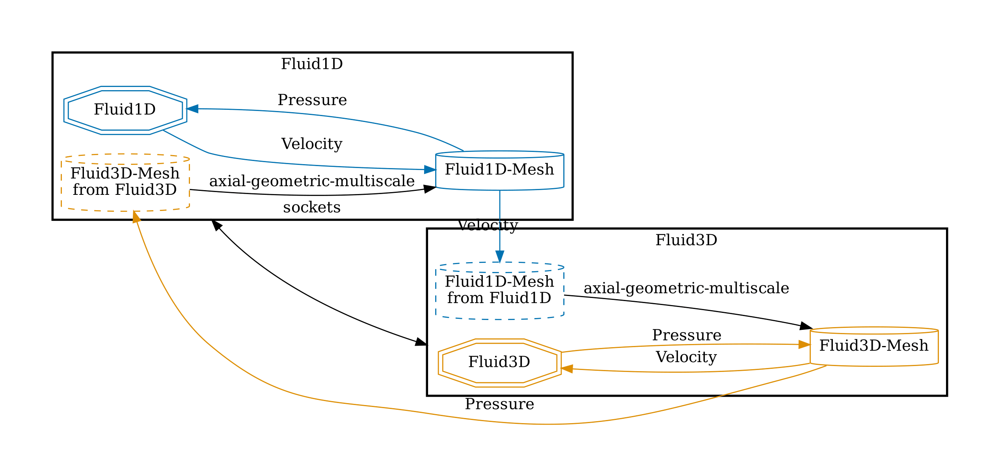
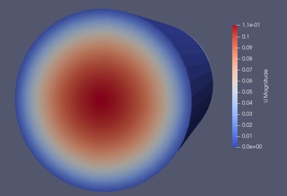


Get the [case files of this tutorial](https://github.com/precice/tutorials/tree/master/partitioned-pipe-multiscale). Read how in the [tutorials introduction](https://www.precice.org/tutorials.html).


## Setup

We exchange velocity data from the upstream 1D to the downstream 3D participant and for the pressure data vice versa. The config looks as follows:



## How to run

In two different terminals execute

```bash
cd fluid1d-python && ./run.sh
```

```bash
cd fluid3d-openfoam && ./run.sh
```

## Results

Visualizing the results in ParaView, we see an established laminar profile at the inlet of the 3D participant.


