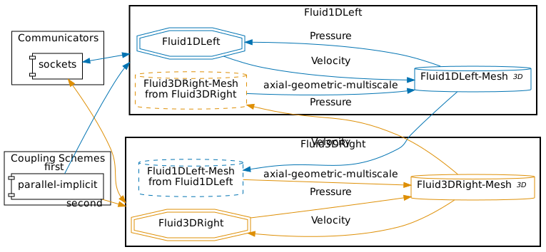
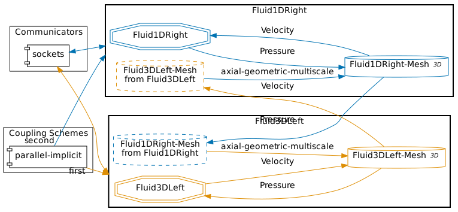
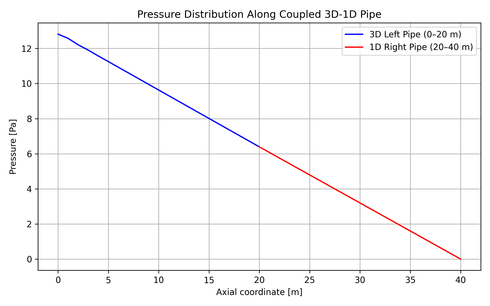
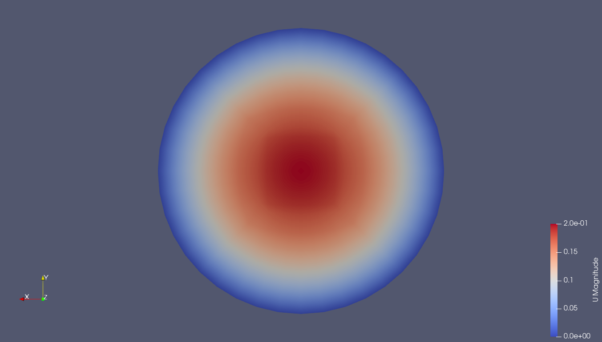


Get the [case files of this tutorial](https://github.com/precice/tutorials/tree/develop/partitioned-pipe-multiscale), as continuously rendered here, or see the [latest released version](https://github.com/precice/tutorials/tree/master/partitioned-pipe-multiscale) (if there is already one). Read how in the [tutorials introduction](https://precice.org/tutorials.html).


## Setup

We solve a simple **partitioned pipe problem** using a 1D–3D coupling approach.  
In this tutorial, the computational domain is split into two coupled regions: a 1D pipe section and a 3D pipe section.  
The coupling is performed using **preCICE**.

In the following, `1D` denotes the reduced-order domain (e.g., a Nutils solver) and `3D` denotes the full 3D CFD domain (e.g., OpenFOAM).

The problem consists of a straight pipe of length

$$
L = 40~\text{m}
$$

and diameter

$$
D = 10~\text{m}.
$$

We partition the domain at

$$
y_c = 20~\text{m},
$$

where the coupling interface is located.  
The **1D domain** solves the flow equations using Nutils, while the **3D domain** is solved using OpenFOAM.  
Both solvers are coupled via preCICE by exchanging the **pressure** and **axial velocity** at the interface.

Two coupling directions are possible:  

- **1D → 3D**: The 1D solver provides the interface velocity to the 3D solver, which responds with pressure.  
- **3D → 1D**: The 3D solver provides the velocity, and the 1D solver returns the pressure.

In addition to the 1D–3D setup, this tutorial also includes configurations for **1D–1D** and **3D–3D** coupling.  
These variants can be beneficial for validation studies, solver comparisons, or for investigating the influence of model dimensionality

The outlet pressure is set to

$$
p_\text{in} = 98100~\text{Pa}.
$$

For the **3D → 1D** coupling, the 3D inlet velocity is prescribed as a **parabolic (Poiseuille)** profile with a bulk velocity of

$$
u_\text{in} = 0.1~\text{m/s}.
$$

implemented using a `codedFixedValue` boundary condition. This ensures a physically realistic velocity distribution consistent with the 1D model.

For the **1D → 3D** coupling, the inlet velocity is set to

$$
u_\text{in} = 0.1~\text{m/s}.
$$

## Configuration

preCICE configuration for the 1D-3D simulation (image generated using the [precice-config-visualizer](https://precice.org/tooling-config-visualization.html)):



preCICE configuration for the 3D-1D simulation:



## Available solvers

- OpenFOAM (**pimpleFoam**). An incompressible/transient OpenFOAM solver. See the [OpenFOAM adapter documentation](https://precice.org/adapter-openfoam-overview.html).
- Nutils. A Python-based finite element framework. For more information, see the [Nutils adapter documentation](https://precice.org/adapter-nutils.html)

## Running the Simulation

First, select which coupling you want to run. This sets the correct `precice-config.xml` symlink:

```bash
# Choose one configuration
./setcase.sh 1d3d
# or
./setcase.sh 3d1d
# or
./setcase.sh 1d1d
# or
./setcase.sh 3d3d
```

Open **two terminals** and start the corresponding participants for your chosen setup.

### Example A — 1D → 3D coupling

Terminal 1:

```bash
cd fluid1d-left
./run.sh
```

Terminal 2:

```bash
cd fluid3d-right
./run.sh
```

### Example B — 3D → 1D coupling

Terminal 1:

```bash
cd fluid3d-left
./run.sh
```

Terminal 2:

```bash
cd fluid1d-right
./run.sh
```

> Tip: If you switch coupling direction later, rerun `./setcase.sh` with the other option before launching the participants.

## Visualization

The output of the coupled simulation is written into the folders `fluid1d-left`, `fluid1d-right`, `fluid3d-left`, and `fluid3d-right`, depending on which coupling direction (`1d3d` or `3d1d`) you selected.

### 3D domain (OpenFOAM)

For the 3D participant, all simulation results are stored in the time directories inside the respective case folder (e.g., `fluid3d-right/`).  
You can visualize the flow field and pressure distribution using **ParaView** by opening the case file:

```bash
paraview fluid3d-right/fluid3d-right.foam
```

or, for the left domain if applicable:

```bash
paraview fluid3d-left/fluid3d-left.foam
```

Typical fields to inspect include:  

- `p` – pressure
- `U` – velocity

We also record pressure and velocity at fixed points each time step using the OpenFOAM `probes` function object.

**Probe setup (excerpt):**

```c
#includeEtc "caseDicts/postProcessing/probes/probes.cfg"

fields (p U);
probeLocations
(
    (0 0 20)
    (0 0 40)
);
// For the left 3D domain use instead:
// probeLocations ((0 0 0) (0 0 20));
```

**Output location:**  

- `fluid3d-right/postProcessing/probes/0/p`  
- `fluid3d-right/postProcessing/probes/0/U`

### 1D domain (Nutils)

The 1D solver writes a `watchpoint.txt` with semicolon-separated time series:

```text
time; p_in; u_in; p_out; u_out; p_mid; u_mid
```

where:

- `p_in`, `u_in` → pressure and velocity at the inlet of the 1D domain  
- `p_out`, `u_out` → pressure and velocity at the outlet of the 1D domain  
- `p_mid`, `u_mid` → pressure and velocity at the midpoint of the 1D domain

The 1D solver also writes a `final_fields.txt with space-separated values:

```text
x u p
```

They correspond to the axial position, velocity and pressure at the last time-step, it is, at a time of 20 s.

### Example visualization



**Pressure along the pipe centerline.** The pressure decreases nearly linearly from **≈12.8 Pa** at the 3D inlet to **0 Pa** at the 1D outlet, consistent with steady, laminar Poiseuille flow. The 3D (0–20 m) and 1D (20–40 m) sections connect smoothly at the coupling interface.



**Parabolic velocity profile at the 3D outlet / coupling interface (y = 20 m).**  
The profile is Poiseuille-like with bulk velocity **0.1 m/s**; consequently the **centerline velocity is ≈ 0.2 m/s** (≈ 2 × bulk) and vanishes at the wall (no-slip). This is the velocity state at the interface used for coupling to the 1D domain.
