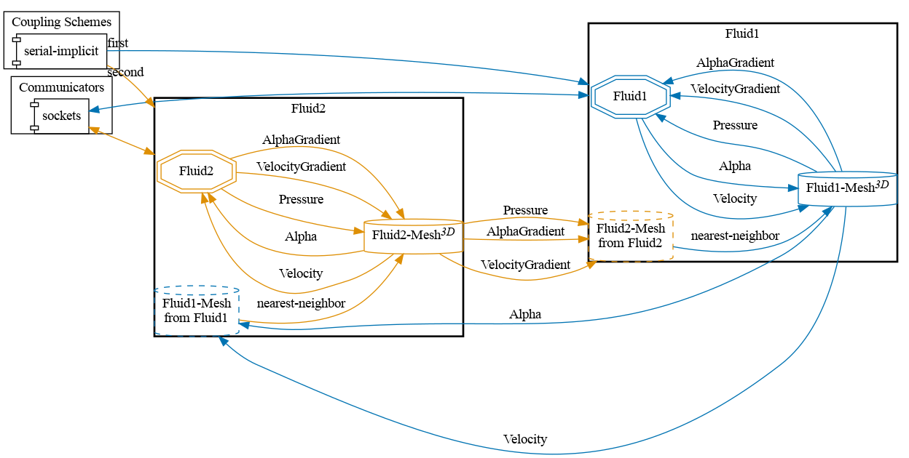


Get the [case files of this tutorial](https://github.com/precice/tutorials/tree/master/partitioned-pipe-two-phase). Read how in the [tutorials introduction](https://precice.org/tutorials.html).


## Setup

This scenario consists of two pipes connected in series, both simulated with OpenFOAM's interFoam solver. Fluids can enter from the left (here $$ z=0 $$) boundary of the Fluid1 participant with a uniform velocity profile ($$ u_{in} = 1 m/s $$) and fixed flux pressure boundary coundition.
The simulation begins with some water being present at the bottom left of the pipe. The volume fraction variable alpha is set to be 1 (water) at the bottom half of the inlet and 0 (air) at the top half. The water stream will approach the coupling interface at around $$ t=5s $$ in the simulation.
At the right boundary of Fluid2 there is a zero gradient boundary condition for velocity and alpha as well as a total pressure set to zero.


On the coupling interface, Fluid1 sends velocity, and alpha to Fluid2 and receives pressure, velocity gradient and alpha gradient. Fluid2 uses the [fixedFluxExtrapolatedPressure](https://www.openfoam.com/documentation/guides/v2112/api/classFoam_1_1fixedFluxExtrapolatedPressureFvPatchScalarField.html) boundary condition as shown in the [partitioned pipe tutorial](https://precice.org/tutorials-partitioned-pipe.html).

To make sure that preCICE works on the correct OpenFOAM fields, the field names are passed to the OpenFOAM adapter in `fluid*/system/preciceDict`:

```CPP
FF
{
  nameP   p_rgh;
  nameAlpha alpha.water;
}
```


This is a very basic example case demonstrating the coupling of a two-phase flow. To keep it as simple as possible, gravity is set to $0$ to avoid any kind of turbulences/vortices. Read more in the accompanying conference paper [1].


## Configuration

preCICE configuration (image generated using the [precice-config-visualizer](https://precice.org/tooling-config-visualization.html)):



## Available solvers

Both Fluid1 and Fluid2 are simulated with OpenFOAM (interFoam). An incompressible multiphase solver for two immiscible fluids using the *Volume-of-fluid* method. For more information, have a look at the [OpenFOAM adapter documentation](https://precice.org/adapter-openfoam-overview.html).

## Running the Simulation

Open two separate terminals and start the fluid1 and fluid2 participants by calling the respective run script. For example:

```bash
cd fluid1-openfoam
./run.sh
```

and

```bash
cd fluid2-openfoam
./run.sh
```

## Post-processing

The OpenFOAM solvers generate a `.foam` file each. You can open this file in ParaView.
You can see the water-air interface crossing the coupling interface at around $t=5.0s$.



This offering is not approved or endorsed by OpenCFD Limited, producer and distributor of the OpenFOAM software via www.openfoam.com, and owner of the OPENFOAM®  and OpenCFD®  trade marks.


## References

[1] M. Mühlhäußer, G. Chourdakis and B. Uekermann, Partitioned Flow Simulations with preCICE and OpenFOAM, in: COUPLED 2023. DOI: [10.23967/c.coupled.2023.014](https://doi.org/10.23967/c.coupled.2023.014)
