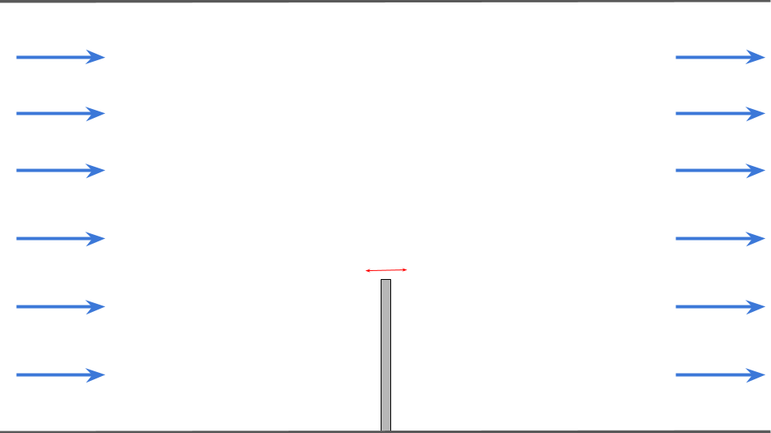
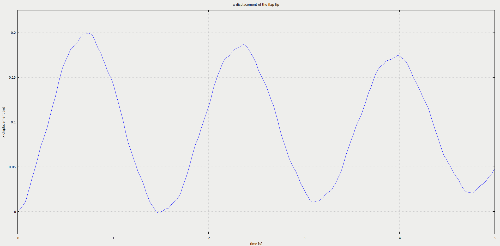
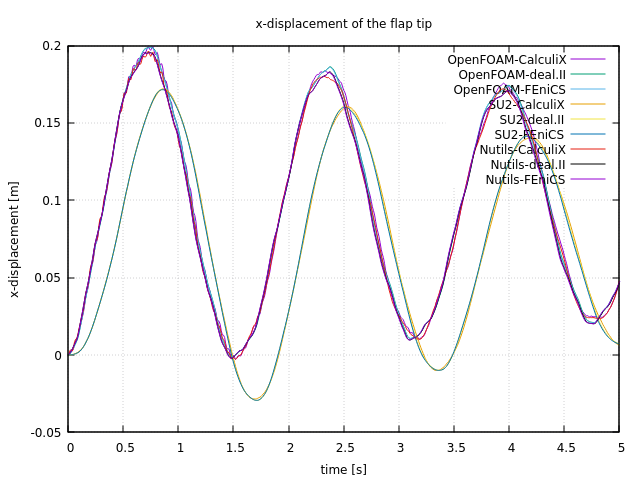



## Setup

We model a two-dimensional fluid flowing through a channel. A solid, elastic flap is fixed to the floor of this channel. The flap oscillates due to the fluid pressure building up on its surface. The setup is shown schematically here:



The simulated flow domain is 6 units long (x) and 4 units tall (y). The flap is located at the center of the bottom (x=0) and is 1 unit long (y) and 0.1 units thick (x). We set the fluid density $$ \rho_F= 1.0kg/m^{3} $$, the kinematic viscosity $$ \nu_f= 1.0m^{2}/s $$, the solid density $$ \rho_s= 3.0·10^{3}kg/m^{3} $$, the Young’s modulus to $$ E= 4.0·10^{6} kg/ms^{2} $$ and the Poisson ratio $$ \nu_s = 0.3 $$. On the left boundary a constant inflow profile in x-direction of 10m/s is prescribed. The right boundary is an outflow and the top and bottom of the channel as well as the surface of the flap are no-slip walls.

## Available solvers

Fluid participant:

* OpenFOAM. For older OpenFOAM versions, the solver name differs: If you are using OpenFOAM v1712 / 5.x or older have a look at `fluid-openfoam/system/controlDict` and set the appropriate solver name. The solver can run in parallel using the command line argument `run.sh -parallel`. For more information, have a look at the [OpenFOAM adapter documentation](https://www.precice.org/adapter-openfoam-overview.html).

* Nutils. For more information, have a look at the [Nutils adapter documentation](https://www.precice.org/adapter-nutils.html). This Nutils solver requires at least Nutils v6.0.

* SU2. As opposed to the other two fluid codes, SU2 is in particular specialized for compressible flow. Therefore the default simulation parameters haven been adjusted in order to pull the setup into the compressible flow regime. For more information, have a look at the [SU2 adapter documentation](https://www.precice.org/adapter-su2-overview.html).

Solid participant:

* FEniCS. The structural model is currently limited to linear elasticity. For more information, have a look at the [FeniCS adapter documentation](https://www.precice.org/adapter-fenics.html).

* CalculiX. In order to allow a reasonable comparison to all solid codes, the geometrically non-linear solver has been disabled and only a linear model is used by default. For more information, have a look at the [CalculiX adapter documentation](https://www.precice.org/adapter-calculix-overview.html)

* deal.II. This tutorial works only with `Model = linear` since the deal.II codes were developed with read data `Stress` instead of `Force` as applied here (example given in Turek-Hron-FSI) in the first place. The `./run.sh` script takes the compiled executable `elasticity` as input argument (`run.sh -e=/path/to/elasticity`) and is required in case the executable is not discoverable at runtime (e.g. has been added to the system `PATH`). For more information, have a look at the [deal.II adapter documentation](https://www.precice.org/adapter-dealii-overview.html).

## Running the Simulation

All listed solvers can be used in order to run the simulation. Open two separate terminals and start the desired fluid and solid participant by calling the respective run script `run.sh` located in the participant directory. For example:

```bash
cd fluid-openfoam
./run.sh
```

and

```bash
cd solid-fenics
./run.sh
```

in order to use OpenFOAM and FEniCS for this test case.

## Post-processing

How to visualize the simulation results depends on the selected solvers. Most of the solvers generate `vtk` files which can visualized using, e.g., ParaView.

CalculiX exports results in `.frd` format, which you can visualize in CGX (`cgx flap.frd`). In the CGX window, you can click-and-hold to select different times and fields, or to animate the geometry. If you prefer to work with VTK files, you can also use tools such as [ccx2paraview](https://github.com/calculix/ccx2paraview) or a converter included in the [calculix-adapter/tools](https://github.com/precice/calculix-adapter/tree/master/tools) directory.

As we defined a watchpoint on the 'Solid' participant at the flap tip (see `precice-config.xml`), we can plot it with gnuplot using the script `plot-displacement.sh.` You need to specify the directory of the selected solid participant as a command line argument, so that the script can pick-up the desired watchpoint file, e.g. `plot-displacement.sh solid-fenics`. The resulting graph shows the x displacement of the flap tip. You can modify the script to plot the force instead.



There is moreover a script `plot-all-displacements.sh` to plot and compare all possible variants. This script expects all watchpoint logs to be available in a subfolder `watchpoints` in the format `openfoam-dealii.log` or similar. If you want to use this script, you need to copy the files over accordingly.

You should get results similar to this one:



Reasons for the differences:

* The CalculiX adapter only supports linear finite elements (deal.II uses 4th order, FEniCS 2nd order).
* SU2 models a compressible fluid, OpenFOAM and Nutils an incompressible one.  


