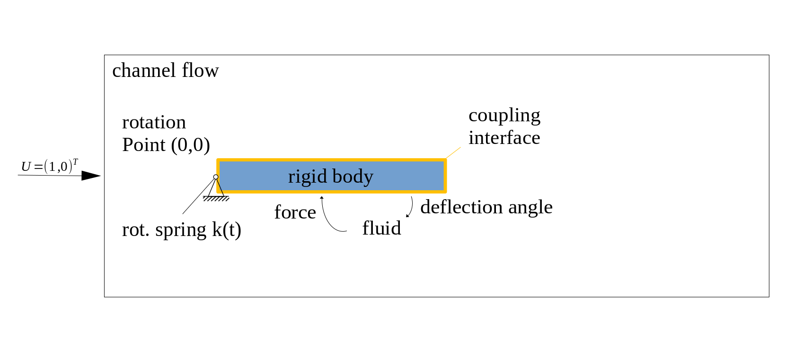
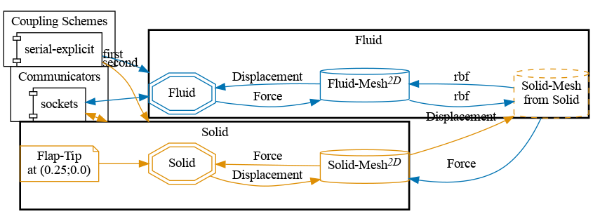
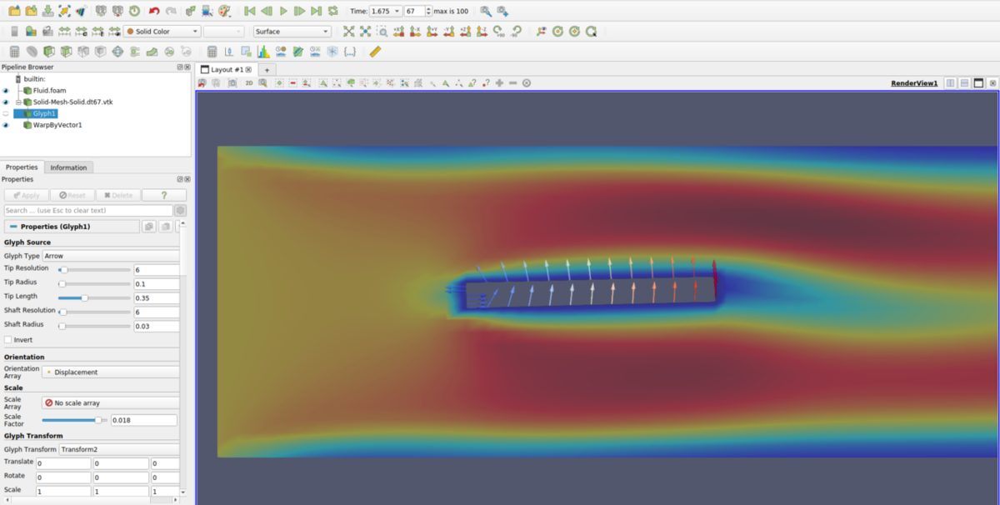

This is the first step you may want to try if you are new to preCICE: install preCICE and some solvers, and run a simple coupled case.

To get a feeling what preCICE does, watch a [short presentation](https://www.youtube.com/watch?v=FCv2FNUvKA8) or a [longer talk on the fundamentals](https://www.youtube.com/watch?v=9EDFlgfpGBs).

## Installation

1. Get and install preCICE. For Ubuntu 22.04 (Jammy Jellyfish), this is pretty easy: [download](https://github.com/precice/precice/releases/latest) and install our binary package by clicking on it or using the following commands:

    ```bash
    wget https://github.com/precice/precice/releases/download/v3.1.1/libprecice3_3.1.1_jammy.deb
    sudo apt install ./libprecice3_3.1.1_jammy.deb
    ```

    | OS                            | Package |
    | ---                           | ---     |
    | Ubuntu 20.04 Focal Fossa      | [`libprecice3_3.1.1_focal.deb`](https://github.com/precice/precice/releases/download/v3.1.1/libprecice3_3.1.1_focal.deb) |
    | Ubuntu 22.04 Jammy Jellyfish  | [`libprecice3_3.1.1_jammy.deb`](https://github.com/precice/precice/releases/download/v3.1.1/libprecice3_3.1.1_jammy.deb) |
    | Debian 11 "bullseye"          | [`libprecice3_3.1.1_bullseye.deb`](https://github.com/precice/precice/releases/download/v3.1.1/libprecice3_3.1.1_bullseye.deb) |
    | Debian 12 "bookworm"          | [`libprecice3_3.1.1_bookworm.deb`](https://github.com/precice/precice/releases/download/v3.1.1/libprecice3_3.1.1_bookworm.deb) |
    | Something else                | See an [overview of options](https://precice.org/installation-overview.html) |

    - Facing any problems? [Ask for help](https://precice.org/community-channels.html).
2. We will use OpenFOAM here and in many of our tutorial cases, so [install OpenFOAM](https://precice.org/adapter-openfoam-support.html):

    ```bash
    # Add the signing key, add the repository, update (check this):
    wget -q -O - https://dl.openfoam.com/add-debian-repo.sh | sudo bash
    # Install OpenFOAM v2312:
    sudo apt install openfoam2312-dev
    # Enable OpenFOAM by default in your system and apply now:
    echo "source /usr/lib/openfoam/openfoam2312/etc/bashrc" >> ~/.bashrc
    source ~/.bashrc
    ```

3. Install a few common dependencies that we will need later:

    ```bash
    sudo apt install build-essential pkg-config cmake git
    ```

4. Download and install the [OpenFOAM-preCICE adapter](https://precice.org/adapter-openfoam-get.html):

    ```bash
     wget https://github.com/precice/openfoam-adapter/archive/refs/tags/v1.3.0.tar.gz
     tar -xzf v1.3.0.tar.gz 
     cd openfoam-adapter-1.3.0/
     ./Allwmake
     cd ..
    ```

5. Get the quickstart tutorial case:

    ```bash
    wget https://github.com/precice/tutorials/releases/tag/v202404.0
    tar -xzf v202404.0.tar.gz
    cd tutorials/quickstart
    ```

If you prefer to easily try everything in an isolated environment, you may prefer using our [demo virtual machine](https://precice.org/installation-vm.html).

## Case setup

We will couple OpenFOAM with a C++ rigid body solver for fluid-structure interaction. The rigid body has only a single degree of freedom, namely the deflection angle of the flap in the channel. It is also fixed in the origin at (0,0) and the force exerted by the fluid on the rigid body structure causes an oscillatory rotation of the body. The simulation runs for 2.5 seconds.

In order to gain more control over the rigid body oscillation, a rotational spring is applied at the rigid body origin. After 1.5 seconds we increase the spring constant by a factor of 8 to stabilize the coupled problem. Feel free to modify these parameters (directly in `rigid_body_solver.cpp`) and increase the simulation time (in `precice-config.xml`).



## Configuration

preCICE configuration (image generated using the [precice-config-visualizer](https://precice.org/tooling-config-visualization.html)):



## Building the rigid body solver

Before starting the coupled simulation, we need to build the rigid body solver. You can run the following commands from the `solid-cpp` directory to build the `rigid_body_solver.cpp`:

```bash
cd tutorials/quickstart/solid-cpp
cmake . && make
```

## Running the coupled simulation

You may run the two simulations in two different terminals and watch their output on the screen using `./run.sh` from inside the directory of each participant:

```bash
# Terminal window 1
cd tutorials/quickstart/solid-cpp
./run.sh
```

```bash
# Terminal window 2
cd tutorials/quickstart/fluid-openfoam
./run.sh
# Alternative, in parallel: ./run.sh -parallel
```

You can also run OpenFOAM in parallel: `./run.sh -parallel`.

In serial, the simulation should take less than a minute to compute (simulated time: 2.5s).

## Visualizing the results

You can visualize the simulation results of the `Fluid` participant using ParaView and loading the (empty) file `fluid-openfoam/fluid-openfoam.foam`. The rigid body does not generate any readable output files, but the OpenFOAM data should be enough for now: click "play" in ParaView, the flap should already be moving! 🎉

You may be curious what displacements OpenFOAM received from the rigid body solver. We can actually easily visualize the coupling meshes, including the exchanged coupling data: preCICE generates the relevant files during the simulation and stores them in the directory `solid-cpp/precice-exports`. Load these VTK files in ParaView and apply a `Glyph` filter with `Glyph Type: Arrow`,`Orientation Array: Displacement`, and `Scale Array: No scale array`. You can further add a `Warp By Vector` filter with `Displacement` to deform the coupling data. The result should look as follows:




This offering is not approved or endorsed by OpenCFD Limited, producer and distributor of the OpenFOAM software via www.openfoam.com, and owner of the OPENFOAM®  and OpenCFD®  trade marks.


## Running again (and again, and again)

Now that you have a first working example, experiment! For example, how can you tell preCICE to simulate for a longer maximum time?

Before running the simulation again, cleanup the results and temporary files using `./clean-tutorial.sh`.

## What's next?

To become a preCICE pro:

- Get an overview of the [preCICE docs](https://precice.org/docs.html).
- See what users talk about in the [preCICE forum](https://precice.discourse.group/).
- Run [tutorials with other coupled solvers](https://precice.org/tutorials.html).
- Watch some [preCICE videos](https://www.youtube.com/c/preCICECoupling/).
- Meet our [community](https://precice.org/community.html).
- Find out how to [couple your own solver](https://precice.org/couple-your-code-overview.html).
- Tell us [your story](https://precice.org/community-projects.html).

Are you just starting with simulation software on Linux? Note that much of the complexity for partitioned simulations comes from working with multiple software packages and some new tools. These resources may help your first steps:

- E-book [Research Software Engineering with Python](https://merely-useful.tech/py-rse/).
- Material of the course [Simulation Software Engineering](https://simulation-software-engineering.github.io/) (University of Stuttgart).
- Material of the course [The Missing Semester of Your CS Education](https://missing.csail.mit.edu/) (MIT).
