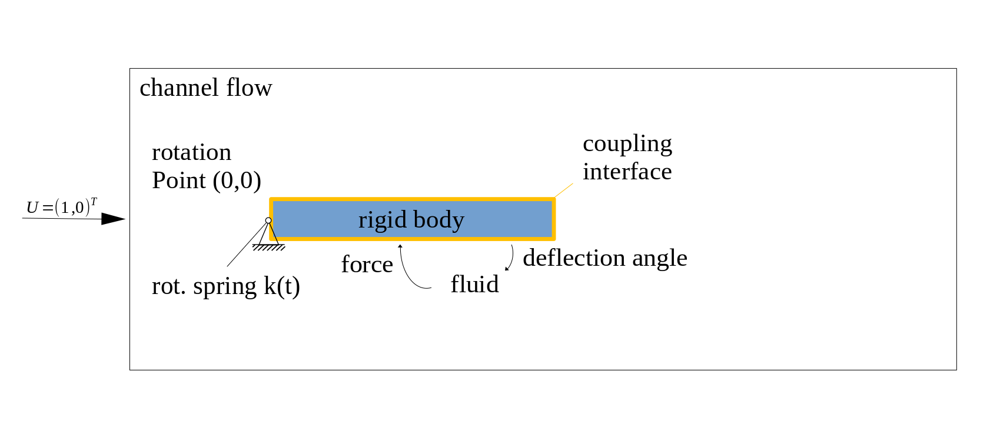

## Start here

1. To get a feeling what preCICE does, watch a [short presentation](https://www.youtube.com/watch?v=FCv2FNUvKA8), a [longer training session](https://www.youtube.com/watch?v=FCv2FNUvKA8), or [click through a tutorial in your browser](http://run.precice.org/).
2. Get and install preCICE. For Linux systems, this is pretty easy. Just pick what suits you best on [this overview page](installation-overview.html). Facing any problems? [Ask for help](community-channels.html).
    - For example, [download](https://github.com/precice/precice/releases/latest) and install our binary package for Ubuntu 20.04 (Focal Fossa) by clicking on it or using the following commands:
    ```shell
    wget https://github.com/precice/precice/releases/download/v2.2.0/libprecice2_2.2.0_focal.deb
    sudo apt install ./libprecice2_2.2.0_focal.deb
    ```
3. Build and couple two [C++ solverdummies](https://github.com/precice/precice/tree/master/examples/solverdummies/cpp).
4. You probably want to couple a solver you are already using, such as OpenFOAM. Since many of our tutorials use it, [install OpenFOAM](adapter-openfoam-support.html).
5. Download and install the [OpenFOAM-preCICE adapter](adapter-openfoam-get.html).
6. [Couple OpenFOAM with a c++ rigid body solver](https://github.com/precice/tutorials/quickstart).

## What's next?

To become a preCICE pro:

* Get an overview of the [preCICE docs](docs.html).
* See what users talk about in the [preCICE forum](https://precice.discourse.group/).
* Run [tutorials with other coupled solvers](https://github.com/precice/precice/wiki#2-getting-started---tutorials).
* Watch some [preCICE videos](https://www.youtube.com/channel/UCxZdSQdmDrheEqxq8g48t6A).
* Register to our [virtual preCICE Workshop 2021](precice-workshop-2021.html).
* Find out how to [couple your own solver](couple-your-code-overview.html).
* Tell us [your story](community-projects.html).


## About the case

This tutorial deals with a fluid-structure-interaction problem. The fluid part of the simulation is computed using OpenFOAM and the rigid body motion is a rigid body model written in c++ with only a single degree of freedom, namely the deflection angle of the flap in the channel. The rigid body is fixed in the origin at (0,0) and the force exerted by the fluid on the rigid body structure causes an oscillatory rotation of the body. The simulation runs for 2.5 seconds. In order to gain more control over the rigid body oscillation, a rotational spring is applied at the rigid body origin. After 1.5 seconds we increase the spring constant by a factor of 8 to stabilize the coupled problem. Feel free to modify these parameters and increase the simulation time.



### Building the `rigid_body` participant
Before starting the coupled simulation, the `rigid_body` solver needs to be compiled using `cmake`. You can run the following commands from this directory to build the `rigid_body` solver
```
cd Solid && cmake . && make
```

### Running the coupled simulation

You may run the two simulations in two different terminals and watch their output on the screen by using the `run.sh` scripts (or `run.sh -parallel` for OpenFOAM) located in each participant directory. You can cleanup the simulation using `clean.sh`.

There is an [open issue](https://github.com/precice/openfoam-adapter/issues/26) that leads to additional "empty" result directories when running with some OpenFOAM versions, leading to inconveniences during post-processing. Please run the script `removeObsoleteSolvers.sh` to delete the additional files.

Ini serial, the simulation takes roughly 30 seconds to compute.

### Visualizing the results

You can visualize the simulation results of the `Fluid` participant using paraView (use paraFoam to trigger the OpenFOAM native reader or load the (empty) file `Fluid.foam` into paraView). The rigid body doesn't generate any readable output files, but the motion can be observed in the OpenFOAM data. In addition, one could visualize the coupling meshes including the exchanged coupling data. preCICE generates the relevant files during the simulation and stores them in the directory `coupling-meshes`. In order to visualize the results, load the `vtk` files in paraView and apply a `Glyph` filter. Depending on the specific paraView version, you might additionally need to disable the `ScaleArray` option by selecting `No scale array` since the exchanged data might be inappropriate for a scaling operation. You can further add a `Warp By Vector` filter with `Displacements` to deform the coupling data.


