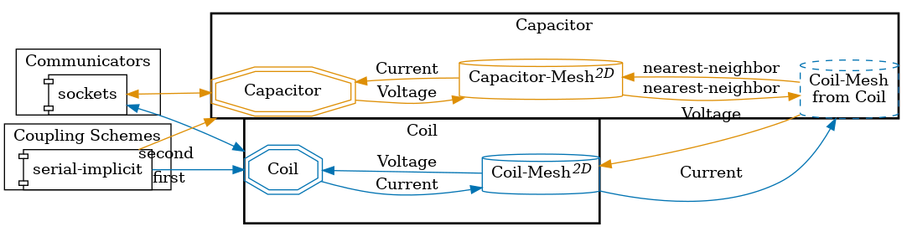
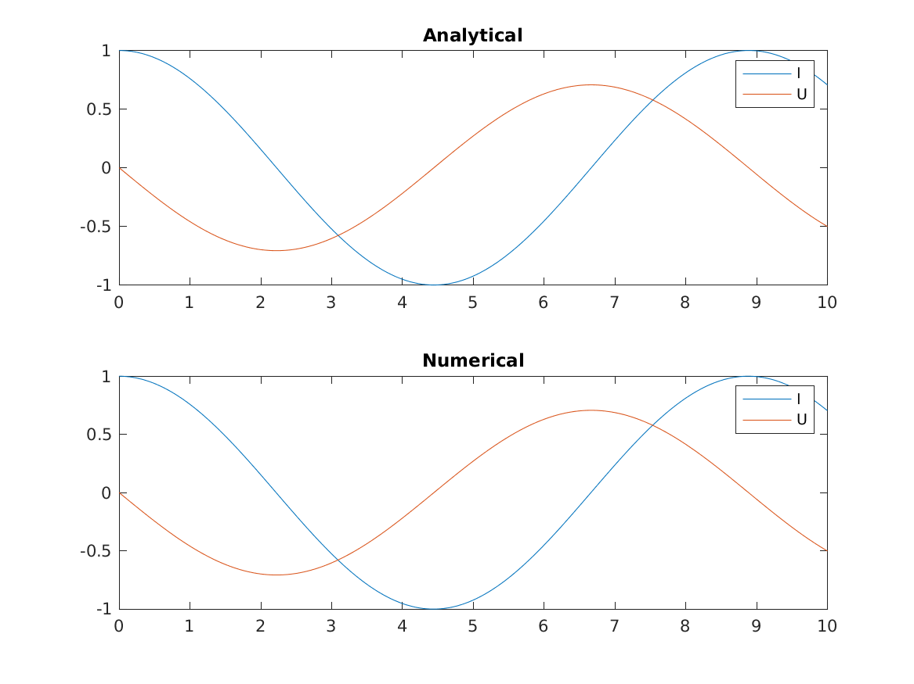

## Setup

The purpose of this tutorial is to illustrate the usage of preCICE to couple MATLAB code. Two different MATLAB solvers will be coupled to simulate a two-element LC circuit. This type of circuit consists of a very simple system with one inductor and one capacitor:

![LC circuit diagram [1]](images/tutorials-resonant-circuit-diagram.svg)

The circuit is described by the following system of ODEs:

$U(t) = L \frac{\text{d}I}{\text{d}t}$

$I(t) = -C \frac{\text{d}U}{\text{d}t}$

where $I$ is the current and $U$ the voltage of the circuit.

Each of these equations is going to be solved by a different MATLAB solver. Note that, as only one scalar is solved per equation, this is a 0+1 dimensional problem.

## Configuration

preCICE configuration (image generated using the [precice-config-visualizer](https://precice.org/tooling-config-visualization.html)):



## Available solvers

* *MATLAB* A solver using the [MATLAB bindings](https://precice.org/installation-bindings-matlab.html).
 Before running this tutorial, follow the [instructions](https://precice.org/installation-bindings-matlab.html) to correctly install the MATLAB bindings.
* *Python* A solver using the preCICE [Python bindings](https://precice.org/installation-bindings-python.html).

## Running the simulation

### MATLAB

For running this example, first get into one of the solver folders and open a MATLAB instance.
Afterward, do the same for the second solver.
After adding the MATLAB bindings to the MATLAB path (in both instances), run the following commands:

In the first MATLAB instance, one can run the solver for the current:

```MATLAB
coil
```

And in the second MATLAB instance, the solver for the voltage:

```MATLAB
capacitor
```

The preCICE configuration file is hard-coded as `precice-config.xml` in the solvers.

#### Running from terminal

If you prefer to not open the MATLAB GUIs, you can alternatively use two shells instead.
For that, modify the path in the file `matlab-bindings-path.sh` found in the base directory of this tutorial to the path to your MATLAB bindings.

By doing that, you can now open two shells and switch into the directories `capacitor-matlab` and `coil-matlab` and execute the `run.sh` scripts.

## Post-processing

As we defined a watchpoint on the 'Capacitor' participant (see `precice-config.xml`), we can plot it with gnuplot using the script `plot-solution.sh.` You need to specify the directory of the selected solid participant as a command line argument, so that the script can pick-up the desired watchpoint file, e.g. `./plot-solution.sh capacitor-python`. The resulting graph shows the voltage and current exchanged between the two participants.

Additionally, the MATLAB participant `capacitor-matlab` records the current and voltage over time. At the end of the simulation it creates a plot with the computed waveforms of current and voltage, as well as the analytical solution.

After successfully running the coupling, one can find the curves in the folder `capacitor-matlab` as `Curves.png`.

Example of a `Curves.png` plot:


## References

[1] Schematic of a simple parallel LC circuit by First Harmonic - Own work, CC BY-SA 3.0, https://commons.wikimedia.org/w/index.php?curid=21991221
