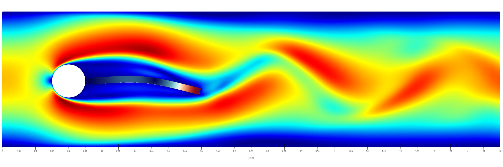
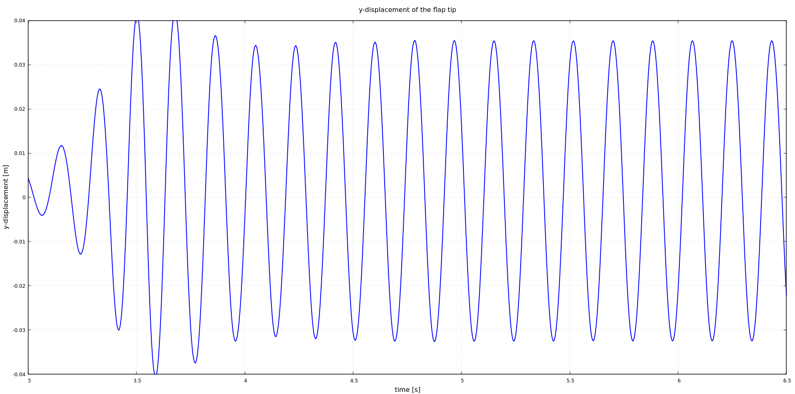


Get the [case files of this tutorial](https://github.com/precice/tutorials/tree/develop/turek-hron-fsi3), as continuously rendered here, or see the [latest released version](https://github.com/precice/tutorials/tree/master/turek-hron-fsi3) (if there is already one). Read how in the [tutorials introduction](https://precice.org/tutorials.html).


## Setup

The setup is shown schematically here:



For more information please refer to the original publication of the benchmark [1].

## Configuration

preCICE configuration (image generated using the [precice-config-visualizer](https://precice.org/tooling-config-visualization.html)):


## Available solvers

Fluid participant:

* OpenFOAM (pimpleFoam). For more information, have a look at the [OpenFOAM adapter documentation](https://precice.org/adapter-openfoam-overview.html).
* Nutils. For more information, have a look at the [Nutils adapter documentation](https://precice.org/adapter-nutils.html). This case takes significantly longer to run than the OpenFOAM case, see [related issue](https://github.com/precice/tutorials/issues/506).

Solid participant:

* deal.II. For more information, have a look at the [deal.II adapter documentation](https://precice.org/adapter-dealii-overview.html). This tutorial requires the nonlinear solid solver. Please copy the nonlinear solver executable to the `solid-dealii` folder or make it discoverable at runtime and update the `solid-dealii/run.sh` script.
* Nutils. For more information, have a look at the [Nutils adapter documentation](https://precice.org/adapter-nutils.html).
* solids4foam (OpenFOAM). A neo-Hookean, nonlinear-geometry total-Lagrangian solid model with the same material properties as the deal.II case (E = 5.6 MPa, nu = 0.4, rho = 1000 kg/m^3), solved with PETSc SNES. The `interface` patch uses the solids4foam `solidTraction` boundary condition, reading the coupled traction from the `solidTraction` field that the adapter fills. This requires solids4foam v2.4 or later built with PETSc, and an OpenFOAM-preCICE adapter with support for reading `Stress` in solid participants. For more information, have a look at the [solids4foam documentation](https://solids4foam.github.io/).

  The material is a compressible neo-Hookean law (`neoHookeanElastic`), matching the deal.II participant. Note that the original Turek-Hron benchmark specifies a St. Venant-Kirchhoff solid, which is what the Nutils participant uses. At the strain levels reached here the two laws are very close, but they are not identical; `StVenantKirchhoffElastic` is available in solids4foam and is a drop-in replacement in `constant/mechanicalProperties` if strict fidelity to the benchmark definition is preferred.

  This case uses the high-order (polynomial reconstruction) solid discretisation with `polynomialOrder 3`, set in `constant/solidProperties`. Lowering the order, or removing the `highOrderCoeffs` sub-dictionary altogether, trades accuracy for a cheaper solid solve. The first-order row below uses the default scheme rather than `highOrderCoeffs` with `polynomialOrder 1`; the two give essentially the same answer, differing only through the stencil size. The values are measured over the settled limit cycle (t = 8 to 15 s) of the full 15 s simulation, against the benchmark value of uy = 1.48 +/- 34.38 mm:

  | solid discretisation | amplitude [mm] | amplitude error | solid solver cost | end-to-end runtime |
  | --- | --- | --- | --- | --- |
  | p = 1, default scheme (no `highOrderCoeffs`) | 32.59 | -5.2% | 1.0x | 1.00x |
  | p = 2, `polynomialOrder 2` | 33.34 | -3.0% | 1.8x | 0.96x |
  | p = 3, `polynomialOrder 3` (used here) | 34.50 | +0.3% | 3.2x | 1.03x |

  The solid solver itself is markedly more expensive at higher polynomial order, but the end-to-end runtime is almost unaffected: in this tutorial the fluid participant dominates, so the extra solid work is largely hidden behind the coupling. If you run this case with a solid participant that is the bottleneck, `polynomialOrder 2` is a reasonable compromise.

## Running the Simulation

Open two separate terminals and start each participant by calling the respective run script. For example:

```bash
cd fluid-openfoam
./run.sh
```

and

```bash
cd solid-dealii
./run.sh
```

You can also run OpenFOAM in parallel by `./run.sh -parallel`. The default setting here uses 25 MPI ranks. You can change this setting in `fluid-openfoam/system/decomposeParDict`.

You may adjust the end time in the `precice-config.xml`, or interrupt the execution earlier if you want.

In the first few timesteps, many coupling iterations are required for convergence. Don't lose hope, things get better quickly.

## Post-processing

You can visualize the results of the coupled simulation using e.g. ParaView. OpenFOAM uses an OpenFOAM-specific format, and you can directly load the (empty) file `fluid-openfoam.foam` in Paraview or convert the results to VTK with `foamToVTK`. deal.II writes VTK files. Both Nutils solvers currently do not write VTK files (but use their own in-situ visualization), but this can be easily added similarly to the [perpendicular flap solvers](https://github.com/precice/tutorials/blob/98a78fe2dc2f6c5d84b2b30d35d00352782236f8/perpendicular-flap/fluid-nutils/fluid.py#L227).

If you want to visualize both domains with ParaView, keep in mind that the different solvers may write results with different output frequencies, which you might want to [synchronize](https://precice.org/tutorials-visualization.html#synchronizing-results).

There is a [known issue](https://github.com/precice/openfoam-adapter/issues/26) that leads to additional "empty" result directories when running with some OpenFOAM versions, leading to inconveniences during post-processing. At the end of `run.sh`, we call `openfoam_remove_empty_dirs` (provided by `tools/openfoam-remove-empty-dirs`) to delete the additional files before importing the results in ParaView.

Moreover, as we defined a watchpoint at the flap tip (see `precice-config.xml`), we can plot it with gnuplot using the script `plot-displacement.sh`, which expects the directory of the selected solid participant as a command line argument. For example:

 ```shell
 plot-displacement.sh solid-dealii



Before running the simulation again, you may want to cleanup any result files using the script `clean-tutorial.sh`.

## Mesh refinement

In `fluid-openfoam/system/`, we provide three different fluid meshes:

* `blockMeshDict`: the default mesh with approximately 21k cells,
* `blockMeshDict_refined`: a refined mesh with approximately 38k cells,
* `blockMeshDict_double_refined`: a refined mesh with approximately 46k cells.

If you want to use one of the two refined meshes, simply swap the `blockMeshDict`:

```bash
mv blockMeshDict blockMeshDict_original
mv blockMeshDict_refined blockMeshDict
```

## Acknowledgements

Thanks to the Technical University of Eindhoven for funding the development of
the Nutils participants for this tutorial.

## References

[1]  S. Turek, J. Hron, M. Madlik, M. Razzaq, H. Wobker, and J. Acker. Numerical simulation and benchmarking of a monolithic multigrid solver for fluid-structure interaction problems with application to hemodynamics. In H.-J. Bungartz, M. Mehl, and M. Schäfer, editors, Fluid Structure Interaction II: Modelling, Simulation, Optimization, page 432. Springer Berlin Heidelberg, 2010.


This offering is not approved or endorsed by OpenCFD Limited, producer and distributor of the OpenFOAM software via www.openfoam.com, and owner of the OPENFOAM®  and OpenCFD®  trade marks.

