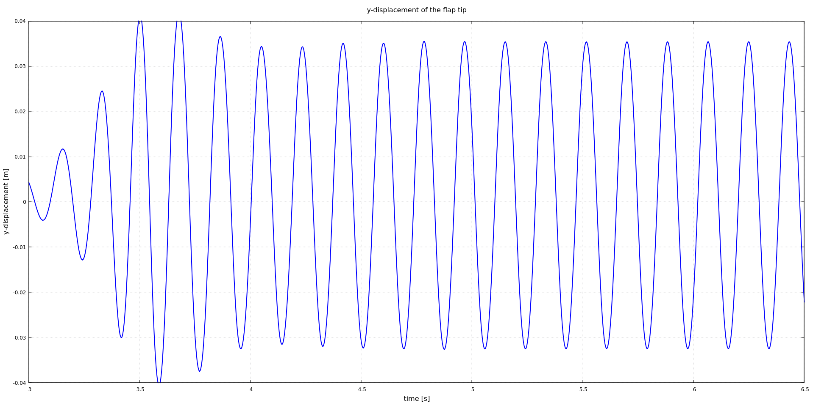


Get the [case files of this tutorial](https://github.com/precice/tutorials/tree/master/turek-hron-fsi3). Read how in the [tutorials introduction](https://precice.org/tutorials.html).


## Setup

The setup is shown schematically here:


For more information please refer to the original publication of the benchmark [1].

## Configuration

preCICE configuration (image generated using the [precice-config-visualizer](https://precice.org/tooling-config-visualization.html)):


## Available solvers

Fluid participant:

* OpenFOAM (pimpleFoam). In case you are using a very old OpenFOAM version, you will need to adjust the solver to `pimpleDyMFoam` in the `Fluid/system/controlDict` file. For more information, have a look at the [OpenFOAM adapter documentation](https://precice.org/adapter-openfoam-overview.html).

Solid participant:

* deal.II. For more information, have a look at the [deal.II adapter documentation](https://precice.org/adapter-dealii-overview.html). This tutorial requires the nonlinear solid solver. Please copy the nonlinear solver executable to the `solid-dealii` folder or make it discoverable at runtime and update the `solid-dealii/run.sh` script.

## Running the Simulation

Open two separate terminals and start each participant by calling the respective run script.

```bash
cd fluid-openfoam
./run.sh
```

and

```bash
cd solid-dealii
./run.sh
```

You can also run OpenFOAM in parallel by `./run.sh -parallel`. The default setting here uses 25 MPI ranks. You can change this setting in `fluid-openfoam/system/decomposeParDict`.

You may adjust the end time in the `precice-config.xml`, or interrupt the execution earlier if you want.

In the first few timesteps, many coupling iterations are required for convergence. Don't lose hope, things get better quickly.

## Post-processing

You can visualize the results of the coupled simulation using e.g. ParaView. Fluid results are in the OpenFOAM format and you may load the `fluid-openfoam.foam` file. Solid results are in VTK format.

If you want to visualize both domains with ParaView, keep in mind that the deal.II solver writes results every few timesteps, while the OpenFOAM solver writes in reference to simulated time. For this reason, make sure that you use compatible write intervals. You may also need to convert the OpenFOAM results to VTK (with the command `foamToVTK`).

There is an [known issue](https://github.com/precice/openfoam-adapter/issues/26) that leads to additional "empty" result directories when running with some OpenFOAM versions, leading to inconveniences during post-processing. At the end of `run.sh`, we call `openfoam_remove_empty_dirs` (provided by `tools/openfoam-remove-empty-dirs`) to delete the additional files before importing the results in ParaView.

Moreover, as we defined a watchpoint at the flap tip (see `precice-config.xml`), we can plot it with gnuplot using the script `plot-displacement.sh`.  The resulting graph shows the vertical (y) displacement of the tip of the flap.



Before running the simulation again, you may want to cleanup any result files using the script `clean-tutorial.sh`.

## Mesh refinement

In `fluid-openfoam/system/`, we provide three different fluid meshes:

* `blockMeshDict`: the default mesh with approximately 21k cells,
* `blockMeshDict_refined`: a refined mesh with approximately 38k cells,
* `blockMeshDict_double_refined`: a refined mesh with approximately 46k cells.

If you want to use one of the two refined meshes, simply swap the `blockMeshDict`:

```bash
mv blockMeshDict blockMeshDict_original
mv blockMeshDict_refined blockMeshDict
```

For the double-refined mesh, it is wisely to use local basis functions in the RBF data mapping method instead of global ones. You can use:

```xml
<mapping:rbf-compact-tps-c2 direction="read" from="Fluid-Mesh-Centers" to="Solid-Mesh"
                            support-radius="0.011" constraint="consistent" />
```

You can find more information on RBF data mapping in the [documentation](https://precice.org/configuration-mapping.html#radial-basis-function-mapping).

## References

[1]  S. Turek, J. Hron, M. Madlik, M. Razzaq, H. Wobker, and J. Acker. Numerical simulation and benchmarking of a monolithic multigrid solver for fluid-structure interaction problems with application to hemodynamics. In H.-J. Bungartz, M. Mehl, and M. Schäfer, editors, Fluid Structure Interaction II: Modelling, Simulation, Optimization, page 432. Springer Berlin Heidelberg, 2010.


This offering is not approved or endorsed by OpenCFD Limited, producer and distributor of the OpenFOAM software via www.openfoam.com, and owner of the OPENFOAM®  and OpenCFD®  trade marks.

