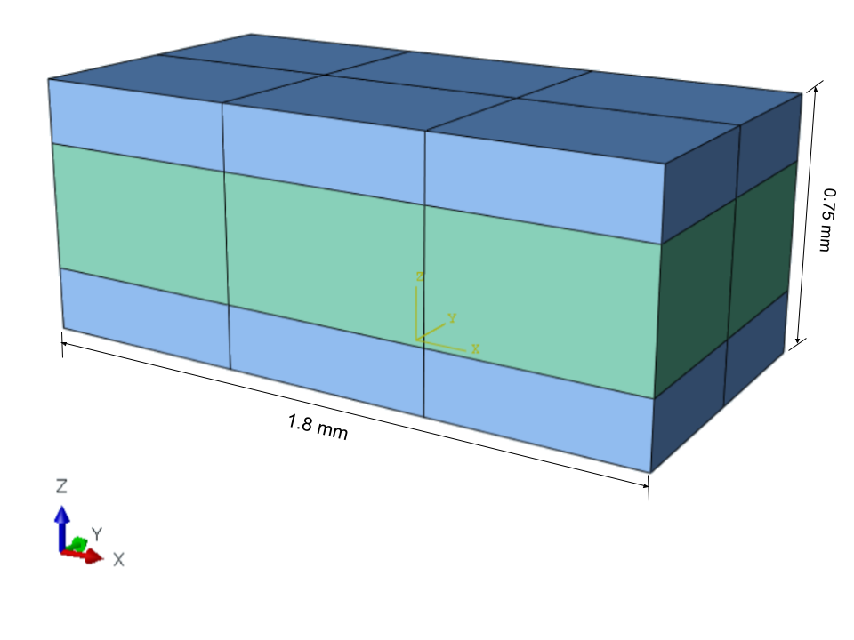
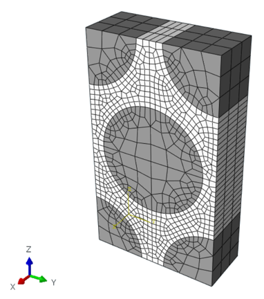
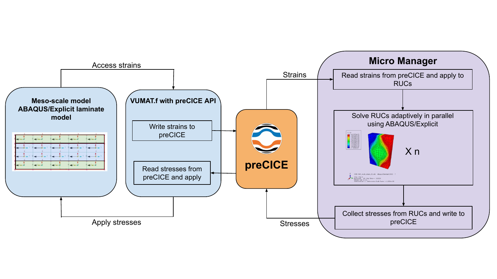
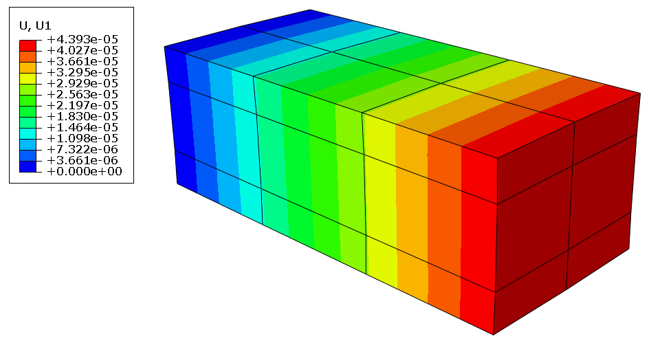
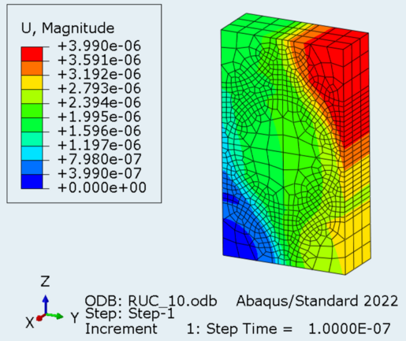


Get the [case files of this tutorial](https://github.com/precice/tutorials/tree/master/two-scale-composite-laminate). Read how in the [tutorials introduction](https://www.precice.org/tutorials.html).


This tutorial solves a two-scale coupled simulation of a composite structure using the preCICE coupling library. One meso-scale simulation is coupled to many micro-scale simulations. Both the scales are solved using [ABAQUS](https://www.3ds.com/products-services/simulia/products/abaqus/). This case was developed at the [Composite Structures Lab](https://sites.google.com/umich.edu/um-csl) of the University of Michigan, with a significant contribution from [Minh Hoang Nguyen](https://github.com/mhoangnUM). At each Gauss point of the meso domain there exists a micro simulation. The meso problem is one participant, which is coupled to many micro simulations. Each micro simulation is not an individual coupling participant, instead we use a managing software which controls all the micro simulations and their coupling via preCICE.

This tutorial shows how to couple ABAQUS to other simulation software via preCICE. The [VUMAT.f](meso-laminate-abaqus/VUMAT.f) uses the Fortran bindings of the preCICE API for coupling. On the micro scale, ABAQUS simulations for each micro simulation are started from scratch in every time step.

## Setup

The meso-scale model is a 3D beam structure which is being axially loaded.

The micro-scale model is a 3D fibre structure.

The coupling workflow is as follows

## Available solvers and dependencies

* Both the macro and micro simulations are solved using the finite element software [ABAQUS](https://www.3ds.com/products-services/simulia/products/abaqus/) 2022.
* The [Micro Manager](https://precice.org/tooling-micro-manager-installation.html) controls all micro-simulations and facilitates coupling via preCICE. To solve this case, use the [develop](https://github.com/precice/micro-manager/tree/develop) branch of the Micro Manager.

## Running the simulation

This case was developed by running it on the [Great Lakes HPC cluster](https://arc.umich.edu/greatlakes/) at the University of Michigan. In principle the setup should work on any machine or cluster which has an adequate amount of ABAQUS licenses. To case is run on the Great Lakes HPC cluster via a SLURM job submission script, which is given for reference as [submit_job.sbat](submit_job.sbat).

Due to restrictions in the way ABAQUS creates folder and starts the simulation, some paths are hard coded in this example. The exchange directory in [precice-config.xml](precice-config.xml) and the directory paths in [micro-ruc-abaqus/ruc_abaqus_restart.py](micro-ruc-abaqus/ruc_abaqus_restart.py) are currently set manually.

## Post-processing

Both the meso and micro scale simulations produce output files which can be viewed in ABAQUS. The axial displacement on the meso scale looks like

The displacement on the micro scale looks like

