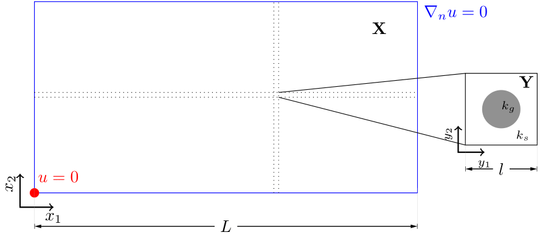


Get the [case files of this tutorial](https://github.com/precice/tutorials/tree/master/two-scale-heat-conduction). Read how in the [tutorials introduction](https://www.precice.org/tutorials.html).


## Setup

This tutorial solves a heat conduction problem on a 2D domain which has an underlying micro-structure. This micro-structure changes the constituent quantities necessary for solving the problem on the macro scale. This leads to a two-scale problem with one macro-scale simulation and several micro-scale simulations.



At each Gauss point of the macro domain there exists a micro simulation. The macro problem is one participant, which is coupled to many micro simulations. Each micro simulation is not an individual coupling participant, instead we use a managing software which controls all the micro simulations and their coupling via preCICE. The case is chosen from the first example case in *Bastidas, Manuela & Bringedal, Carina & Pop, Iuliu Sorin (2021), A two-scale iterative scheme for a phase-field model for precipitation and dissolution in porous media. Applied Mathematics and Computation. 396. 125933. [10.1016/j.amc.2020.125933](https://doi.org/10.1016/j.amc.2020.125933)*.

## Available solvers and dependencies

* Both the macro and micro simulations are solved using the finite element library [Nutils](https://nutils.org/install.html) v7.
* The macro simulation is written in Python, so it requires the [Python bindings of preCICE](https://precice.org/installation-bindings-python.html)
* The [Micro Manager](https://precice.org/tooling-micro-manager-installation.html) controls all micro-simulations and facilitates coupling via preCICE.

## Running the simulation

The macro problem can be started using:

```bash
python macro-nutils/macro.py
```

Check the Micro Manager [configuration](https://precice.org/tooling-micro-manager-configuration.html) and [running](https://precice.org/tooling-micro-manager-running.html) documentation to understand how to set it up and launch it. There is a Python script to directly run the Micro Manager, called [run-micro-problems.py](https://github.com/precice/tutorials/tree/master/two-scale-heat-conduction/run-micro-problems.py), which can be run as:

```bash
python run-micro-problems.py
```

The Micro Manager can also be run in parallel:

```bash
mpirun -n <num_procs> python run-micro-problems.py
```

Even though the case setup and involved physics is simple, each micro simulation is an instance of Nutils, which usually has a moderately high computation time. If the Micro Manager is run on 2 processors, the case takes approximately 10 to 15 minutes to run. Running the Micro Manager in serial is not advisable, as the run time can be more than 1 hour.

## Post-processing

The participant `macro-nutils` outputs `macro-*.vtk` files which can be viewed in ParaView. The Micro Manager uses the [export functionality](https://precice.org/configuration-export.html#enabling-exporters) of preCICE to output micro simulation data and [adaptivity related data](https://precice.org/tooling-micro-manager-configuration.html#adding-adaptivity-in-the-precice-xml-configuration) to VTU files which can be viewed in ParaView.
