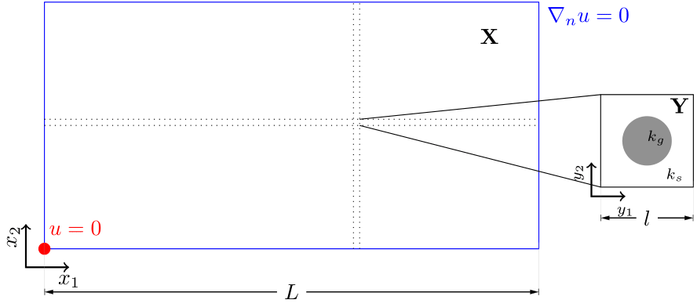
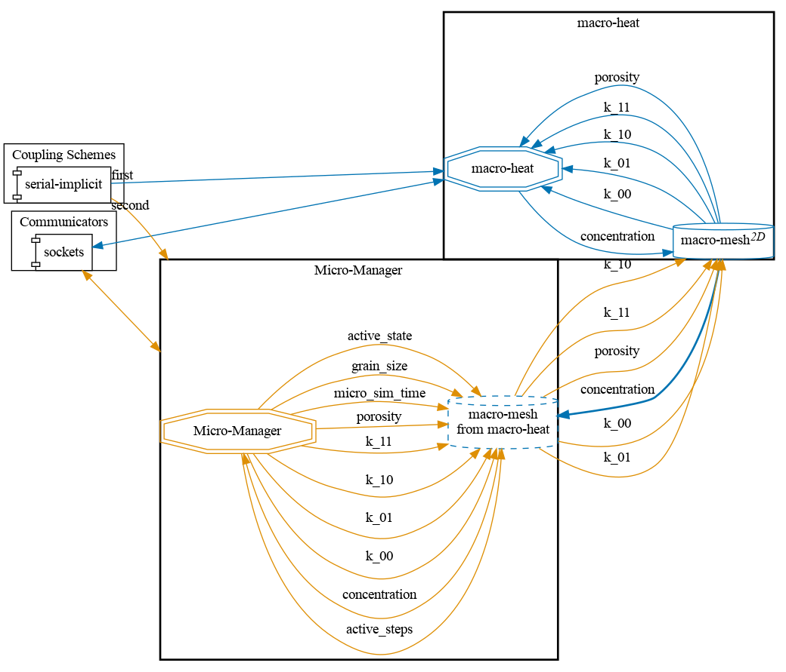
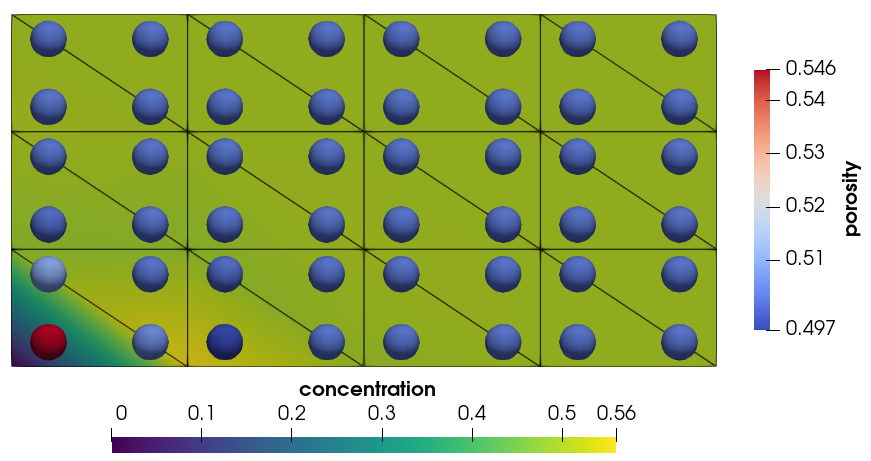
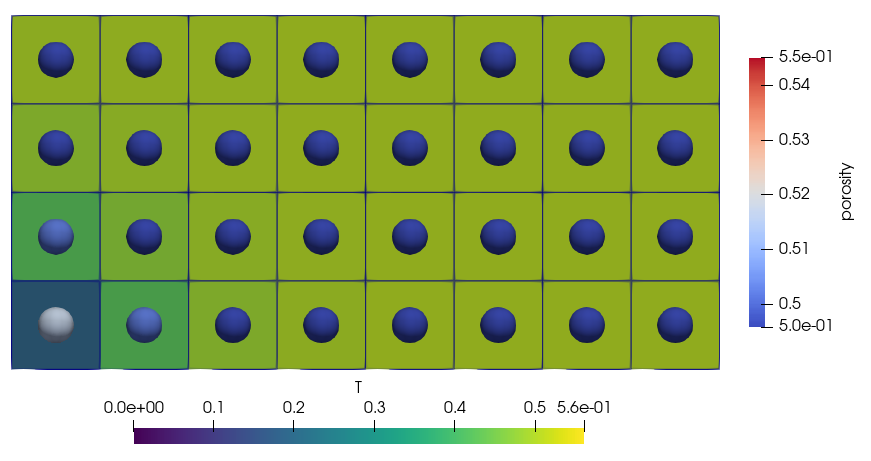
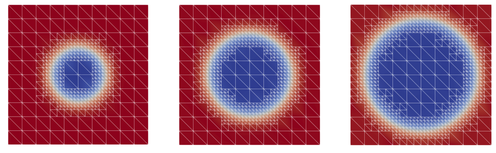


Get the [case files of this tutorial](https://github.com/precice/tutorials/tree/master/two-scale-heat-conduction). Read how in the [tutorials introduction](https://www.precice.org/tutorials.html).


## Setup

This tutorial solves a heat conduction problem on a 2D domain which has an underlying micro-structure. This micro-structure changes the constituent quantities necessary for solving the problem on the macro scale. This leads to a two-scale problem with one macro-scale simulation and several micro-scale simulations.



At each Gauss point of the macro domain there exists a micro simulation. The macro problem is one participant, which is coupled to many micro simulations. Each micro simulation is not an individual coupling participant, instead we use a managing software which controls all the micro simulations and their coupling via preCICE. The case is chosen from the first example case in the publication

*Bastidas, Manuela & Bringedal, Carina & Pop, Iuliu Sorin (2021), A two-scale iterative scheme for a phase-field model for precipitation and dissolution in porous media. Applied Mathematics and Computation. 396. 125933. [10.1016/j.amc.2020.125933](https://doi.org/10.1016/j.amc.2020.125933)*.

## Configuration

preCICE configuration (image generated using the [precice-config-visualizer](https://precice.org/tooling-config-visualization.html)):



## Available solvers and dependencies

* Both the macro and micro simulations can be solved using the finite element library [Nutils](https://nutils.org/install.html) v7 or the simulation framework [DuMu<sup>x</sup>](https://git.iws.uni-stuttgart.de/dumux-repositories/dumux/).
* While using Nutils, the macro simulation is written in Python, so it requires the [Python bindings of preCICE](https://precice.org/installation-bindings-python.html).
* The [Micro Manager](https://precice.org/tooling-micro-manager-installation.html) controls all micro-simulations and facilitates coupling via preCICE. Use the [develop](https://github.com/precice/micro-manager/tree/develop) branch of the Micro Manager.

### DuMu<sup>x</sup> setup

To solve either the macro or micro simulations with the DuMu<sup>x</sup> framework, the necessary DUNE modules need to be downloaded and set up. This is done by running `sh setup-dumux.sh` in the tutorial folder.

Note that if an existing installation of DUNE modules is detected in a default location, this may lead to problems in running the `setup-dumux.sh` script. The environment variable `DUNE_CONTROL_PATH` is suppressed by the script.

## Running the simulation

You can find the corresponding `run.sh`script for running the case in the folders corresponding to the solvers you want to use.

Run the macro problem:

```bash
cd macro-nutils
./run.sh
```

Check the Micro Manager [configuration](https://precice.org/tooling-micro-manager-configuration.html) and [running](https://precice.org/tooling-micro-manager-running.html) documentation to understand how to set it up and launch it. There is a Python script `run-micro-problems.py` in the tutorial directory to directly run the Micro Manager. This script imports the Micro Manager, and calls its `solve()` method. The Micro Manager can be run via this script in serial or parallel. Run it in serial:

```bash
cd micro-nutils
./run.sh -s
```

If you want to use DuMu<sup>x</sup>, use `cd macro-dumux` instead of `cd macro-nutils` and/or `cd micro-dumux` instead of `cd micro-nutils`.

## Running the simulation in parallel

Only the `micro-nutils` participant can be run in parallel. To run it in parallel, run:

```bash
cd micro-nutils
./run.sh -p <num_procs>
```

The `num_procs` needs to fit the decomposition specified in the `micro-manager-config.json` (default: two ranks).

**NOTE**: When running `micro-nutils`, even though the case setup and involved physics is simple, each micro simulation is an instance of Nutils, which usually has a moderately high computation time. If the Micro Manager is run on 2 processors, the total runtime is approximately 10-15 minutes depending on the compute machine. Do not run the Micro Manager in serial, because the runtime will be several hours.

Running `micro-dumux` is much faster. A serial simulation takes approximately 2 minutes to finish.

## Post-processing

Here are the results from Nutils-Nutils and DuMu<sup>x</sup>-DuMu<sup>x</sup> combination:





The differences of the fields are mainly introduced in by the different numerical schemes in the two solvers.

The participant `macro-nutils` outputs `macro-*.vtk` files which can be viewed in ParaView to see the macro concentration field. The Micro Manager uses the [export functionality](https://precice.org/configuration-export.html#enabling-exporters) of preCICE to output micro simulation data and [adaptivity related data](https://precice.org/tooling-micro-manager-configuration.html#adding-adaptivity-in-the-precice-xml-configuration) to VTU files which can be viewed in ParaView. To view the data on each micro simulation, create a Glyph on the Micro Manager VTU data. In the figure above, micro-scale porosity is shown. For a lower concentration value, the porosity increases (in the lower left corner).



The micro simulations themselves have a circular micro structure which is resolved in every time step. To output VTK files for each micro simulation, uncomment the `output()` function in the file `micro-nutils/micro.py`. The figure above shows the changing phase field used to represent the circular micro structure and the diffuse interface width.

Similar to the output data files from simulation with Nutils, the `VTU` files from macro and micro solvers, that are written in DuMu<sup>x</sup>, could also be rendered and inspected with ParaView with the mentioned method.
