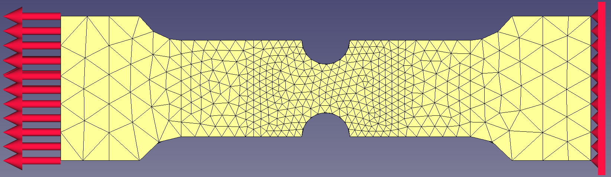
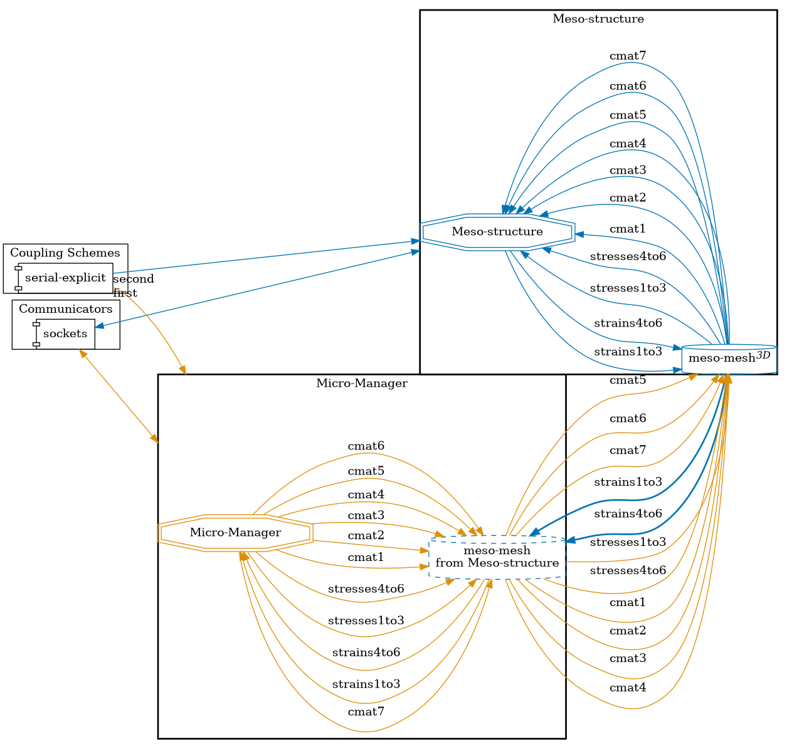
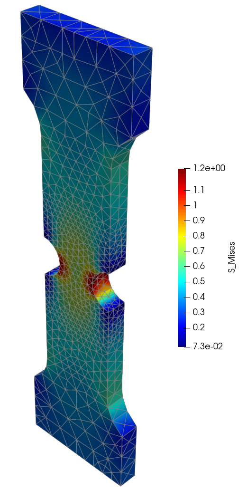


Get the [case files of this tutorial](https://github.com/precice/tutorials/tree/master/two-scale-notch). Read how in the [tutorials introduction](https://precice.org/tutorials.html).


## Setup

This tutorial solves a linear elastic static problem on a 3D notch geometry which has an underlying micro-structure. The notch is fixed at one end and has a force boundary condition at the other end.



The micro-structure needs to be evaluated to obtain the stresses and the material stiffness matrix, both necessary for solving the problem on the macro scale. This leads to a two-scale problem with one macro-scale simulation and several micro-scale simulations.

At each Gauss point of the macro domain there exists a micro simulation. The macro problem is one participant, which is coupled to many micro simulations. Each micro simulation is not an individual coupling participant, instead we use the [Micro Manager](https://github.com/precice/micro-manager), which controls all the micro simulations and is itself a coupling participant.

## Configuration

preCICE configuration (image generated using the [precice-config-visualizer](https://precice.org/tooling-config-visualization.html)):



## Available solvers and dependencies

* The macro notch problem is solved using [CalculiX](https://www.calculix.de/), so it required the [CalculiX adapter](https://github.com/precice/calculix-adapter).
* The micro problem is solved using [FANS](https://github.com/DataAnalyticsEngineering/FANS/tree/develop). FANS needs to be compiled in a Python-wrapped library form, check the [documentation](https://github.com/DataAnalyticsEngineering/FANS/blob/develop/pyfans/README.md) on how to do this.
* The [Micro Manager](https://precice.org/tooling-micro-manager-installation.html) controls all micro-simulations and facilitates coupling via preCICE. Use the [develop](https://github.com/precice/micro-manager/tree/develop) branch of the Micro Manager.

## Running the simulation

You can find the corresponding `run.sh` script for running the case in the folders corresponding to the solvers you want to use.

Run the macro problem:

```bash
cd macro-calculix
./run.sh
```

Check the Micro Manager [configuration](https://precice.org/tooling-micro-manager-configuration.html) and [running](https://precice.org/tooling-micro-manager-running.html) documentation to understand how to set it up and launch it. The Micro Manager can be run via this script in serial or parallel. Run it in serial:

```bash
cd micro-fans
./run.sh -s
```

## Running the simulation in parallel

```bash
cd micro-fans
./run.sh -p <num_procs>
```

The `num_procs` needs to fit the decomposition specified in the `micro-manager-config.json` (default is serial). See the documentation on [how to set domain decomposition](https://precice.org/tooling-micro-manager-configuration.html#domain-decomposition) in the Micro Manager configuration.

**NOTE**: When running `micro-fans`, even though the case setup and involved physics is simple, each micro simulation is a FANS simulation with a mesh of 32x32x32 nodes, which usually has a moderately high computation time. If the Micro Manager is run in serial, the total runtime is approximately 30 minutes.

## Post-processing

The final von Mises stress on the macro scale look like



The result is generated by converting the CalculiX `.frd` output file to a VTU or VTK file using [ccx2paraview](https://github.com/calculix/ccx2paraview).
