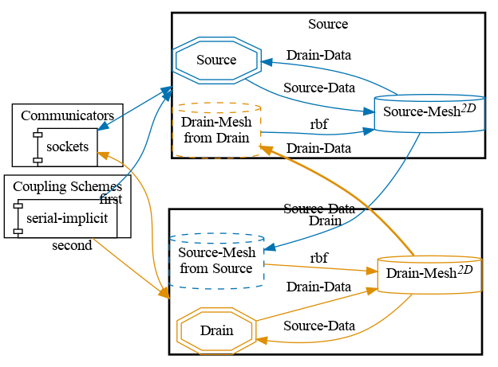



## Setup

This case illustrates how to implement volume coupling in a simple toy problem. Two diffusion problems are coupled via volume terms. One domain (the source) has constant non-zero Dirichlet boundary conditions. The other domain (the drain) has Neumann boundary conditions and a zero Dirichlet boundary condition at the right edge of the domain. The quantity u flows from the source to the drain.


## Configuration

preCICE configuration (image generated using the [precice-config-visualizer](https://precice.org/tooling-config-visualization.html)):



## Available solvers and dependencies

Both participants (Source and Drain):

* FEniCS. Install [FEniCS](https://fenicsproject.org/download/) and the [FEniCS-adapter](https://github.com/precice/fenics-adapter). Additionally, you will need to have preCICE and the python bindings installed on your system.

## Running the simulation

FEniCS is used to run the simulation. Open two separate terminals and start the source and drain participant by calling the respective run script `run.sh` located in the participant directory. For example:

```bash
cd source-fenics
./run.sh
```

and

```bash
cd drain-fenics
./run.sh
```

in order to use FEniCS for both participants in this test case.
