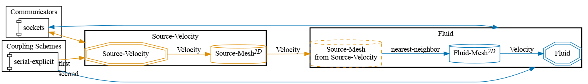


Get the [case files of this tutorial](https://github.com/precice/tutorials/tree/master/volume-coupled-flow). Read how in the [tutorials introduction](https://www.precice.org/tutorials.html).


## Setup

We introduce flow into a fluid through a square-shaped source located between $$ (3.0, 1.0) $$ and $$ (3.5, 1.5) $$. The velocity at the source is constant in the x component $$ (U.x() = 10.0) $$.

The state of the $$ U.x() $$ of the fluid at $$ t = 0.5s $$ (the source region is highlighted):


This case is a convenient starting point for volume coupling where OpenFOAM is a reading participant. The writing Nutils participant (dummy source) can be replaced by a more complex solver according to the user's needs.

## Configuration

preCICE configuration (image generated using the [precice-config-visualizer](https://precice.org/tooling-config-visualization.html)):



## Available solvers

Fluid participant:

* OpenFOAM (buoyantPimpleFoam). For more information, have a look at the [OpenFOAM adapter documentation](https://precice.org/adapter-openfoam-overview.html).

Source participant:

* Nutils. For more information, have a look at the [Nutils adapter documentation](https://www.precice.org/adapter-nutils.html). This Nutils solver requires at least Nutils v7.0.

## Running the simulation

Open two separate terminals and start the participants by calling the respective run scripts `run.sh` located in each of the participants' directory. For example:

```bash
cd fluid-openfoam
./run.sh
```

and

```bash
cd source-nutils
./run.sh
```

## Post-processing

The fluid participants generates a `.foam` file which can be visualized using, e.g., ParaView.

## Notes on the configuration

This case uses OpenFOAM's `fvOptions` to enforce source terms. Additionally, the coupled variable `U` needs to be given an alternative name in order for this to work:

```C++
FF
{
  nameU       U_vol;
};
```

Since OpenFOAM already uses `U`, we need to create an additional velocity variable to use specifically for the coupling. That allows us to carry the desired value over to OpenFOAM and apply it at the correct moment in the iteration. A simplified view of the workflow:


